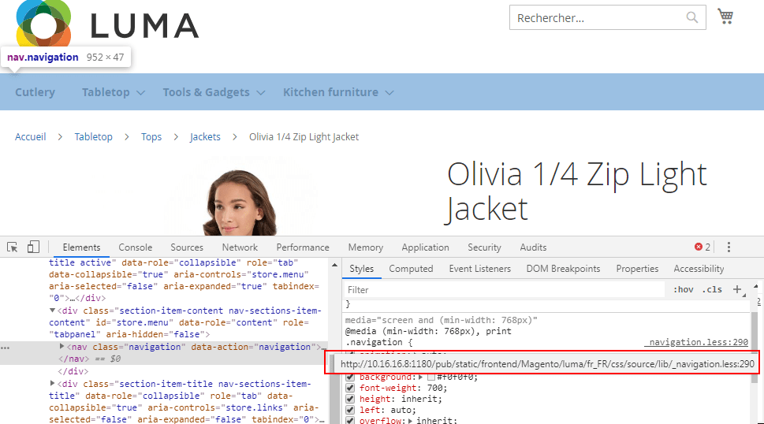

# Compile LESS with Grunt

The topic describes how to use the [Grunt JavaScript task runner](http://gruntjs.com/) to compile `.less` files.

## Prerequisites

-  Make sure that you [set](https://experienceleague.adobe.com/docs/commerce-operations/configuration-guide/cli/set-mode.html) your application to the developer or default [mode](https://experienceleague.adobe.com/docs/commerce-operations/configuration-guide/setup/application-modes.html). The default mode sets the Less compilation mode to Server-side Less compilation.
-  Install and configure [Grunt](../tools/grunt.md).

## Track changes using Grunt

The following shows which Grunt tasks to use for debugging:

-  After you switch the compilation mode from client-side to server-side, run the `exec` command.
-  After you customize the content of any `.less` file, except the root source files, run the `less` task and reload the page.
-  After you [customize the root source files or move the files included to the root files](../css/preprocess.md#clean-static-view-files), run the `exec` command and reload the page.
-  After you run `php bin/magento setup:upgrade`, run `exec` command.
-  After you run the `exec` command, run the `clear` command to `clear` the cache, then run the `watch` command. Running the commands in this order will ensure that any custom jQuery attributes like product sliders, banners, etc are loaded correctly.

If you have LiveReload installed, run the `grunt watch` command, and the flow is even simpler:

-  After you customize the content of any `.less` file, changes are applied and the page reloads automatically. No additional changes
-  After you [customize the root source files or move the files included to the root files](../css/preprocess.md#clean-static-view-files), run the `clean` and `exec` commands, which reloads the page in the browser.

## CSS source maps

When using Grunt for styles preprocessing, you can enable the CSS source maps generation in your browser. It will make the theme styles debugging easier.

For each theme, the application compiles all theme `.less` files into two CSS files: `styles-m.css` and `styles-l.css`. So when you debug a theme, your browser only sees `styles-m.css` and it might be difficult to define which `.css` or `.less` file requires corrections. For example:


CSS source maps solve this issue. They help to find the `.less` file, where the style is specified. For example:


CSS source maps are generated automatically when you compile CSS for your theme using the `grunt less: <theme>` command. To use them, you need to enable the display of source maps in your browser. For example, in Chrome, you would open the Developer Tools, go to the **Settings** panel, select **Preferences**, then check the **Enable CSS source maps** checkbox.

The application has a base set of variables that define commonly used aspects of a theme; such as colors, fonts, style of page titles, and so on.

The `<magento-root>/lib/web/css/source/lib/variables` directory contains LESS files that define values assigned to variables for many of the common elements.

To change or override any of these variables, simply create a file in `<theme-dir>/web/css/source/_theme.less` For example:



```css
@navigation__background: @secondary__color__light;
@font-family__sans-serif: 'Helvetica Neue', Helvetica, Arial, sans-serif;
```
