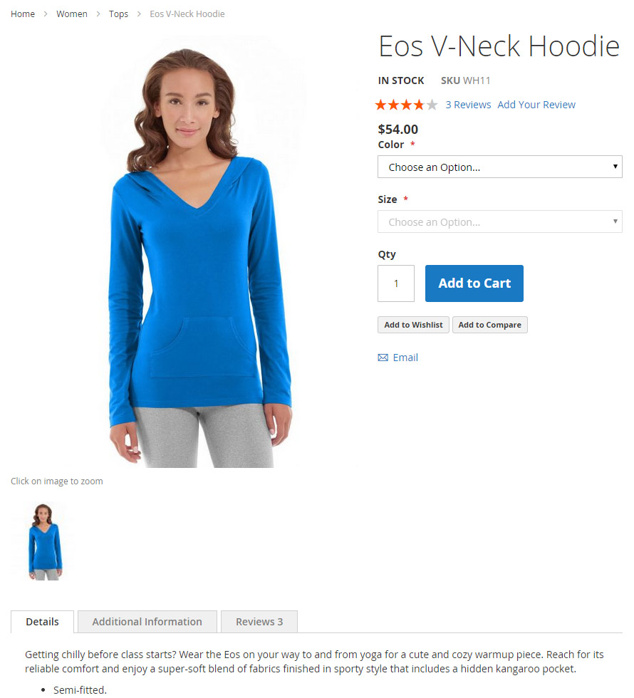
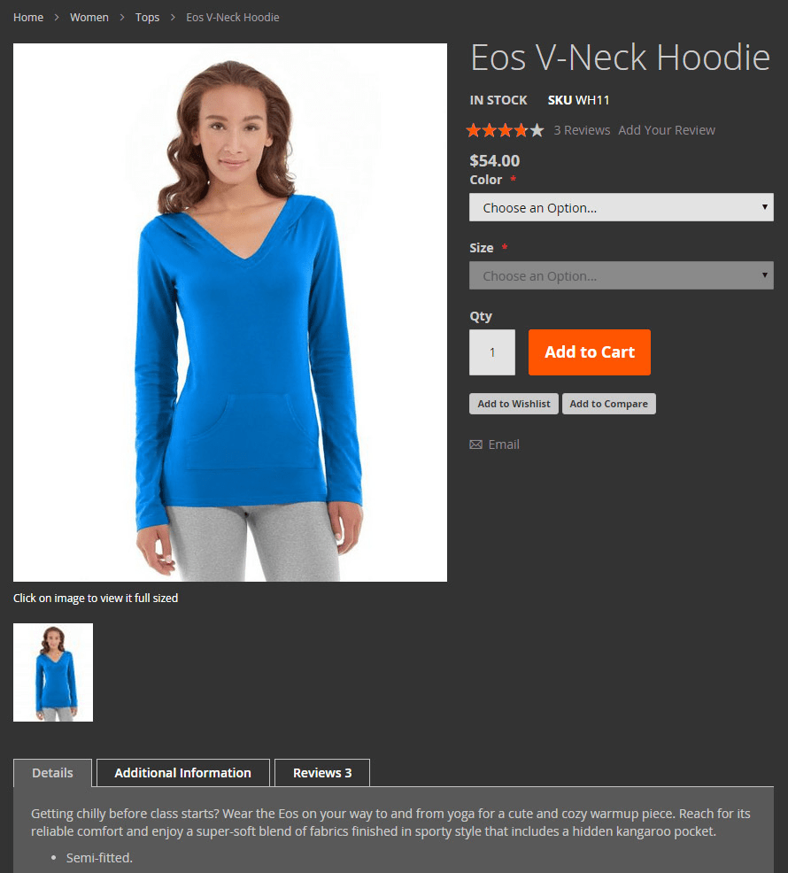

## What is in this topic

This topic features a step-by-step illustration of how to change a theme's color scheme using UI library.

## Changing theme color scheme

ExampleCorp created a custom theme that inherits from the Magento basic Blank theme.
The following image illustrates how store pages look when the Blank theme is applied:



In their Grey theme, ExampleCorp wants to change the color scheme from white to grey.

The Grey theme directory is `app/design/frontend/ExampleCorp/grey`.

ExampleCorp decided to use the UI library, so to change the color scheme, they need to define new values for certain default Less variables.
To do this, they added an overriding `_theme.less` file in the `app/design/frontend/ExampleCorp/grey/web/css/source` directory, with the following content:

```less
//  Color nesting
@page__background-color: @color-gray20;
@sidebar__background-color: @color-gray40;
@primary__color: @color-gray80;
@border-color__base: @color-gray76;

@link__color: @color-gray56;
@link__hover__color: @color-gray60;

//  Buttons
@button__color: @color-gray20;
@button__background: @color-gray80;
@button__border: 1px solid @border-color__base;

//  Primary button
@button-primary__background: @color-orange-red1;
@button-primary__border: 1px solid @color-orange-red2;
@button-primary__color: @color-white;
@button-primary__hover__background: darken(@color-orange-red1, 5%);
@button-primary__hover__border: 1px solid @color-orange-red2;
@button-primary__hover__color: @color-white;

//  Navigation
@navigation-level0-item__color: @color-gray80;
@submenu-item__color: @color-gray80;

@navigation__background: @color-gray40;
@navigation-desktop-level0-item__color: @color-gray80;
@navigation-desktop-level0-item__hover__color: @color-gray34;
@navigation-desktop-level0-item__active__color: @navigation-desktop-level0-item__color;

//  Tabs
@tab-control__background-color: @page__background-color;

//  Forms
@form-element-input__background: @color-gray89;
@form-element-input-placeholder__color: @color-gray60;

//  Header icons
@header-icons-color: @color-gray89;
@header-icons-color-hover: @color-gray60;
```

After the Grey theme is applied (and [static files cache cleared](../caching.md#clean-cache-cleancache)), store pages will look like following:


