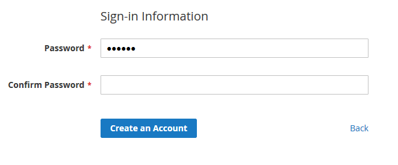
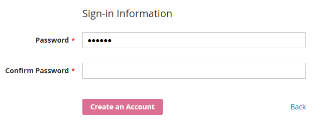
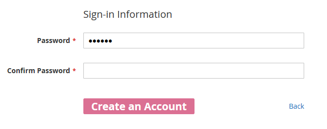

# Compilation mode

After you [create a theme](../../themes/create-storefront.md), you need to decide which LESS compilation mode to use before changing styles. You can choose between [two modes](../preprocess.md):

-  **Server-side compilation mode (default):** less file is compiled with PHP less library. In developer mode, PHP will generate the CSS files on the fly provided there is not one already. Running static content deploy will compile the stylesheet.

-  **Client-side compilation mode (recommended for [theme](https://glossary.magento.com/theme) development):** Less file is compiled client-side on every page load, which results in slow response times and "flash of unstyled text" (FOUT) issues.

The examples in this topic use the [simple approach](../quickstart/customize-styles.md#) for customizing theme styles. You make changes to the `_extend.less` file.

In our examples, we will change the color and font of the primary buttons. The default view of the primary buttons can be illustrated by the **Create an Account** button view on the Customer login page:



## Before you begin

1. [Create a theme](../../themes/create-storefront.md). In your `theme.xml` file, specify Luma or Blank as the parent theme.
1. [Apply your theme](../../themes/apply-storefront.md) in the [Admin](https://glossary.magento.com/magento-admin).

## Server-side compilation mode

The following is an illustration of how the process of making simple changes looks like with the server-side LESS compilation mode:

1. Navigate to your theme directory and add the `web/css/source/_extend.less` file.
1. Change the color of the buttons by adding the following code in the `_extend.less` file:

   ```less
   .action {
       &.primary {
           background-color: palevioletred;
           border-color: palevioletred;
       }
   }
   ```

1. [Clean static files cache](../../caching.md#clean-cache).
1. Refresh the page and verify your changes.

   

1. Change the button font size by adding the following code in the `_extend.less` file:

   ```less
   .action {
       &.primary {
           background-color: palevioletred;
           border-color: palevioletred;
           font-size: 1.5em;
       }
   }
   ```

1. Delete all files in the following directories:

   -  `pub/static/frontend/<vendor>/<theme>`
   -  `var/view_preprocessed/pub/static/frontend/<vendor>/<theme>`

1. Refresh the page and verify your changes.

   

<InlineAlert variant="info" slots="text"/>

If you are using server-side compilation mode, you must [clean generated static view files](../../caching.md#clean-static-files). Continue to the next section to learn how to use Grunt to automate this process.

## Server-side compilation mode with Grunt

1. Navigate to your theme directory and create a `web/css/source/_extend.less` file.
1. Install Grunt and register your theme as described in [Installing and configuring Grunt](../../tools/grunt.md).
1. From your installation directory, run the following commands:

   -  `grunt exec:<your_theme>`
   -  `grunt less:<your_theme>`
   -  `grunt watch`

1. Change the color of the buttons by adding the following code in the `_extend.less` file:

   ```less
   .action {
       &.primary {
           background-color: palevioletred;
           border-color: palevioletred;
       }
   }
   ```

1. Refresh the page and verify your changes.

   

1. Change the button font size by adding the following code in the `_extend.less` file:

   ```less
   .action {
       &.primary {
           background-color: palevioletred;
           border-color: palevioletred;
           font-size: 1.5em;
       }
   }
   ```

1. Refresh the page and verify your changes.

   

## Client-side compilation mode

1. Navigate to your theme directory and create a `web/css/source/_extend.less` file.
1. Log in to the Admin.
1. Click **STORES** > **Settings** > **Configuration** > **ADVANCED** > **Developer** > **Frontend development workflow** > **Workflow type**.
1. Change the LESS compilation mode to client-side.
1. [Clean static view files](../../caching.md#clean-static-files).
1. Change the color of the buttons by adding the following code in the `_extend.less` file:

   ```less
   .action {
       &.primary {
           background-color: palevioletred;
           border-color: palevioletred;
       }
   }
   ```

1. Refresh the page and verify your changes.

   

1. Change the button font size by adding the following code in the `_extend.less` file:

   ```less
   .action {
       &.primary {
           background-color: palevioletred;
           border-color: palevioletred;
           font-size: 1.5em;
       }
   }
   ```

1. Refresh the page and verify your changes.

   

<InlineAlert variant="info" slots="text"/>

When your instance is in client-side Less compilation mode, simple changes are applied after saving or refreshing the page. For more sophisticated changes, you may need to manually clean the theme sub-directory in the `pub/static/frontend` directory and generate a new deployment. See [Styles debugging](../debug.md).
