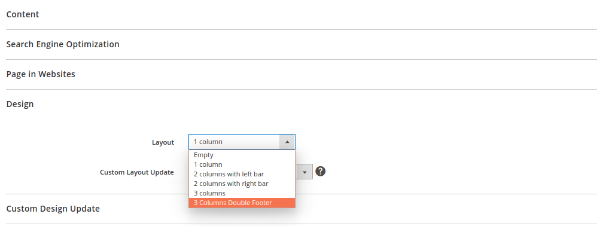
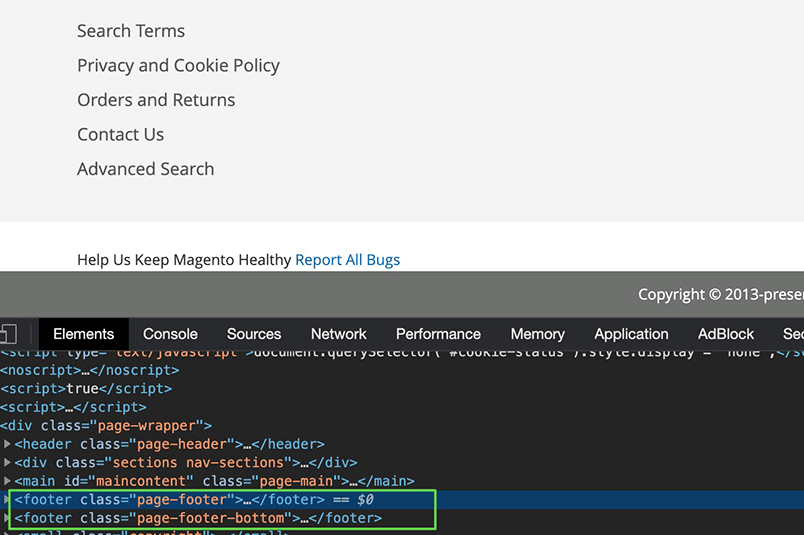

# Create a new layout

When an existing page layout does not meet your requirements, create a new page layout.

If the new page has a `3-columns-double-footer` layout, create a custom page-layout XML file: `app/design/frontend/<VendorName>/<ThemeName>/Magento_Theme/page_layout/3-columns-double-footer.xml`.

```xml
<?xml version="1.0"?>
<layout xmlns:xsi="http://www.w3.org/2001/XMLSchema-instance" xsi:noNamespaceSchemaLocation="urn:magento:framework:View/Layout/etc/page_layout.xsd">
    <update handle="3columns"/>
    <referenceContainer name="page.wrapper">
        <container name="footer-bottom" as="footer-bottom" after="footer" label="Footer Bottom" htmlTag="footer" htmlClass="page-footer-bottom">
            <container name="footer-bottom-content" as="footer-bottom-content" htmlTag="div" htmlClass="footer content" />
        </container>
    </referenceContainer>
</layout>
```

To add a block to the container, create the layout:

`app/design/frontend/<VendorName>/<ThemeName>/Magento_Theme/layout/default.xml`

```xml
<?xml version="1.0"?>
<page xmlns:xsi="http://www.w3.org/2001/XMLSchema-instance" xsi:noNamespaceSchemaLocation="urn:magento:framework:View/Layout/etc/page_configuration.xsd">
    <referenceContainer name="footer-bottom-content">
        <block class="Magento\Framework\View\Element\Template" name="report.bugs.bottom" template="Magento_Theme::html/bugreport.phtml"/>
    </referenceContainer>
</page>
```

## Add the layout to the layouts.xml file

Add the newly created page layout to the `layouts.xml` file of the theme directory: `app/design/frontend/<VendorName>/<ThemeName>/Magento_Theme/layouts.xml`.

```xml
<?xml version="1.0" encoding="UTF-8"?>
<page_layouts xmlns:xsi="http://www.w3.org/2001/XMLSchema-instance" xsi:noNamespaceSchemaLocation="urn:magento:framework:View/PageLayout/etc/layouts.xsd">
    <layout id="3-columns-double-footer">
        <label translate="true">3 Columns Double Footer</label>
    </layout>
</page_layouts>
```

<InlineAlert variant="info" slots="text"/>

Note that the value of the new layout `id` attribute should match the name of the newly created page-layout XML file.

Clean the cache by going to **System** > **Cache Management** > **Flush Magento Cache** or by entering the following command:

```bash
bin/magento cache:clean
```

## Result

The new page layout displays in all `Layout` dropdowns.



On the storefront, there is a new footer for those pages that use the `3 Columns Double Footer` layout.


