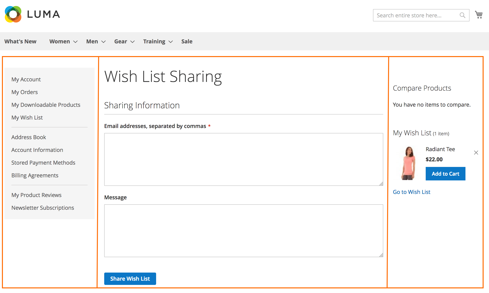

# Layout file types

For a particular page, its layout is defined by two major layout components: *page layout* file and *page configuration* file.

A page layout file defines the page wireframe, for example, one-column layout. Technically page layout is an .xml file defining the structure inside the `<body>` section of the HTML page markup. Page layouts feature only [containers](xml-instructions.md#container).
All page layouts used for page rendering should be declared in the page layout declaration file.

Page configuration is also an .xml file. It defines the detailed structure (page header, footer, etc.), contents and page meta information, including the page layout used. Page configuration features both main elements, [blocks](xml-instructions.md#block) and [containers](xml-instructions.md#container).

We also distinguish the third type of layout files, *generic layouts*. They are .xml files which define the contents and detailed structure inside the `<body>` section of the HTML page markup. These files are used for pages returned by AJAX requests, emails, HTML snippets and so on.

This article gives a comprehensive description of each layout file type.

## Page layout

Page layout declares the wireframe of a page inside the `<body>` section. For example, one-column layout or two-column layout.

Allowed layout instructions:

*  `<head>`
*  `<body>`
*  [`<container>`](xml-instructions.md#container)
*  [`<referenceContainer>`](xml-instructions.md#referenceblock-and-referencecontainer)
*  [`<move>`](xml-instructions.md#move)
*  [`<update>`](xml-instructions.md#update)

Sample page layout:

`<Magento_Theme_module_dir>/view/frontend/page_layout/2columns-left.xml`

```xml
<layout xmlns:xsi="http://www.w3.org/2001/XMLSchema-instance" xsi:noNamespaceSchemaLocation="urn:magento:framework:View/Layout/etc/page_layout.xsd">
    <update handle="1column"/>
    <referenceContainer name="columns">
        <container name="div.sidebar.main" htmlTag="div" htmlClass="sidebar sidebar-main" after="main">
            <container name="sidebar.main" as="sidebar_main" label="Sidebar Main"/>
        </container>
        <container name="div.sidebar.additional" htmlTag="div" htmlClass="sidebar sidebar-additional" after="div.sidebar.main">
            <container name="sidebar.additional" as="sidebar_additional" label="Sidebar Additional"/>
        </container>
    </referenceContainer>
</layout>
```

### Conventional file location

Conventionally page layouts must be located as follows:

*  Module page layouts: `<module_dir>/view/frontend/page_layout`
*  Theme page layouts: `<theme_dir>/<Namespace>_<Module>/page_layout`

### Page layouts declaration

To be able to use a layout for actual page rendering, you need to declare it in `layouts.xml`.

Conventionally layout declaration file can be located in one of the following locations:

*  Module layout declarations: `<module_dir>/view/frontend/layouts.xml`
*  Theme layout declaration: `<theme_dir>/<Namespace>_<Module>/layouts.xml`

Declare a layout file using the `<layout></layout>` instruction, for which specify the following:

*  `<layout id="layout_file_name">`. For example, the `2columns-left.xml` page layout is declared like following: `<layout id="2columns-left"/>`
*  `<label translate="true|false">&#123;Label_used_in_admin&#125;</label>`

Sample page layout declaration file: `<Magento_Theme_module_dir>/view/frontend/layouts.xml`

```xml
<page_layouts xmlns:xsi="http://www.w3.org/2001/XMLSchema-instance" xsi:noNamespaceSchemaLocation="urn:magento:framework:View/PageLayout/etc/layouts.xsd">
    <layout id="1column">
        <label translate="true">1 column</label>
    </layout>
    <layout id="2columns-left">
        <label translate="true">2 columns with left bar</label>
    </layout>
    <layout id="2columns-right">
        <label translate="true">2 columns with right bar</label>
    </layout>
    <layout id="3columns">
        <label translate="true">3 columns</label>
    </layout>
</page_layouts>
```

Use the `layout` attribute in the `page` node of a page configuration file to define a layout type for the page. The following example shows how to use the `3 columns` page layout type for the [Wish List Sharing](https://github.com/magento/magento2/blob/2.4/app/code/Magento/Wishlist/view/frontend/layout/wishlist_index_share.xml#L8) page:

Override the default `wishlist_index_share.xml` in any one of the following paths and add the `layout="3columns"` in the `page` node.

*  Override the layout in a custom `theme` (*in the case where a custom-built theme is applied on the storefront*): `<custom_theme_dir>/Magento_Wishlist/layout/wishlist_index_share.xml`
*  Override the layout in custom `module` (*in case the when building third-party extensions and you need to make changes to the existing layout*): `<custom_module_dir>/view/frontend/layout/wishlist_index_share.xml`

```xml
<?xml version="1.0"?>
<!--
/**
 * Copyright Adobe
 * All rights reserved.
 */
-->
<page xmlns:xsi="http://www.w3.org/2001/XMLSchema-instance" layout="3columns" xsi:noNamespaceSchemaLocation="urn:magento:framework:View/Layout/etc/page_configuration.xsd">
    <update handle="customer_account"/>
    <body>
        <referenceContainer name="content">
            <block class="Magento\Wishlist\Block\Customer\Sharing" name="wishlist.sharing" template="Magento_Wishlist::sharing.phtml" cacheable="false"/>
        </referenceContainer>
    </body>
</page>
```



<InlineAlert variant="info" slots="text"/>

By default, the application provides five page layout types for the frontend (`empty`, `1column`, `2columns-left`, `2columns-right`, and `3columns`) and 3 page layout types for the backend (`admin-empty`, `admin-1column`, and `admin-2columns-left`).

## Page configuration

The page configuration adds content to the wireframe defined in a page layout file. A page configuration also contains page meta-information, and contents of the `<head>` section.

### Conventional file location

Conventionally page configuration files must be located as follows:

*  Module page configurations: `<module_dir>/view/frontend/layout`
*  Theme page configurations: `<theme_dir>/<Namespace>_<Module>/layout`

### Structure and allowed layout instructions

The following table describes the instructions specific for page configuration files. For the descriptions of common layout instructions see [Layout instructions](xml-instructions.md).

Element | Attributes | Parent of | Description
--------|------------|-----------|------------
`<page>` | `layout = {layout}`<br />`xsi:noNamespaceSchemaLocation = path_to_schema"` | `<html>`<br />`<head>`<br />`<body>`<br />`<update>` | Mandatory root element.
`<html>` | none | `<attribute>` |
`<head>` | none | `<title>`<br />`<meta>`<br />`<link>`<br />`<css>`<br />`<font>`<br />`<script>`<br />`<remove>`<br />`<attribute>` |
`<body>` | none | `<block>`<br />`<container>`<br />`<move>`<br />`<attribute>`<br />`<referenceBlock>`<br />`<referenceContainer>`<br />`<action>` |
`<attribute>` | `name = {arbitrary_name}`<br />`value = {arbitrary_value}` | | Specified for `<html>`, rendered as:<br />`<html name="value"`>
`<title>` | none | none | Page title
`<meta>` | `<content>`<br />`<charset>`<br />`<http-equiv>`<br />`<name>`<br />`<scheme>` | none
`<link>` | `<defer>`<br />`<ie_condition>`<br />`<charset>`<br />`<hreflang>`<br />`<media>`<br />`<rel>`<br />`<rev>`<br />`<sizes>`<br />`<src_type>`<br />`<target>`<br />`<type>` | none
`<css>` | `<defer>`<br />`<ie_condition>`<br />`<charset>`<br />`<hreflang>`<br />`<media>`<br />`<rel>`<br />`<rev>`<br />`<sizes>`<br />`<src>`<br />`<src_type>`<br />`<target>`<br />`<type>` | none
`<script>` | `<defer>`<br />`<ie_condition>`<br />`<async>`<br />`<charset>`<br />`<src>`<br />`<src_type>`<br />`<type>` | none

## Generic layout

Generic layouts define the contents and detailed structure inside the `<body>` section of the HTML page markup.

### Conventional file location

Conventionally generic layout files must be located as follows:

*  Module generic layouts: `<module_dir>/view/frontend/layout`
*  Theme generic layouts: `<theme_dir>/<Namespace>_<Module>/layout`

### Structure and allowed layout instructions

The following table describes the instructions specific for generic layout files. For the descriptions of common layout instructions see [Layout instructions](xml-instructions.md).

Element | Attributes | Parent of | Description
--------|------------|-----------|------------
`<layout>` | `xsi:noNamespaceSchemaLocation="{path_to_schema}"` | `<container>`<br />`<update>` | Mandatory root element.
`<update>` | `handle="{name_of_handle_to_include}"` | none |
`<container>` | `name="root"`<br />For a complete list of attributes, see [Layout instructions](xml-instructions.md) | `<block>`<br />`<container>`<br />`<referenceBlock>`<br />`<referenceContainer>` | Mandatory element.

Sample generic layout:

```xml
<layout xmlns:xsi="http://www.w3.org/2001/XMLSchema-instance" xsi:noNamespaceSchemaLocation="urn:magento:framework:View/Layout/etc/layout_generic.xsd">
    <update handle="formkey"/>
    <update handle="adminhtml_googleshopping_types_block"/>
    <container name="root">
        <block class="Magento\Backend\Block\Widget\Grid\Container" name="googleshopping.types.container" template="Magento_Backend::widget/grid/container/empty.phtml"/>
    </container>
</layout>
```
