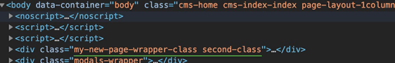
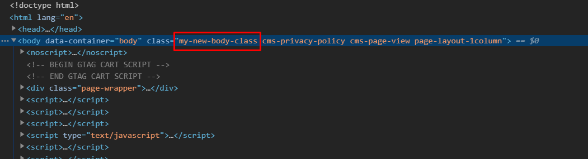
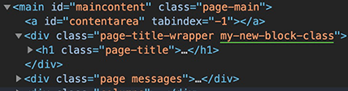
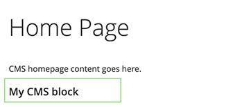
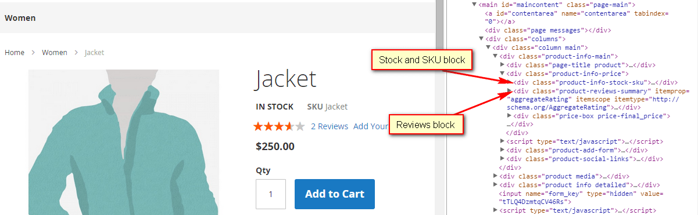
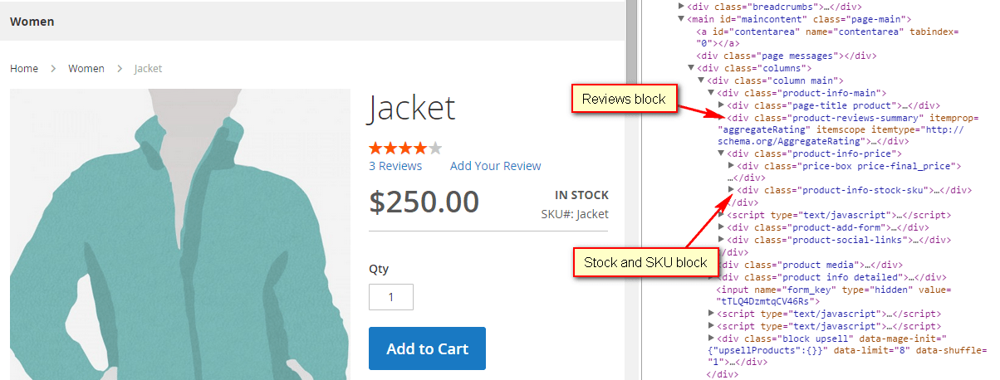

# Common customization tasks

<InlineAlert variant="info" slots="text"/>

To ensure stability and secure your customizations from being deleted during upgrade, do not change out-of-the-box module and theme layouts. To customize your layout, create extending and overriding layout files in your custom theme.

## Set the page layout

The type of page layout to be used for a certain page is defined in the page configuration file, in the `layout` attribute of the root `<page>` node.

Example:
Change the layout of Advanced Search page from default "1-column" to "2-column with left bar". To do this, extend `catalogsearch_advanced_index.xml` in your theme by adding the following layout:

```xml
<page layout="2columns-left" xmlns:xsi="http://www.w3.org/2001/XMLSchema-instance" xsi:noNamespaceSchemaLocation="urn:magento:framework:View/Layout/etc/page_configuration.xsd">
...
</page>
```

## Include static resources (JavaScript, CSS, fonts)

JavaScript, CSS, and other static assets are added in the `<head>` section of a [page configuration] file. The default look of a store page `<head>` is defined by `app/code/Magento/Theme/view/frontend/layout/default_head_blocks.xml`. The recommended way to add CSS and JavaScript is to extend this file in your custom theme, and add the assets there.
The following file is a sample of a file you must add:

```xml
<page xmlns:xsi="http://www.w3.org/2001/XMLSchema-instance" xsi:noNamespaceSchemaLocation="urn:magento:framework:View/Layout/etc/page_configuration.xsd">
  <head>
    <!-- Add local styles resources -->
    <css src="css/my-styles.css" />
    <css src="<Namespace>_<Module>::css/custom-styles.css" />

    <!-- The following two ways to add local JavaScript files are equal -->
    <script src="Magento_Catalog::js/sample1.js" />
    <script src="Magento_Catalog/js/sample1.js" />

    <!-- The application supports async or defer attribute in script tag -->
    <script async="" src="Magento_Catalog::js/sample1.js" />
    <script defer="" src="Magento_Catalog::js/sample1.js" />

    <link src="js/sample.js" />
    <link src="sample.js" />

    <!-- Add external resources -->
    <css src="https://maxcdn.bootstrapcdn.com/bootstrap/3.3.4/css/bootstrap-theme.min.css" src_type="url" />
    <script src="https://maxcdn.bootstrapcdn.com/bootstrap/3.3.4/js/bootstrap.min.js" src_type="url" />
    <link rel="stylesheet" type="text/css" src="http://fonts.googleapis.com/css?family=Montserrat" src_type="url" />
  </head>
</page>
```

When adding external resources, specifying the `src_type="url"` argument value is a must.

You can use either the `<link src="js/sample.js"/>` or the `<script src="js/sample.js"/>` instruction to add a locally stored JavaScript file to your theme. This way, the path to the javascript file will be `<theme_dir>/web/js/sample.js`. If we use `<link src="sample.js"/>`, The application will get the javascript file at `<theme_dir>/web/sample.js`

The path to assets is specified relatively to one the following locations:

-  CSS and LESS files are stored in the `<theme_dir>/web/css/` directory.
-  Font-related files are stored in the `<theme_dir>/<Namespace>_<Module>/web/fonts/` directory.
-  Static assets, such as images, are stored in the `<theme_dir>/<Namespace>_<Module>/web/images/` directory.
-  JS files are stored in the `<theme_dir>/<Namespace>_<Module>/web/js/` directory.

### Adding conditional comments

[Conditional comments] are meant to give special instructions for Internet Explorer.
In the terms of adding assets, you can add CSS files to be included for a specific version of Internet Explorer.
A sample follows:

```xml
<page xmlns:xsi="http://www.w3.org/2001/XMLSchema-instance" xsi:noNamespaceSchemaLocation="urn:magento:framework:View/Layout/etc/page_configuration.xsd">
  <head>
    <css src="css/ie-9.css" ie_condition="IE 9" />
  </head>
</page>
```

This adds an IE conditional comment in the generated HTML, like in the following example:

```html
<!--[if IE 9]>
<link rel="stylesheet" type="text/css" media="all" href="<your_store_web_address>/pub/static/frontend/ExampleCorp/orange/en_US/css/ie-9.css" />
<![endif]-->
```

In this example, `orange` is a custom theme created by the ExampleCorp vendor.

## Remove static resources (JavaScript, CSS, fonts)

To remove the static resources linked in a page `<head>`, make a change similar to the following in a theme extending `app/design/frontend/<Vendor>/<theme>/Magento_Theme/layout/default_head_blocks.xml`:

```xml
<page xmlns:xsi="http://www.w3.org/2001/XMLSchema-instance" xsi:noNamespaceSchemaLocation="urn:magento:framework:View/Layout/etc/page_configuration.xsd">
   <head>
    <!-- Remove local styles resources -->
    <remove src="css/styles-m.css" />
    <remove src="<Namespace>_<ModuleName>::css/styles.css" />

    <!-- Remove js resources -->
    <remove src="my-js.js" />
    <remove src="Magento_Catalog::js/sample1.js" />

    <!-- Remove external resources -->
    <remove src="https://maxcdn.bootstrapcdn.com/bootstrap/3.3.4/css/bootstrap-theme.min.css" />
    <remove src="https://maxcdn.bootstrapcdn.com/bootstrap/3.3.4/js/bootstrap.min.js" />
    <remove src="http://fonts.googleapis.com/css?family=Montserrat" />
   </head>
</page>
```

Note, that if a static asset is added with a module path (for example `Magento_Catalog::js/sample.js`) in the initial layout, you need to specify the module path as well when removing the asset.

<InlineAlert variant="warning" slots="text"/>

If js files are called via the RequireJS approach: by declaring in the require/define sections, we cannot remove it from the layout.

## Add meta tags to the head block

To add `<meta>` tags to the `<head>` element of your layout, create a theme-extending file similar to: `app/design/frontend/<Vendor>/<theme>/Magento_Theme/layout/default_head_blocks.xml`.

By default, the class that renders the `<meta>` tags is `\Magento\Framework\View\Page\Config\Renderer`. This class can render five meta types and a catch-all (the default).]

1. og:
1. charset
1. content_type
1. x_ua_compatible
1. media_type
1. "default" case

**Examples:**
Use the following examples to include in your own layout themes.

```xml
<page xmlns:xsi="http://www.w3.org/2001/XMLSchema-instance" xsi:noNamespaceSchemaLocation="urn:magento:framework:View/Layout/etc/page_configuration.xsd">
   <head>
    <!-- This will create a tag like '<meta http-equiv="X-UA-Compatible" content="IE=edge,chrome=1">' -->
    <meta name="x_ua_compatible" content="IE=edge,chrome=1"/>
    <!-- This will create a tag like '<meta property="og:type" content="article"/>'' -->
    <meta name="og:type" content="article"/>
    <!-- This will create a tag like '<meta charset="UTF-8">' -->
    <meta name="charset" content="UTF-8"/>
    <!-- This will create a tag like '<meta http-equiv="Content-Type" content="content-type-value"/>' -->
    <meta name="content_type" content="content-type-value"/>
    <!-- This tag will not render (see \Magento\Framework\View\Page\Config\Renderer for details) -->
    <meta name="media_type" content="any-value"/>
    <!-- This will create a tag like '<meta name="my_custom_type" content="my_custom_value"/>' -->
    <meta name="my_custom_type" content="my_custom_value"/>
   </head>
</page>
```

## Add or change itemprop global attribute for products

By default, `itemprop=description` is an argument on the `short_description` attribute of a product, as shown here:

```xml
<!-- short_description attribute block -->
<block class="Magento\Catalog\Block\Product\View\Description" name="product.info.overview"
       template="Magento_Catalog::product/view/attribute.phtml" group="detailed_info" after="product.info.extrahint">
  <arguments>
    <argument name="at_call" xsi:type="string">getShortDescription</argument>
    <argument name="at_code" xsi:type="string">short_description</argument>
    <argument name="css_class" xsi:type="string">overview</argument>
    <argument name="at_label" xsi:type="string">none</argument>
    <argument name="title" translate="true" xsi:type="string">Overview</argument>
    <argument name="add_attribute" xsi:type="string">itemprop="description"</argument>
  </arguments>
</block>
```

```html
<!-- Example usage -->
<div class="product attribute overview">
  <div class="value" itemprop="description">
    <p>The instructors and routines featured in LifeLong Fitness IV provide safe options to serve all types of physical conditions and abilities. Range of motion, body awareness and breathing practices are essential tools of yogic self-care, essential for maintaining alertness, health, and dignity over a lifetime. The LifeLong Fitness series acknowledges that as we age, the safety and sustainability of our exercise become as important as pushing our limits.
    </p>
  </div>
</div>
```

To add the `itemprop` attribute to another product attribute displayed in the `<body>` of your product page layout:

1. Create a new theme-extension file similar to the `catalog_product_view.xml` found here: `app/design/frontend/<Vendor>/<theme>/Magento_Catalog/layout/catalog_product_view.xml`.
2. Within the new file, remove the `add_attribute` argument from the `short_description` attribute block and add it to the `description` attribute block, as shown here:

```xml
<!-- description attribute block -->
<block class="Magento\Catalog\Block\Product\View\Description" name="product.info.description" as="description" template="Magento_Catalog::product/view/attribute.phtml" group="detailed_info">
    <arguments>
        <argument name="at_call" xsi:type="string">getDescription</argument>
        <argument name="at_code" xsi:type="string">description</argument>
        <argument name="css_class" xsi:type="string">description</argument>
        <argument name="at_label" xsi:type="string">none</argument>
        <argument name="title" translate="true" xsi:type="string">Details</argument>
        <argument name="sort_order" xsi:type="string">10</argument>
        <argument name="add_attribute" xsi:type="string">itemprop="description"</argument>
    </arguments>
</block>
```

```html
<!-- Example usage -->
<div class="product attribute description">
  <div class="value" itemprop="description">
    <p>Luma LifeLong Fitness Series is a world recognized, evidence based exercise program designed specifically for individuals focused on staying active their whole lives. If followed regularly, participants will see improved heart rate and blood pressure, increased mobility, reduced joint pain and overall improvement in functional fitness and health.</p>
    <ul>
      <li>10 minute warm up.</li>
      <li>30 minutes of mild aerobics.</li>
      <li>20 minutes of strength, stretch and balance.</li>
      <li>Extensive modifications for varying fitness levels.</li>
    </ul>
  </div>
</div>
```

```xml
<block class="Magento\Catalog\Block\Product\View\Description" name="product.info.overview" template="Magento_Catalog::product/view/attribute.phtml" group="detailed_info" after="product.info.extrahint">
    <arguments>
        <argument name="at_call" xsi:type="string">getShortDescription</argument>
        <argument name="at_code" xsi:type="string">short_description</argument>
        <argument name="css_class" xsi:type="string">overview</argument>
        <argument name="at_label" xsi:type="string">none</argument>
        <argument name="title" translate="true" xsi:type="string">Overview</argument>
        <argument name="add_attribute" xsi:type="string">itemprop="description"</argument>
    </arguments>
</block>
```

```html
<div class="product attribute overview">
    <div class="value" itemprop="description">
        <p>The instructors and routines featured in LifeLong Fitness IV provide safe options to serve all types of physical conditions and abilities. Range of motion, body awareness and breathing practices are essential tools of yogic self-care, essential for maintaining alertness, health, and dignity over a lifetime. The LifeLong Fitness series acknowledges that as we age, the safety and sustainability of our exercise become as important as pushing our limits.</p>
    </div>
</div>
```

To generate `itemprop=description` for `description` attribute, move the `add_attribute` argument from `short_description` to `description` xml configuration:

```xml
<block class="Magento\Catalog\Block\Product\View\Description" name="product.info.description" as="description" template="Magento_Catalog::product/view/attribute.phtml" group="detailed_info">
    <arguments>
        <argument name="at_call" xsi:type="string">getDescription</argument>
        <argument name="at_code" xsi:type="string">description</argument>
        <argument name="css_class" xsi:type="string">description</argument>
        <argument name="at_label" xsi:type="string">none</argument>
        <argument name="title" translate="true" xsi:type="string">Details</argument>
        <argument name="sort_order" xsi:type="string">10</argument>
        <argument name="add_attribute" xsi:type="string">itemprop="description"</argument>
    </arguments>
</block>
```

```html
<div class="product attribute description">
  <div class="value" itemprop="description">
    <p>Luma LifeLong Fitness Series is a world recognized, evidence based exercise program designed specifically for individuals focused on staying active their whole lives. If followed regularly, participants will see improved heart rate and blood pressure, increased mobility, reduced joint pain and overall improvement in functional fitness and health.</p>
    <ul>
      <li>10 minute warm up.</li>
      <li>30 minutes of mild aerobics.</li>
      <li>20 minutes of strength, stretch and balance.</li>
      <li>Extensive modifications for varying fitness levels.</li>
    </ul>
  </div>
</div>
```

## Create a container

Use the following sample to create (declare) a container:

```xml
<container name="some.container" as="someContainer" label="Some Container" htmlTag="div" htmlClass="some-container" />
```

## Reference a container

To update a container use the `<referenceContainer>` instruction.

Example: add links to the page header panel.

```xml
<referenceContainer name="header.panel">
  <block class="Magento\Framework\View\Element\Html\Links" name="header.links">
    <arguments>
      <argument name="css_class" xsi:type="string">header links</argument>
    </arguments>
  </block>
</referenceContainer>
```

To wrap div or block using container see example:

```xml
<container name="some.container" as="someContainer" label="Some Container" htmlTag="div" htmlClass="some-container">
  <block class="Magento\Framework\View\Element\Html\Links" name="header.links">
    <arguments>
      <argument name="css_class" xsi:type="string">header links</argument>
    </arguments>
  </block>
</container>
```

To add new classes to the container:

```xml
<referenceContainer name="page.wrapper" htmlClass="my-new-page-wrapper-class second-class"/>
```



<InlineAlert variant="warning" slots="text"/>

This method overrides existing classes.

To add a new ID to the container:

```xml
<referenceContainer name="page.wrapper" htmlId="MyWrapper"/>
```

To remove a container from the layout:

```xml
<referenceContainer name="product.info.stock.sku" remove="true"/>
```

## Create a block

Blocks are created (declared) using the `<block>` instruction.

Example: add a block with a product SKU information.

```xml
<block class="Magento\Catalog\Block\Product\View\Description" name="product.info.sku" template="Magento_Catalog::product/view/attribute.phtml" after="product.info.type">
  <arguments>
    <argument name="at_call" xsi:type="string">getSku</argument>
    <argument name="at_code" xsi:type="string">sku</argument>
    <argument name="css_class" xsi:type="string">sku</argument>
  </arguments>
</block>
```

<InlineAlert variant="info" slots="text"/>

Declare the `template` attribute with the name of the module it belongs to: `template="<VendorName>_<ModuleName>::path-to-template.phtml"`. Following this approach avoids failures with template rendering and makes it easier for the developer to find and navigate to the template file.

## Set body attributes

To set attributes for the HTML `body` tag use the `<attribute>` instruction.

**Example:** Add a new class to the `body` tag.

```xml
    <body>
        <attribute name="class" value="my-new-body-class"/>
    </body>
```



**Example:** Add a custom attribute to the `body` tag.

```xml
<page>
    <body>
        <attribute name="data-role" value="my-body-role"/>
    </body>
</page>
```

**Example:** Add an id to the `body` tag.

```xml
<page>
    <body>
        <attribute name="id" value="my-new-body-id"/>
    </body>
</page>
```

<InlineAlert variant="warning" slots="text"/>

It is not recommended to set the `body` id in layout files that have a wider impact (`e.g. default.xml`).

**Example:** Add an inline style to the `body` tag.

```xml
<page>
    <body>
        <attribute name="style" value="opacity:0;"/>
    </body>
</page>
```

## Reference a block

To update a block use the `<referenceBlock>` instruction.

Example: pass the image to the `logo` block.

```xml
<referenceBlock name="logo">
  <arguments>
    <argument name="logo_file" xsi:type="string">images/logo.png</argument>
  </arguments>
</referenceBlock>
```

To add a new class to the block:

```xml
<referenceBlock name="page.main.title">
    <arguments>
        <argument name="css_class" xsi:type="string">my-new-block-class</argument>
    </arguments>
</referenceBlock>
```



## Reference a CMS block

A CMS block is injected into the layout by using the [Magento/Cms/Block/Block] class with the `block_id` argument. Any `block` or `container` can be used as a reference.

```xml
<referenceContainer name="content.bottom">
    <block class="Magento\Cms\Block\Block" name="block_identifier">
        <arguments>
            <!-- Here is the CMS Block id -->
            <argument name="block_id" xsi:type="string">my_cms_block_identifier</argument>
        </arguments>
    </block>
</referenceContainer>
```

As a result, the CMS block added to the bottom of the page.



## Making the block visibility dynamic

Any block can be configured to show or not based on a [Magento/Config/Model/Config/Source/Yesno] system configuration field, using the `ifconfig` argument. For the value, use the XPath to the needed field.

```xml
<block class="Namespace\Module\Block\Type" name="block.example" ifconfig="my/yesno/field">
    ...
</block>
```

The visibility can also be adjusted using the [ACL Resource](https://developer.adobe.com/commerce/php/best-practices/). Although it is used mostly in the admin area, the same approach works for the storefront as well.

```xml
<block class="Namespace\Module\Block\Type" name="block.example" aclResource="Vendor_ModuleName::acl_name">
    <!-- ... -->
</block>
```

In the admin area, this is implemented for [global search](https://github.com/magento/magento2/blob/2.4/app/code/Magento/Backend/view/adminhtml/layout/default.xml) and for [admin notification list](https://github.com/magento/magento2/blob/2.4/app/code/Magento/AdminNotification/view/adminhtml/layout/default.xml).

## Set the template used by a block

There are three ways to set the template for a block:

-  using the `template` attribute
-  using the `<argument>` instruction
-  using the `<action method="setTemplate">` instruction

Each approach is demonstrated in the following examples:

**Example 1:** using the `template` attribute

```xml
 <referenceBlock name="page.main.title" template="%Namespace_Module::new_template.phtml%"/>
```

**Example 2:** using the `<argument>` instruction

```xml
 <referenceBlock name="page.main.title">
   <arguments>
     <argument name="template" xsi:type="string">%Namespace_Module::new_template.phtml%</argument>
   </arguments>
 </referenceBlock>
```

**Example 3:** using the `<action method="setTemplate">` instruction

```xml
 <referenceBlock name="page.main.title">
   <action method="setTemplate">
     <argument name="template" xsi:type="string">%Namespace_Module::new_template.phtml%</argument>
   </action>
 </referenceBlock>
```

In the above examples, the template is specified according to the following:

-  `Namespace_Module:` defines the module the template belongs to. For example, `Magento_Catalog`.
-  `new_template.phtml`: the path to the template relative to the `templates` directory. For example: `<module_dir>/view/<area>/templates` or `<theme_dir>/<Namespace_Module>/templates`.

<InlineAlert variant="info" slots="text"/>

The highest priority template is one with setTemplate action `<action method="setTemplate">`. Second priority has the attribute specified as `<referenceBlock name="..." template="..."/>`, and the lowest priority has the template using `<argument>`.

It means, that if for a certain block, a template is set as an attribute, it will override the value you specify in `<argument>` for the same block. In the case where we have `<action method="setTemplate">` construction - it will override the values that you specified in the template attribute `<referenceBlock name="..." template="..."/>` and the value you specified using `<argument>`.

## Modify block arguments

<InlineAlert variant="info" slots="text"/>

Adobe Commerce and Magento Open Source 2.3.2 added a `shared` attribute. Now, instances of the view models are shared by default. If a view model is required to be a new instance each time, you must add the attribute `shared="false"` on the argument node in the layout xml file.

To modify block arguments, use the `<referenceBlock>` instruction.

**Example:** change the value of the existing block argument and add a new argument.

Initial block declaration:

```xml
<block class="Namespace_Module_Block_Type" name="block.example">
  <arguments>
    <argument name="label" xsi:type="string">Block Label</argument>
  </arguments>
</block>
```

Extending layout:

```xml
<referenceBlock name="block.example">
  <arguments>
    <!-- Modified block argument -->
    <argument name="label" xsi:type="string">New Block Label</argument>
    <!-- Newly added block argument -->
    <argument name="custom_label" xsi:type="string">Custom Block Label</argument>
  </arguments>
</referenceBlock>
```

## Use block object methods to set block properties

There are two ways to access block object methods:

-  using the `<argument>` instruction for `<block>` or `<referenceBlock>`
-  using the `<action>` instruction. This way is not recommended, but can be used for calling those methods, which are not refactored yet to be accessed through `<argument>`.

**Example 1:** Set a CSS class and add an attribute for the product page using `<argument>`.

Extending layout:

```xml
<referenceBlock name="page.main.title">
  <arguments>
    <argument name="css_class" xsi:type="string">product</argument>
    <argument name="add_base_attribute" xsi:type="string">itemprop="name"</argument>
  </arguments>
</referenceBlock>
```

**Example 2:** Set a page title using `<action>`.

<InlineAlert variant="warning" slots="text"/>

Do not use `<action>` if the method implementation allows calling it using `<argument>` for `<block>` or `<referenceBlock>`.

Extending layout:

```xml
<referenceBlock name="page.main.title">
  <action method="setPageTitle">
    <argument translate="true" name="title" xsi:type="string">Catalog Advanced Search</argument>
  </action>
</referenceBlock>
```

## Rearrange elements

In layout files you can change the elements order on a page. This can be done using one of the following:

-  [`<move>` instruction](xml-instructions.md#move): allows changing elements' order and parent.
-  [`before` and `after` attributes of `<block>`](xml-instructions.md#before-and-after-attributes): sets the order of elements within a parent.

**Example of `<move>` usage:**
put the stock availability and SKU blocks next to the product price on a product page.

In the Blank theme these elements are located as follows:



Place the stock availability and SKU blocks after product price block on a product page, and move the review block out of the product-info-price container.
To do this, add the extending `catalog_product_view.xml` in the `app/design/frontend/ExampleCorp/orange/Magento_Catalog/layout/` directory:

```xml
<page layout="1column" xmlns:xsi="http://www.w3.org/2001/XMLSchema-instance" xsi:noNamespaceSchemaLocation="urn:magento:framework:View/Layout/etc/page_configuration.xsd">
  <body>
    <move element="product.info.stock.sku" destination="product.info.price" after="product.price.final"/>
    <move element="product.info.review" destination="product.info.main" before="product.info.price"/>
  </body>
</page>
```

This would make the product page look like following:



<InlineAlert variant="info" slots="text"/>

To learn how to locate the layout file you need to customize, see [Locate templates, layouts, and styles].

## Add functionality to existing elements

Let us say that we want to add functionality to a core template with custom logic using a ViewModel in the `cart/item/default.phtml` template found in `Magento/Checkout/view/frontend/layout/checkout_cart_item_renderers.xml`:

```xml
<?xml version="1.0"?>
<page xmlns:xsi="http://www.w3.org/2001/XMLSchema-instance" xsi:noNamespaceSchemaLocation="urn:magento:framework:View/Layout/etc/page_configuration.xsd">
<body>
  <referenceBlock name="checkout.cart.item.renderers.default">
    <arguments>
      <argument name="view_model" xsi:type="object">Vendor\CustomModule\ViewModel\Class</argument>
    </arguments>
  </referenceBlock>
</body>
```

You would also have to implement the right interface in your viewModel class (i.e. `ArgumentInterface`):

```php
namespace Vendor\CustomModule\ViewModel;

class Class implements \Magento\Framework\View\Element\Block\ArgumentInterface
{
    public function __construct()
    {

    }

    public function canShowAdditionalData()
    {
        return true;
    }
}
```

Then, in the `cart/item/default.phtml` file, use the viewModel:

```php
/** @var \Vendor\CustomModule\ViewModel\Class $viewModel */
$viewModel = $block->getViewModel();

$viewModel->canShowAdditionalData();
```

<InlineAlert variant="info" slots="text"/>

The name provided to the `$block->getData()` function should match the name of the view model provided in the `xml` file.

## Modify layout with plugins (interceptors)

Plugins can be also useful, when we need to make some layout updates.
Here is an example of how a css class can be added to `<body>` tag on product view page.

> `ExampleCorp/Learning/etc/frontend/di.xml`

```xml
<?xml version="1.0"?>
<config xmlns:xsi="http://www.w3.org/2001/XMLSchema-instance"
        xsi:noNamespaceSchemaLocation="urn:magento:framework:ObjectManager/etc/config.xsd">
    <type name="Magento\Catalog\Helper\Product\View">
        <plugin name="add_custom_body_class_to_product_page"
                type="ExampleCorp\Learning\Plugin\AddBodyClassToProductPagePlugin"/>
    </type>
</config>
```

> `ExampleCorp/Learning/Plugin/AddBodyClassToProductPagePlugin.php`

```php
<?php

namespace ExampleCorp\Learning\Plugin;

use Magento\Catalog\Helper\Product\View as ProductViewHelper;
use Magento\Framework\View\Result\Page;

/**
 * Class AddBodyClassToProductPagePlugin
 */
class AddBodyClassToProductPagePlugin
{
    /**
     * Adding a custom class to body
     *
     * @param ProductViewHelper $subject
     * @param Page $resultPage
     * @param $product
     * @param $params
     *
     * @return array
     */
    public function beforeInitProductLayout(
        ProductViewHelper $subject,
        Page $resultPage,
        $product,
        $params
    ): array {
        $pageConfig = $resultPage->getConfig();

        if (/*add your logic here*/) {
            $pageConfig->addBodyClass('my-new-body-class');
        }

        return [$resultPage, $product, $params];
    }
}
```

As result, the `<body>` tag has a new `my-new-body-class` class on all product pages.

See [plugins](https://developer.adobe.com/commerce/php/development/components/plugins/).

## Manage the 'My Account' dashboard navigation links

You can remove navigation links from the 'My Account' dashboard on the storefront by setting the `remove` attribute.

```xml
<!-- ################################## -->
<!-- Version: Magento Open Source -->
<!-- ################################## -->

<!-- File:  app/design/frontend/<Vendor>/<theme>/Magento_Customer/layout/customer_account.xml -->
<!-- "My Account" link -->
<referenceBlock name="customer-account-navigation-account-link" remove="true"/>

<!-- "Address Book" link -->
<referenceBlock name="customer-account-navigation-address-link" remove="true"/>

<!-- "Account Information" link -->
<referenceBlock name="customer-account-navigation-account-edit-link" remove="true"/>

<!-- File:  app/design/frontend/<Vendor>/<theme>/Magento_Downloadable/layout/customer_account.xml -->
<!-- "My Downloadable Products" link -->
<referenceBlock name="customer-account-navigation-downloadable-products-link" remove="true"/>

<!-- File:  app/design/frontend/<Vendor>/<theme>/Magento_Newsletter/layout/customer_account.xml -->
<!-- "Newsletter Subscriptions" link -->
<referenceBlock name="customer-account-navigation-newsletter-subscriptions-link" remove="true"/>

<!-- File:  app/design/frontend/<Vendor>/<theme>/Magento_Paypal/layout/customer_account.xml -->
<!-- "Billing Agreements" link -->
<referenceBlock name="customer-account-navigation-billing-agreements-link" remove="true"/>

<!-- File:  app/design/frontend/<Vendor>/<theme>/Magento_Review/layout/customer_account.xml -->
<!-- "My Product Reviews" link -->
<referenceBlock name="customer-account-navigation-product-reviews-link" remove="true"/>

<!-- File:  app/design/frontend/<Vendor>/<theme>/Magento_Sales/layout/customer_account.xml -->
<!-- "My Orders" link -->
<referenceBlock name="customer-account-navigation-orders-link" remove="true"/>

<!-- File:  app/design/frontend/<Vendor>/<theme>/Magento_Vault/layout/customer_account.xml -->
<!-- "Stored Payment Methods" link -->
<referenceBlock name="customer-account-navigation-my-credit-cards-link" remove="true"/>

<!-- File:  app/design/frontend/<Vendor>/<theme>/Magento_Wishlist/layout/customer_account.xml -->
<!-- "My Wish List" link -->
<referenceBlock name="customer-account-navigation-wish-list-link" remove="true"/>

<!-- ################################### -->
<!-- Version: Adobe Commerce -->
<!-- ################################### -->

<!-- File:  app/design/frontend/<Vendor>/<theme>/Magento_AdvancedCheckout/layout/customer_account.xml -->
<!-- "Order by SKU" link -->
<referenceBlock name="customer-account-navigation-checkout-sku-link" remove="true"/>

<!-- File:  app/design/frontend/<Vendor>/<theme>/Magento_CustomerBalance/layout/customer_account.xml -->
<!-- "Store credit" link -->
<referenceBlock name="customer-account-navigation-customer-balance-link" remove="true"/>

<!-- File:  app/design/frontend/<Vendor>/<theme>/Magento_GiftCardAccount/layout/customer_account.xml -->
<!-- "Gift card" link -->
<referenceBlock name="customer-account-navigation-gift-card-link" remove="true"/>

<!-- File:  app/design/frontend/<Vendor>/<theme>/Magento_GiftRegistry/layout/customer_account.xml -->
<!-- "Gift Registry" link -->
<referenceBlock name="customer-account-navigation-giftregistry-link" remove="true"/>

<!-- File:  app/design/frontend/<Vendor>/<theme>/Magento_Invitation/layout/customer_account.xml -->
<!-- "My Invitations" link -->
<referenceBlock name="customer-account-navigation-magento-invitation-link" remove="true"/>

<!-- File:  app/design/frontend/<Vendor>/<theme>/Magento_Reward/layout/customer_account.xml -->
<!-- "Reward Points" link -->
<referenceBlock name="customer-account-navigation-reward-link" remove="true"/>

<!-- File:  app/design/frontend/<Vendor>/<theme>/Magento_Rma/layout/customer_account.xml -->
<!-- "My Returns" link -->
<referenceBlock name="customer-account-navigation-return-history-link" remove="true"/>
```

## Create selectable layouts

As of Adobe Commerce and Magento Open Source 2.3.4, merchants can select layout updates to be applied to specific Category/Product/CMS Page pages on the frontend. These layout
updates are made by creating layout XML files following specific naming conventions.

<InlineAlert variant="info" slots="text"/>

Selectable layout updates can only be loaded from the global store theme and work only in the single website with single theme configurations.
If a specific entity like `cms-page/product/category` has an individual theme applied in the design configuration tab, the selected theme will have priority over the selected layout update.

For Categories:

-  `catalog_category_view_selectable_<Category ID>_<Layout Update Name>.xml`

where:

-  _Category ID_ is desired category ID
-  _Layout Update Name_ is what is shown as the option for **Custom layout update** field of **Design** section on _Category Edit_ page.

For Products:

-  `catalog_product_view_selectable_<Product SKU>_<Layout Update Name>.xml`

where:

-  _Product SKU_ is the desired product's SKU encoded as a URI.
  _example_: "My Product SKU" -> "My%20Product%20SKU"
-  _Layout Update Name_ is what is shown as the option for **Custom layout update** field of **Design** section on _Product Edit_ page

For CMS Pages:

-  `cms_page_view_selectable_<CMS Page Identifier>_<Layout Update Name>.xml`

where:

-  _CMS Page Identifier_ is the desired page's _URL Key_ with "/" symbols replaced with "_".
-  _Layout Update Name_ is what is shown as the option for the  **Custom layout update** field of the **Design**
  section on the _CMS Page Edit_ page. For example, a layout update for an "About Us" page will be "cms_page_view_selectable_about-us_AboutUs.xml".

These files must be placed in the appropriate folders for layout XML files. They will be available as **Custom Layout Update** options for Merchants after flushing the cache.

<!-- Link Definitions -->
[page configuration]: types.md#page-configuration
[Locate templates, layouts, and styles]: ../themes/debug.md
[Conditional comments]: http://en.wikipedia.org/wiki/Conditional_comment
[`<move>` instruction]: xml-instructions.md#move
[`before` and `after` attributes of `<block>`]: xml-instructions.md#before-and-after-attributes
[Magento/Cms/Block/Block]: https://github.com/magento/magento2/blob/2.4/app/code/Magento/Cms/Block/Block.php
[Magento/Config/Model/Config/Source/Yesno]: https://github.com/magento/magento2/blob/2.4/app/code/Magento/Config/Model/Config/Source/Yesno.php
