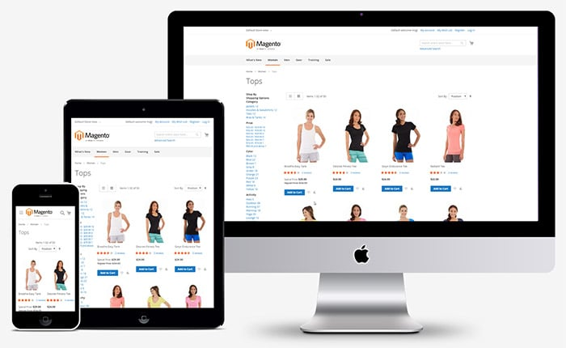

# Responsive web design

Responsive web design (RWD, also referred as *responsive design*) crafts websites to provide an optimal viewing experience across a wide range of devices (from large, high-resolution desktop computer monitors to mobile phones).

The out of the box Blank and Luma themes (Luma [inherits](../themes/inheritance.md) from Blank) use the mobile first RWD approach. It is ensured mostly by means of CSS and JavaScript.

The following image illustrates how the same page built on the Blank theme looks on mobile, tablet and desktop devices.

We recommend using the Blank theme, as a starting point for your customizations. That is, your custom theme should [inherit](../themes/inheritance.md) from Blank.

The articles in this chapter describe the particular approaches used in the Blank theme, and provide practical recommendations on how to use these approaches in your themes:

-  [CSS in responsive design]
-  [JavaScript in responsive design]
-  [Customizing RWD: illustration]
-  [Create a responsive mobile theme based on Blank]

## Terms used

Term | Description
------------ | -------------
*Breakpoint* | The width of the user's screen that causes your responsive layout to change.

[CSS in responsive design]: css.md
[JavaScript in responsive design]: js.md
[Customizing RWD: illustration]: practice.md
[Create a responsive mobile theme based on Blank]: mobile.md
