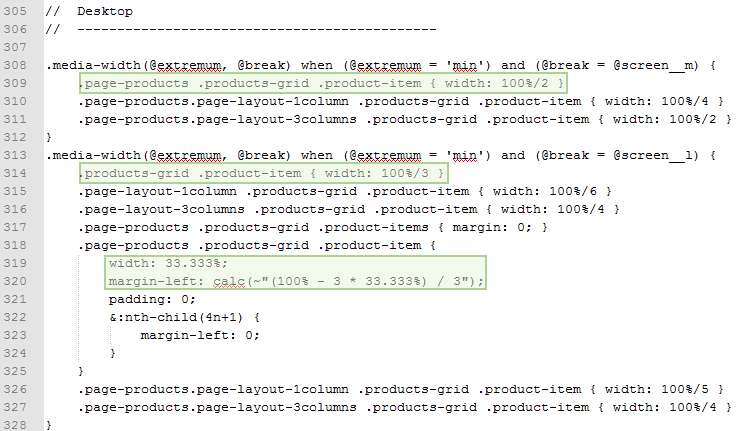

# Practice customizing responsive web design

This topic features a step-by-step illustration of how to change the number of products displayed in a row on a product page, keeping up with the responsive design approach used by out-of-the-box themes.

The described flow is applicable only for themes that [inherit](../themes/inheritance.md) from the out-of-the-box Blank or Luma [theme](https://glossary.magento.com/theme).

## Change the number of products in a row

ExampleCorp wants to make their products more visible by decreasing the quantity of products in a row displayed on a [catalog](https://glossary.magento.com/catalog) page, so that each product takes more space.

In the basic Blank theme, the number of products in a row for each breakpoint is the following (for the [2-column page layout](../layouts/types.md#page-layout)):

-  1024px and more (desktop): four products
-  768px (tablet): three products
-  640px and less (mobile): two products

In their custom Orange theme, ExampleCorp wants to have the least number of products in a row for the desktop and tablet view, namely:

-  Desktop: three products
-  Tablet: two products
-  Mobile: two products

The Orange theme inherits from the Blank theme.

To change the products quantity, ExampleCorp take the following steps:

1. Copy the [`/Magento_Catalog/web/css/source/module/_listings.less`] file.
1. Put it in the corresponding location in their Orange theme directory: `app/design/frontend/ExampleCorp/orange/Magento_Catalog/web/css/source/module/_listings.less`
1. Make the changes in the code. The following image illustrates which section of the file they change, the modified lines are highlighted:

After ExampleCorp [applies their theme](../themes/apply-storefront.md), the catalog page of their store looks like following:

(Compare to the [same page for the Blank theme](mobile.md).)

[`/Magento_Catalog/web/css/source/module/_listings.less`]: https://github.com/magento/magento2/blob/2.4/app/design/frontend/Magento/blank/Magento_Catalog/web/css/source/module/_listings.less
