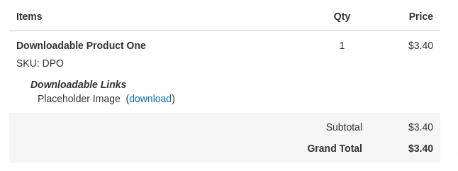

<InlineAlert variant="warning" slots="text"/>

Adobe Commerce and Magento Open Source 2.3.4 and above restricts the way that custom variables can be used within email templates.
See [Migrating custom email templates](email-migration.md) for more information.

# Email templates layout handle

In sales-related email templates (order, invoice, shipment, and credit memo templates), layout handles are used to render the ordered items and grand total sections.



For example, the `sales_email_order_items` layout handle is specified in `app/code/Magento/Sales/view/frontend/email/order_new.html`:

```html
{{layout handle="sales_email_order_items" order_id=$order_id area="frontend"}}
```

The `sales_email_order_items` handle is an XML file located in `app/code/Magento/Sales/view/frontend/layout/sales_email_order_items.xml`

```xml
<page xmlns:xsi="http://www.w3.org/2001/XMLSchema-instance" xsi:noNamespaceSchemaLocation="urn:magento:framework:View/Layout/etc/page_configuration.xsd" label="Email Order Items List" design_abstraction="custom">
    <update handle="sales_email_order_renderers"/>
    <update handle="sales_email_item_price"/>
    <body>
        <block class="Magento\Sales\Block\Order\Email\Items" name="items" template="Magento_Sales::email/items.phtml" cacheable="false">
            <block class="Magento\Framework\View\Element\RendererList" name="sales.email.order.renderers" as="renderer.list"/>
            <block class="Magento\Sales\Block\Order\Totals" name="order_totals" template="Magento_Sales::order/totals.phtml">
                <arguments>
                    <argument name="label_properties" xsi:type="string">colspan="2"</argument>
                </arguments>
                <block class="Magento\Tax\Block\Sales\Order\Tax" name="tax" template="Magento_Tax::order/tax.phtml">
                    <action method="setIsPlaneMode">
                        <argument name="value" xsi:type="string">1</argument>
                    </action>
                </block>
            </block>
        </block>
        <block class="Magento\Framework\View\Element\Template" name="additional.product.info" template="Magento_Theme::template.phtml"/>
    </body>
</page>
```
