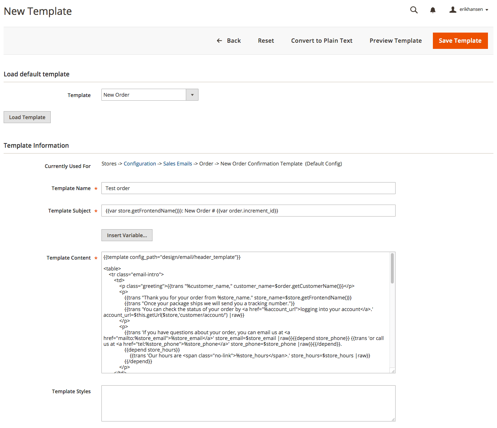
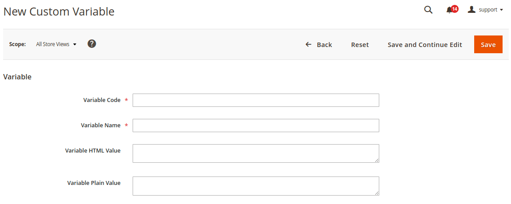
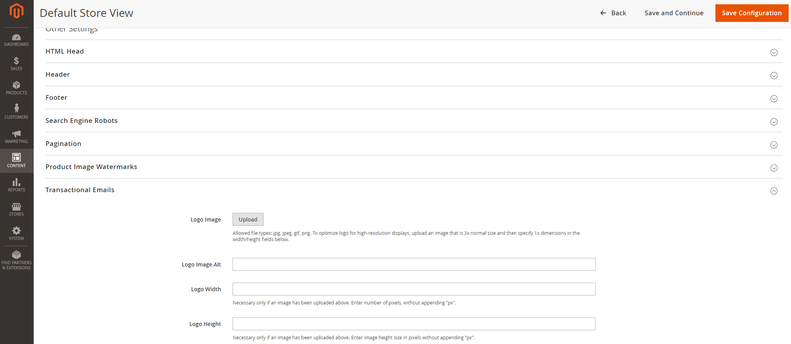
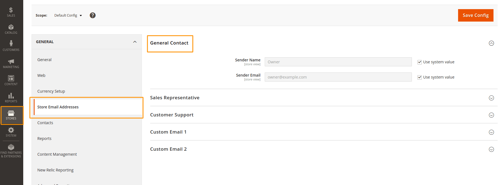

<InlineAlert variant="warning" slots="text"/>

Adobe Commerce and Magento Open Source 2.3.4 restricts the way that custom variables can be used within email templates.
See [Migrating custom email templates](email-migration.md) for more information.

# Email templates

Email templates are stored in the `<module_dir>/view/<area>/email` directory of their respective modules. For example, the template for the new order transactional email for the Sales module is located in [`<Magento_Sales_module_dir>/view/frontend/email/order_new.html`](https://github.com/magento/magento2/blob/2.4/app/code/Magento/Sales/view/frontend/email/order_new.html).

We strongly recommend you not change the default application files. If you want to customize the default templates, you should create your custom templates and configure the application to use them instead of the default templates.

You can add custom templates as physical files in your custom [theme](https://glossary.magento.com/theme) or create them using the [Admin](https://glossary.magento.com/magento-admin). Both approaches are described in the following sections.

### Theme-based customizations

Override email templates by creating templates in a new directory in your custom theme, using this pattern: `<theme_dir>/<ModuleVendorName>_<ModuleName>/email`. For example, to override the New Order email template, create a template named `order_new.html` in the `<theme_dir>/Magento_Sales/email` directory.

[Template fallback](../themes/inherit.md#) is supported for email templates, so parent themes of your current theme are searched for templates.

### Admin-based customizarions

Any templates configured in the [Admin](https://glossary.magento.com/admin) take precedence over default or theme-based templates.

1. In the Admin, navigate to **MARKETING** > Communications > **Email Templates**
1. Click **Add New Template**.
1. If you want to use a default template as a starting point, in the **Load default template** section, choose the template and click **Load Template**. The path to the configuration settings for each default template displays in the **Currently Used For** field in the Template Information section.

   Make note of this path because you will need it later when you configure this new template to be used instead of the default template.

   

1. In **Template Name**, enter a name to identify the template in the Admin.
1. In **Template Subject**, add plain text to use as the Subject of the emails sent using the template you create. This field can contain system variables.
1. Customize template content. For details, see [the section on customizing content](#customize-email-content).
1. In **Template Styles**, optionally add CSS styles for the template. These styles are added inside of a `<style>` tag in the `<head>` of the email. Typically, you'll use the [Less files](#styles-for-email-templates) to make style changes to emails because some email clients don't support styles in `<style>` tags.
1. Click **Save Template**.
1. Now that you have created a template, you must configure that template to be used:

   1. If you haven't done so already, log in to the Admin as an administrator.
   1. Click **STORES** > Settings > **Configuration** > SALES > **Sales Emails**.
   1. In the left pane, locate the section that contains the template you want to override. This is the section referenced by **Currently Used For** in your new template. (See step 3 earlier in this section.)

      For example, if you created a "New Order" template, the configuration section is **Order** as the following figure shows.

      

   1. Select your newly created template from the list.
   1. Click **Save Config**.

### Customize header and footer templates

Every frontend email template includes a header and footer template using these two directives: `{{template config_path="design/email/header_template"}}` and `{{template config_path="design/email/footer_template"}}`. By default, those two directives load contents from these files:

*  [`<Magento_Email_module_dir>/view/frontend/email/header.html`](https://github.com/magento/magento2/blob/2.4/app/code/Magento/Email/view/frontend/email/header.html)
*  [`<Magento_Email_module_dir>/view/frontend/email/footer.html`](https://github.com/magento/magento2/blob/2.4/app/code/Magento/Email/view/frontend/email/footer.html)

You can customize header and footer templates using either the [theme](#customize-email-templates) or [admin](#customize-email-content) customization methods discussed previously.

### Customize email content

<InlineAlert variant="warning" slots="text"/>

Custom variables used within email templates in Adobe Commerce and Magento Open Source 2.3.4+ must be written in 'strict mode'.
See [Migrating custom email templates](email-migration.md) for more information.

To add the store and sales related information to a template, use system variables.

System variables are placeholders which are replaced by particular values when the actual email is generated. For example, the Store Hours (`{{config path="general/store_information/hours"}}`) variable is replaced by the value set in the **STORES** > Settings > **Configuration** > GENERAL > **General** > **Store Information** section.


You may also create your own custom variables and set their values in the Admin, under **SYSTEM** > Other Settings > **Custom Variables**.



To add a variable to your template content:

1. In the Admin, navigate to **MARKETING** > Communications > **Email Templates**
1. Create a new template or edit an existing template.
1. Click to place the cursor in the text in which to insert the variable.
1. Click **Insert Variable**. A pop-up containing a list of variables opens, including custom variables. The variables in the **Store Contact Information** are available in all email templates whereas the variables in the **Template Variables** section are specific to the template you are editing and the extensions you may have installed. The following figure shows an example:

   

1. Click the name of the required variable. The variable code is inserted in the template content.

<InlineAlert variant="info" slots="text"/>

The selection of available variables depends on which template you use as a basis. The template-specific variables are contained in a `<!--@vars @-->` comment at the top of each template on the file system. (For example, look at [app/code/Magento/Customer/view/frontend/email/account_new.html](https://github.com/magento/magento2/blob/2.4/app/code/Magento/Customer/view/frontend/email/account_new.html#L8).

## Styles for email templates

Some email clients (for example, Gmail) support only CSS styles that have been applied as "inline" styles on the `style` attribute of HTML tags. Because of this, the majority of email styles are applied as inline styles. Inline styling is provided by the [Emogrifier](https://github.com/jjriv/emogrifier)Emogrifier library, which takes the HTML and CSS and adds all of the CSS styles to `style` attributes of the HTML tags.

### Inline styles

The `<Magento_Email_module_dir>/view/frontend/email/header.html` file contains an `inlinecss` directive:

```html
{{inlinecss file="css/email-inline.css"}}
```

The `inlinecss` directive tells the application which files to apply as inline styles on the email template.

For example, say an email is being sent from a store configured with the Luma theme. The `inlinecss` directive first looks for a `email-inline.less` file in `<Magento_Luma_theme_dir>/web/css/email-inline.less`. However because that file does not exist, it will fall back to the `<Magento_Blank_theme_dir>/web/css/email-inline.less` file. The contents of that file will then be compiled and its contents are applied as inline styles to the email template.

Refer to the [Emogrifier README](https://github.com/jjriv/emogrifier#supported-css-selectors) to see what CSS selectors are supported.

### Non-inline styles

Non-inline styles for emails come from global and template-specific styles, as described in the following sections.

#### Global non-inline styles

While the majority of styles should be applied inline, there are certain CSS styles that cannot be applied inline, such as media queries or `:hover` pseudo styles. These styles must be in a `<style type="text/css"></style>` tag for them to work.

The `<Magento_Email_module_dir>/view/frontend/email/header.html` file contains a `css` directive inside of a `<style>` tag:

```html
<style type="text/css">
    {{var template_styles|raw}}

    {{css file="css/email.css"}}
</style>
```

The `css` directive compiles the contents of the provided file and outputs it.

For example, say an email is being sent from a store configured with the Luma theme. The `css` directive first looks for an `email.less` file in `<Magento_Luma_theme_dir>/web/css`. However, because the file does not exist there, it falls back to `<Magento_Blank_theme_dir>/web/css/email.less`. The contents of that file are compiled and its contents output in the `<style>` tag.

#### Template-specific non-inline styles

As mentioned in the preceding section, the `header.html` file outputs the `{{var template_styles|raw}}` variable.

The value of that variable comes from any of the following:

*  Any styles you add to any `html` email template inside a comment block, like in the following example, are included in the `template_styles` variable:

```html
 <!--@styles
   .example-style { color: green; }
 @-->
```

*  If you customize transactional emails using the Admin, you can add CSS styles to the **Template Styles** field to include those styles in the `template_styles` variable.

### How email styles are organized

The styles for emails are split into several different files.

When implementing a custom theme, you should be able to fully customize email templates by copying the `<Magento_Blank_theme_dir>/web/css/source/_email-extend.less` and `<Magento_Blank_theme_dir>/web/css/source/_email-variables.less` files to your custom theme and editing those files.

### Custom fonts

Emails inherit the custom fonts that are defined by the frontend theme. The Blank theme uses the **Open Sans** font. Because **Open Sans** is not a standard system font, `@font-face` rules are used to include web fonts.

|File|Description|
|--- |--- |
|`<Magento_Blank_theme_dir>/web/css/email.less`|Imports necessary files and then outputs styles to be included in `<style>` tag|
|`<Magento_Blank_theme_dir>/web/css/email-fonts.less`|Contains `@font-face` declarations for custom fonts. This file is imported by the `_email-extend.less` file using an `@import` rule.|
|`<Magento_Blank_theme_dir>/web/css/email-inline.less`|Imports necessary files and then outputs styles to be inlined|
|`<Magento_Blank_theme_dir>/web/css/source/_email-base.less`|Contains majority of styles for emails, including resets, layout, typography, and so on. Review the comments at the top of this file to understand how the styles in this file are split between the email.less and `email-inline.less` files.|
|`<Magento_Blank_theme_dir>/web/css/source/_email-extend.less`|This file is intended to be copied into your custom themes and edited directly. You can add new email styles or override existing ones. This should prevent having to copy the `_email-base.less` file into your custom theme. See the `<Magento_Luma_theme_dir>/web/css/source/_email-extend.less` file for example usage.|
|`<Magento_Blank_theme_dir>/web/css/source/_email-variables.less`|The `_email-base.less` file uses a number mixins from the UI library. If you want to change any of the styles output by those mixins, you can set the value of any of the variables those mixins uses in this file. See the `<Magento_Luma_theme_dir>/web/css/source/_email-variables.less` file for example usage.|
|`<Namespace>_<Module>/web/css/source/_email.less`|Styles that are specific to modules are stored in these files. This mechanism also allows third-party extensions to include styles that will get included in the inline/non-inline output.|
|l`ib/web/css/source/_email-variables.less`|Same as `<Magento_Blank_theme_dir>/web/css/source/_email-variables.less`|
|`lib/web/css/source/lib/variables/_email.less`|Contains new email-specific variables that can be overridden in a theme-specific `_email-variables.less` file.|

Here is an overview of how the font structure for emails works:

*  [`<Magento_Blank_theme_dir>/web/css/source/_email-extend.less`](https://github.com/magento/magento2/blob/2.4/app/design/frontend/Magento/blank/web/css/source/_email-extend.less) contains the `@import` directive that requests the `email-fonts.css` file.

   The reason the contents of `email-fonts.css` are loaded using `@import` rather than being output directly into a `<style>` tag in the `<head>` of an email is that if a user is reading their email offline, some email clients don't render the text because the web fonts can't be loaded.

*  The `<Magento_Blank_theme_dir>/web/css/email-fonts.less` file imports `source/_variables.less` and `source/_typography.less` files:

   *  [app/design/frontend/Magento/blank/web/css/source/_variables.less](https://github.com/magento/magento2/blob/2.4/app/design/frontend/Magento/blank/web/css/source/_variables.less) defines which font is used in the `@font-family-name__base` variable.
   *  [app/design/frontend/Magento/blank/web/css/source/_typography.less](https://github.com/magento/magento2/blob/2.4/app/design/frontend/Magento/blank/web/css/source/_typography.less) generates the `@font-face` rules which import the custom fonts.

If you want to change the font used for emails, do the following:

1. Refer to the documentation on [using fonts](../css/fonts.md) for details on how to add a new font.
1. After you've added a new font and have updated the `source/_variables.less` and `source/_typography.less` files for your custom theme to refer to the new font, the emails should automatically use the specified font.

## Email logo

You can add a logo to emails by adding it to your theme or by uploading it in the Admin.

Because email clients do not support vector-based formats such as Scalable Vector Graphics (SVG), you must prepare a logo in a standard web format: JPG, GIF, or PNG. There is a maximum file size of 2 MB, but this can be changed by an admin. Because emails are viewed on devices with a broad range of pixel densities, you should use a logo that is 3&times; the size that you actually want it to display. For example, let's say your email has a 200px &times; 100px area for the logo. The logo image should be 600px &times; 300px.

If you do not have access to a high-resolution version of your logo, you can upload a normal-resolution image. For example, if your logo image is 200px &times; 100px, specify `200` for the width and `100` for the height.

### Theme-based customizations

To customize your logo using a theme:

1. Add a file named `logo_email.png` to a `Magento_Email/web` directory in your custom theme.

   For example, if the ExampleCorp vendor wants to add a logo for their custom Orange, they must add a file in the `app/design/frontend/ExampleCorp/orange/Magento_Email/web` directory.

1. Copy the `<Magento_Email_module_dir>/view/frontend/email/header.html` file into a `Magento_Email/email` directory in your theme.

   For example, the ExampleCorp vendor would copy the file to this location: `app/design/frontend/ExampleCorp/orange/Magento_Email/email/header.html`

   Edit the `width` and `height` attributes of the `` tag to reflect the area in which you want your logo to display (for example, 200 &times; 100).

   Example:

   ```html
   {{if logo_width}}
       width="{{var logo_width}}"
   {{else}}
       width="200"
   {{/if}}

   {{if logo_height}}
       height="{{var logo_height}}"
   {{else}}
       height="100"
   {{/if}}
   ```

   You should leave the if/else conditional statement in place in case you ever want to override these values using the Admin.

### Admin-based customizations

1. In the Admin, navigate to **CONTENT** > Design > **Configuration**. A Design Configuration page opens. It contains a grid with the available configuration scopes.
1. In the configuration record corresponding to your store view, click **Edit**.
1. Under **Transactional Emails** in the **Logo Image** field upload your logo and specify the alternative text for it.

   

1. Enter values for **Logo Width** and **Logo Height**. Based on the preceding example, you would enter `200` and `100`, respectively.

1. Click the **Save Configuration** button.

## Contact information

Emails can output your store name, store email address, store phone number, and store hours of operation if those values are configured in the Admin.

To set those values:

1. To set the store name, phone number, and hours of operation:
   1. In the Admin, navigate to **STORES** > Settings > **Configuration** > GENERAL > **General** > **Store Information**
   1. Input values into the **Store Name**, **Store Phone Number**, and **Store Hours of Operation** fields.
   1. Note: The **Store Phone Number** and **Store Hours of Operation** fields are optional.
   1. Click the **Save Config** button.

   

1. To set the store email:
   1. In the Admin, navigate to **STORES** > Settings > **Configuration** > GENERAL > **General** > **Store Email Addresses** > **General Contact**
   1. Input values into the **Sender Name** and **Sender Email** fields.
   1. Click the **Save Config** button.

   

The sales emails are configured to display all of the above values, if they're configured in the admin. If you want to add those values to other email templates, you can use the following variables:

```text
{{var store.getFrontendName()}}
{{var store_email}}
{{var store_phone}}
{{var store_hours}}
```

## Localization

In order to support the translation of content, all strings in emails are output using the `trans` directive. Example:

```html
{{trans "Thank you for your order from %store_name." store_name=$store.getFrontendName()}}
{{trans "Once your package ships we will send you a tracking number."}}
```

The `trans` directive will translate strings into whatever locale is configured for the store from which the email is being sent. For example, if an email is being sent from a store view that is configured to use the `fr_FR` locale, the emails are translated to French.

The directive supports multiple named parameters, separated by spaces. For example:

```html
{{trans "Dear %first_name %last_name," first_name=$first_name last_name=$last_name}}
```

Please note, that variable assignment must not contain spaces.

Correct:

```html
{{trans "Thank you for your order from %store_name." store_name=$store.getFrontendName()}}
```

Incorrect:

```html
{{trans "Thank you for your order from %store_name." store_name = $store.getFrontendName()}}
```

<InlineAlert variant="info" slots="text"/>

Exception: argument value can contain spaces if it is enclosed in brackets.

## Supported email clients and devices

We test responsive emails using a combination of real devices and [Litmus](http://litmus.com/). Due to the greatly varied level of support among email clients for modern web technologies, not all email clients rendered the emails perfectly.
We strive to support all current, modern e-mail clients. Let us know about any client-specific issues you might have.

## Newsletter templates

The focus of this article is on transactional emails but the same techniques can be used with newsletter templates as well, including:

*  Import the header and footer using `{{template config_path="design/email/header_template"}}` and `{{template config_path="design/email/footer_template"}}`
*  Apply inline styles using `{{inlinecss file="css/email-inline.css"}}`
*  Include non-inline styles using `{{css file="css/email.css"}}`
