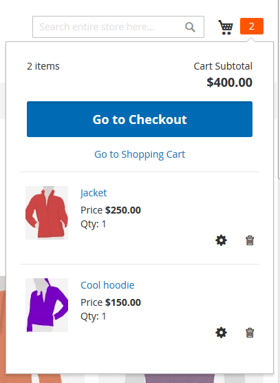
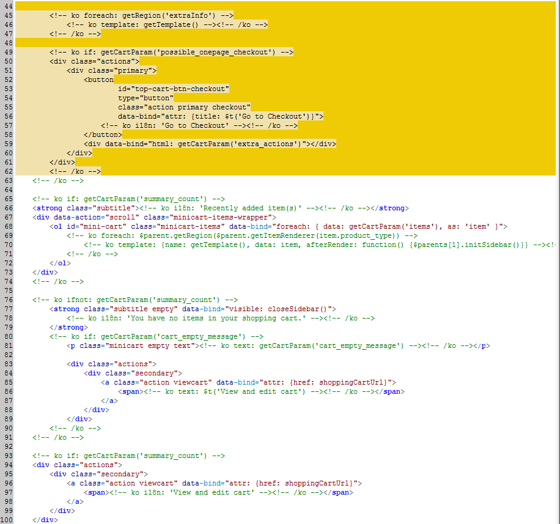
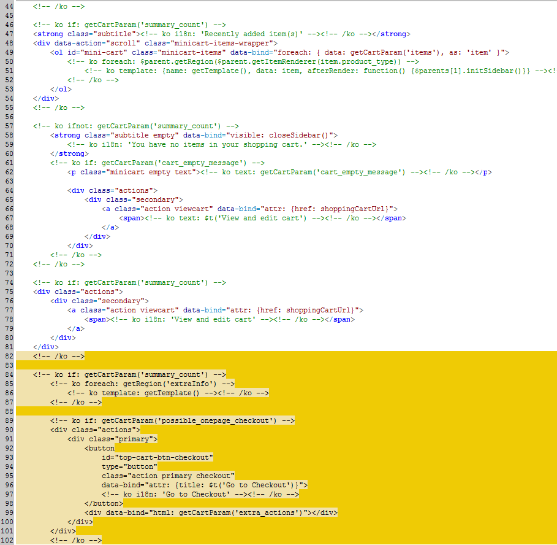
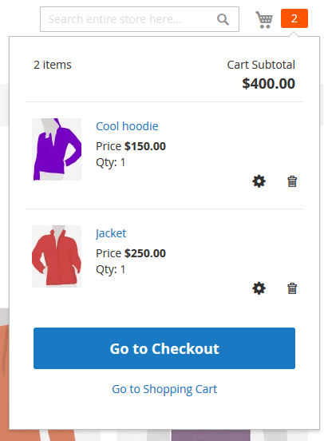

# Tempalte customization example

This topic contains a step-by-step guide to solving a typical design customization task using templates.

## Change the mini shopping cart layout

In the basic Blank theme, in the mini shopping cart, products are listed under the **Go to Checkout** button, like following:

ExampleCorp decided they want to change this and display the product list before the **Go to Checkout** button.

The template responsible for displaying the mini-shopping cart items and controls is [`<Magento_Checkout_module_dir>/view/frontend/web/template/minicart/content.html`](https://github.com/magento/magento2/blob/2.4/app/code/Magento/Checkout/view/frontend/web/template/minicart/content.html).
Here is the part of the code ExampleCorp worked with:

They created a new Orange theme and copied the `content.html` to the theme directory:
`app/design/frontend/ExampleCorp/orange/Magento_Checkout/web/template/minicart/content.html`.

In their copy of the templates, they changed the order of the blocks as follows:

When the Orange theme was applied, the mini shopping cart with products looked like the following:

