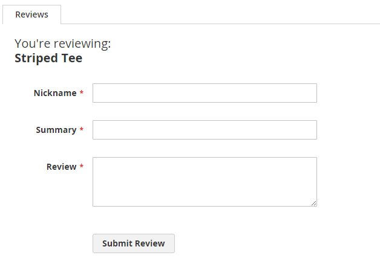
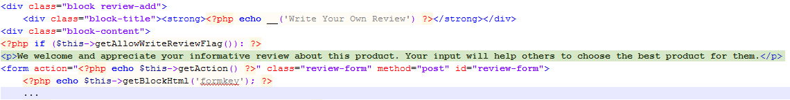
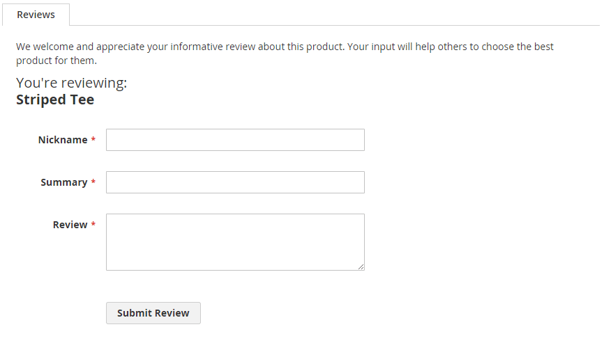

# Template customization walkthrough

This topic walks you through how to customize a template.

## Prerequisites

[Set](https://devdocs.magento.com/guides/v2.4/config-guide/cli/config-cli-subcommands-mode.html) your application to the developer [mode](https://devdocs.magento.com/guides/v2.4/config-guide/bootstrap/magento-modes.html). The application mode influences the way [static files](https://glossary.magento.com/static-files) are cached by the application. The recommendations about [theme](https://glossary.magento.com/theme) development we provide in this chapter are developer/default-mode specific.

## Template customization walkthrough

To customize a template:

1. Locate the template which is associated with the page/block you want to change using [template hints](../themes/debug.md#templates).

1. Copy the template to your theme folder according to the [template storing convention](override.md#template-location).

1. Make the required changes.

To add a new template in a theme:

1. Add a template in your theme directory according to the template storing convention.

1. Assign your template to a block in the [corresponding layout file](override.md#how-templates-are-initiated).

<InlineAlert variant="success" slots="text"/>

If you add a new `.html` template, and then edit it, the changes will not apply until you delete all files in the `pub/static/frontend` and `var/view_preprocessed` directories and reload the pages. You can delete the files manually or run the `grunt clean:<theme_name>` command in CLI. For details about using Grunt, see [Installing and configuring Grunt](../css/debug.md).

## Walkthrough illustration: adding a message to the customer review form

A small customization to illustrate the walkthrough: in their Orange theme, the ExampleCorp company wants to add a short text to the product review form to encourage customers to write reviews.

The following image illustrates how the default review form looks like:

To add the text, ExampleCorp needs to override the default review form template in the Orange theme.

First, they copy the `form.phtml` template from `<Magento_Review_module_dir>/view/frontend/templates` to the corresponding subdirectory in the Orange theme directory: `app/design/frontend/ExampleCorp/orange/Magento_Review/templates`.

In the theme `form.phtml` file they add the HTML snippet with the message before the `<form>`:

Here's how the form will look when the Orange theme is applied in a store:

