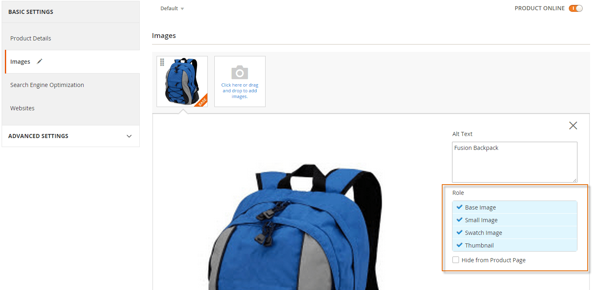

# Configure theme properties

The properties of product images used on the storefront are stored in the `view.xml` configuration file. This topic provides all details about what properties are available and how to configure them.

The properties for the images displayed on the product pages are defined by the gallery widget options. The options of the widget can be configured in the theme `view.xml` as well. For more details, view the [Gallery widget](../../javascript/jquery-widgets/gallery.md) topic.

## Configure image properties

The conventional location of `view.xml` for a theme is:

```text
<theme_dir>/etc/view.xml
```

For example, here is the `view.xml` of the Blank theme: [`app/design/frontend/Magento/blank/etc/view.xml`](https://github.com/magento/magento2/blob/2.4/app/design/frontend/Magento/blank/etc/view.xml).

In `view.xml`, image properties are configured in the scope of `<images module="Magento_Catalog">` element:

```xml
<media>
    <images module="Magento_Catalog">
    ...
    </images>
</media>
```

Image properties are configured for each image type defined by the `id` and `type` attributes of the `<image>` element:

```xml
<images module="Magento_Catalog">
   <image id="unique_image_id" type="image_type">
   ...
   </image>
</images>
```

The following table describes the attributes in detail:

|Attribute|Type| Description                                                                                                                                                                                                                                                                                                                                                                                                                                                   |
|--- |--- |---------------------------------------------------------------------------------------------------------------------------------------------------------------------------------------------------------------------------------------------------------------------------------------------------------------------------------------------------------------------------------------------------------------------------------------------------------------|
|`id`|string| Image identifier. Unique in the scope of theme.\<br /\>Can have any value, but in out-of-the-box themes, the `id` is meaningful and describes the location of an image.\<br /\>For example, the `id` value for images of cross-sell products displayed in a shopping cart is `cart_cross_sell_products`.\<br /\>`id` is used in `.phtml` templates for defining the type and properties of images displayed in each particular location on a particular page. |
|`type`|string| The type of the images defined by the specified `id`. Allowed values:\<br /\>`image` - corresponds to the Base Image role in the Admin\<br /\>`small_image` - corresponds to the Small Image role in the Admin\<br /\>`swatch_image` - corresponds to the Swatch Image role in the Admin\<br /\>`swatch_thumb` - corresponds to the Swatch Image role in the Admin.\<br /\>`thumbnail` - corresponds to the Thumbnail Image role in the Admin                 |

The following picture illustrates how image roles for product images are specified in the Admin:


Image properties are defined by the corresponding elements, for example:

```xml
<images module="Magento_Catalog">
    <image id="unique_image_id" type="image">
        <width>100</width> <!-- Image width in px -->
        <height>100</height> <!-- Image height in px -->
    </image>
</images>
```

All image properties used in `view.xml` should be listed in the order shown here to prevent a **"This element is not expected."** frontend error. The following table contains the list of all properties which can be configured:

| Element | Type | Description | Required |
| --- | --- | --- | --- |
| `width` | integer | Image width in pixels. | Optional |
| `height` | integer | Image height in pixels. | Optional |
| `constrain` | boolean | If set to `true`, images that are smaller than required by the configuration, are not enlarged. Default value: `true`. | Optional |
| `aspect_ratio` | boolean | If set to `true`, proportions of images are not changed even if required by the configuration. Default value: `true`. | Optional |
| `frame` | boolean | If set to `true`, images are not cropped. Default value: `true`. Applied only if `aspect_ratio` is set to `true`. | Optional |
| `transparency` | boolean | If set to `true`, the transparent background of images is saved. If is set to `false`, images have the white background (by default). You can set the color for the background using the `background` parameter. Default value: `true`. | Optional |
| `background` | string | The color for the images background. Not applied to images with transparency, if `transparency` is set to `true`. Format: "[, ,]", e.g.: "[255, 255, 255]". | Optional |

<InlineAlert variant="warning" slots="text"/>

Due to area emulation, emails will ignore `etc/view.xml` configuration files in themes - instead only `etc/view.xml` configurations defined in modules are applied to emails.

### Resize catalog images

Generally, product images are cached while saving the product. However, the `magento catalog:images:resize` command enables you to resize all images for display on your storefront. Situations where this could be necessary might be:

*  After you import products, which might have images of various sizes
*  If images were resized or deleted manually from cache

Each image assigned to a product must be resized in accordance with image metadata defined in a module's [`view.xml`](create-storefront.md#configure-images) configuration file. After resizing an image, its resized copy is stored in the cache (`/pub/media/catalog/product/cache` directory). The application serves storefront images from cache.

Command usage:

```bash
bin/magento catalog:images:resize
```

This command supports synchronous (default) and asynchronous modes.  Asynchronous means that images will not be processed immediately on command execution. Using the queue functionality, these images will be scheduled for resizing and then processed in the background. To enable asynchronous mode, use the `-a` or `--async` option.

The message `Product images resized successfully` displays after the command has finished.

To speed up the job while in asynchronous mode, you may manually run several instances of a consumer with the command in each instance:

```bash
bin/magento queue:consumer:start media.storage.catalog.image.resize
```

## Configure variables

The variable properties `vars` are configured for each module individually, defined by `module` name.

```xml
<vars module="Magento_Catalog">
    <var name="breakpoints">
        <var name="mobile">
            <var name="conditions">
                <var name="max-width">767px</var>
            </var>
            ...
        </var>
    </var>
    ...
</vars>
```

Any block that extends [`AbstractBlock`](https://github.com/magento/magento2/blob/2.4/lib/internal/Magento/Framework/View/Element/AbstractBlock.php), can fetch variable values with the `getVar` method:

```php
$block->getVar($name, $module = null)
```

| Parameter | Required | Description |
| --- | --- | --- |
| `name` | `Yes` | The first level variable name |
| `module` | `No` | The module name where the variable is added. If not passed, it will be determined automatically based on the current module. |

Check the following example on getting the breakpoints variable by the [`Gallery`](https://github.com/magento/magento2/blob/2.4/app/code/Magento/Catalog/Block/Product/View/Gallery.php) block:

```php
/**
 * Return breakpoints options
 *
 * @return string
 */
public function getBreakpoints()
{
    return $this->jsonEncoder->encode($this->getVar('breakpoints'));
}
```

<InlineAlert variant="info" slots="text"/>

Variables may be used within the scope of modules than the defined one.
