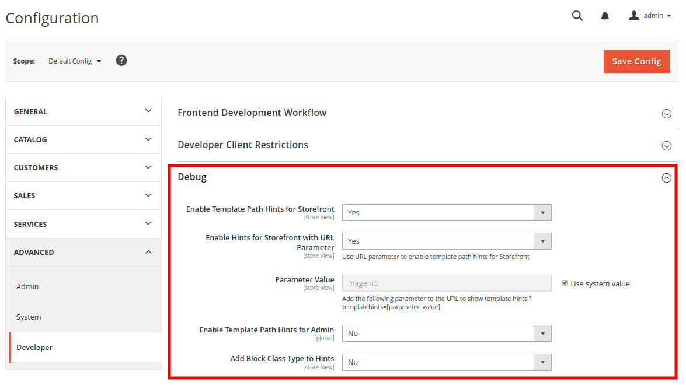
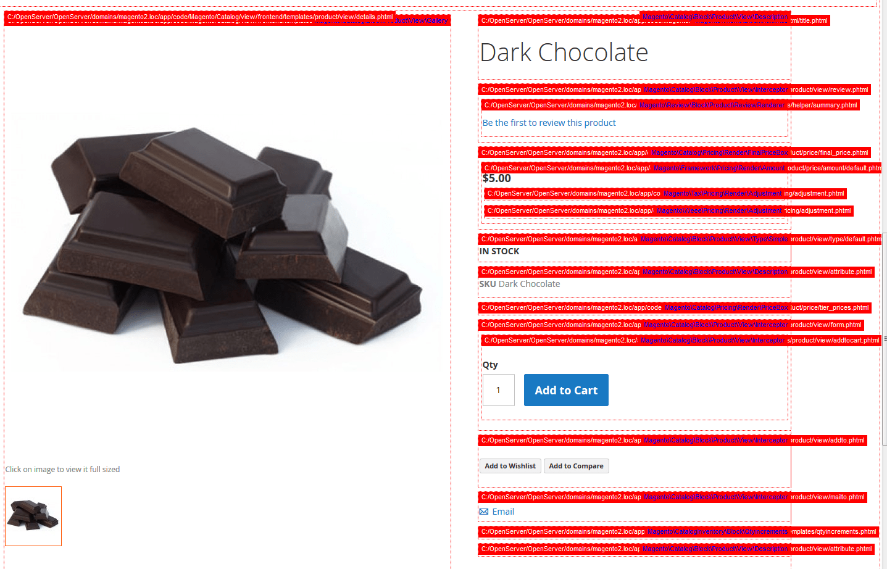
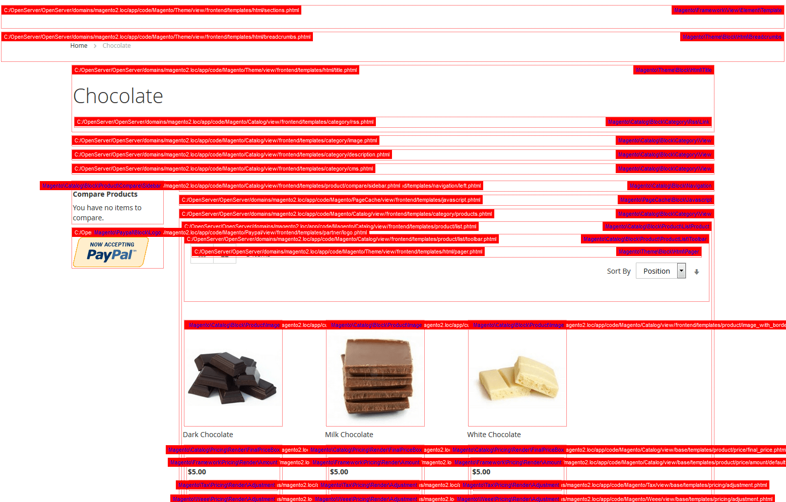
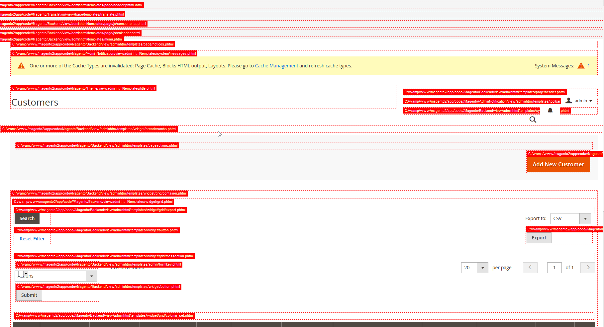

# Locate templates, layouts, and styles

When you create a theme, you might need to create override files for default [theme](https://glossary.magento.com/theme) and [module](https://glossary.magento.com/module) view files. To do so, you must determine which template, layout, and style files that the application uses. This topic describes how to do this.

## Templates

To locate the template that is responsible for a specific part of the [storefront](https://glossary.magento.com/storefront) or Admin, you can use built-in template hints.

To enable template hints:

1. Click **Stores** > Settings > **Configuration** > ADVANCED > **Developer**.

1. In the **Scope:** dropdown in the upper-left corner select the view for which you want the template hints.

1. In the **Debug** tab, set **Template Path Hints for storefront** to **Yes**. To enable path hints for [Admin](https://glossary.magento.com/admin) set **Template Path Hints for Admin** to **Yes**.
1. To save the changes, click **Save Config** in the upper-right corner.



<InlineAlert variant="info" slots="text"/>

You can also use the CLI to enable/disable template hints.

Use the `bin/magento dev:template-hints:enable` command to enable template hints and the `bin/magento dev:template-hints:disable` command to disable them. Do not forget to clear the cache after running the commands. For example:

```bash
bin/magento dev:template-hints:enable
Template hints enabled.
```

```bash
bin/magento cache:clean config full_page
```

Now that you have enabled template hints, reload the page that you want to modify. If you enabled hints for storefront with URL Param, reload the page with the param `?templatehints=magento` in the URL and review the path for the template file or files that the template hints show.
Here is an example of a storefront [category](https://glossary.magento.com/category) page with template hints enabled:



In this example, the mini [shopping cart](https://glossary.magento.com/shopping-cart) page element is defined by the `<Magento_Checkout_module_dir>/view/frontend/templates/cart/minicart.phtml` template:


(the template name is above the element)

Here is how the Customers page looks with template hints enabled in the Admin:



Alternatively, you can perform a text search in the file system by using system generated titles, [CSS](https://glossary.magento.com/css) class names, block titles, labels, or links text as search terms.
For example, using a browser debug tool, you can define that the minicart block css class is `minicart-wrapper`.


A search through the app directory for occurrences of "minicart-wrapper" in `.phtml` files returns the `app/code/Magento/Checkout/view/frontend/templates/cart/minicart.phtml` template.

Since it is not recommended to edit the default files, you need to add overriding files if you want to customize the template. For details about overriding templates please refer to [Customizing Theme Template](../templates/walkthrough.md).

## Layouts

Just like templates, layouts are saved on a per-module basis. You can easily locate the [layout](https://glossary.magento.com/layout) file by determining in which module the templates for the element you are interested in reside in.

After you have determined the module, you can search for the layout in the following locations:

1. `<current_theme_dir>/<Namespace>_<Module>/layout/`
1. `<parent_theme(s)_dir>/<Namespace>_<Module>/layout/`
1. `<module_dir>/view/frontend/layout/`
1. `<module_dir>/view/base/layout/`

There is no straightforward algorithm how to define at once the exact layout file, but in most cases layout file names are self descriptive. Also you can search them for mentions of the corresponding templates.

Example:

Let's say you need to locate the layout that is responsible for displaying mini shopping cart on the storefront, when the Blank theme is applied for the [store view](https://glossary.magento.com/store-view).

Using the Template Hints we determine that the template is `app/code/Magento/Checkout/view/frontend/templates/cart/minicart.phtml`, and in the path, we see that it belongs to the `Magento_Checkout` module.

Let's search for the layout following the fallback scheme:

1. Check the `app/design/frontend/Magento/blank/Magento_Checkout/` layout. To locate the required layout, search this directory for occurrences of the template name, " minicart.phtml ". No matching file is found, so we proceed to the next fallback level, which is the parent theme layouts.
1. We can find the info about parent theme in a theme configuration file `theme.xml`, the parent theme name is specified there in the `<parent></parent>` node. In the `app/design/frontend/Magento/blank/theme.xml` there's no `<parent>` node, which means the Blank theme has no parents. So we should search on the next fallback level which is the module layouts.
1. The Magento_Checkout layouts are located in `app/code/Magento/Checkout/view/frontend/layout/`. After searching this directory for occurrences of "`minicart.phtml`", we define that the layout we are looking for is `app/code/Magento/Checkout/view/frontend/layout/default.xml`.

After you located the necessary layout file, you can create your custom layout file with the corresponding name in your theme folder to add [extending](../layouts/extend.md) or [overriding](../layouts/override.md) content. Please see [Customizing Theme Layouts](../layouts/index.md) for more details.

## Styles

To locate a CSS rule that is applied to a certain element, find the template for the page that contains the element. Or you can use browser debugging tools, to locate the class name.
After you find the class name, use text search in the theme and module styles directories to locate the `.less` or `.css` file that defines the class. Perform the search according to the following fallback scheme:

1. Theme styles `<current_theme_dir>/web/css/`
1. Module theme styles `<current_theme_dir>/<Namespace>_<Module>/web/css/`
1. Parent theme styles `<parent_theme_dir>/web/css/`
1. Parent theme Module styles `<parent_theme_dir>/<Namespace>_<Module>/web/css/`
1. Module styles for the `frontend` area `<module_dir>/view/frontend/web/css/`
1. Module styles for the `base` area `<module_dir>/view/base/web/css/`

Example:

Let's find the file defining on the CSS classes used for displaying the mini shopping cart on the storefront, when the Blank theme is applied for the store view.

In the mini shopping cart template `app/code/Magento/Checkout/view/frontend/templates/cart/minicart.phtml` the top level element has `minicart-wrapper` class.

So, let's search for occurrences of "`minicart-wrapper`" in according to the fallback scheme:

1. Search in `app/design/frontend/Magento/blank/web/css`, the search returns no results.
1. Search in `app/design/frontend/Magento/blank/Magento_Checkout/web/css`.The "`minicart-wrapper`" style is defined in `app/design/frontend/Magento/blank/Magento_Checkout/web/css/source/module/_minicart.less`

After you determine which `.css` or `.less` file defines the class, you can override the default class definition in your custom `.css` or `.less` files.  For details, see [CSS in themes](../css/themes.md).
