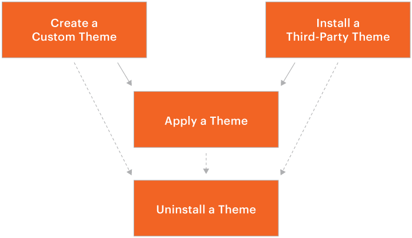

## Themes overview

A *theme* is a component of application which provides a consistent look and feel (visual design) for entire application area (for example, [storefront](https://glossary.magento.com/storefront) or Sdmin) using a combination of custom templates, layouts, styles or images.

Themes are designed to override or customize view layer resources, provided initially by modules or libraries.

Themes are implemented by different vendors (frontend developers) and intended to be distributed as additional packages for the system similar to other components.

Out-of-the-box application provides two design themes: Luma, as a demonstration theme, and Blank as a basis for custom [theme](https://glossary.magento.com/theme) creation.

There are no restrictions on using the demonstration Luma theme for a live store, but if you want to customize the default design, you need to create a new theme. We strongly recommend not to change the default Luma and Blank theme files, because if you do edit the default files, your changes can be overwritten by the new version of the default files during upgrades.

Your new theme can be a standalone new theme, or it can inherit from the default or any other existing one. The theme inheritance concept implemented in the system allows you to change only certain theme files, and [inherit other required files from a parent theme](inherit.md).

## Themes flow

