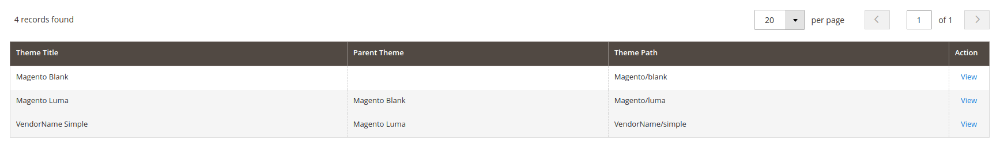

# Install a third-party storefront theme

This topic describes how to install a third-party theme for a store.

To install a theme, you need to add its code to your instance code base, and then register it in the database. The way a theme is distributed determines how to do this:

-  If a theme is just a set of files, for example an archive, add the theme manually.
-  If a theme is a Composer package, install it using Composer.

The following sections contain more information about each installation flow.

## Prerequisites

[Set](https://experienceleague.adobe.com/en/docs/commerce-operations/configuration-guide/cli/set-mode) your application to the developer or default [mode](https://experienceleague.adobe.com/en/docs/commerce-operations/configuration-guide/setup/application-modes).

## Manual install

To install a theme manually:

1. Make sure that the directory structure you are copying is `<VendorName>/<theme>`. And all the [theme files](structure.md) are in the `<theme>` directory.

1. Copy this directory to the `<installation dir>/app/design/frontend` directory.

## Composer install

To install the theme as composer package, follow the instructions in the [Install, manage, and upgrade modules](https://experienceleague.adobe.com/en/docs/commerce-on-cloud/user-guide/configure-store/extensions) topic.

-  Manually installed themes are stored in the `app/design/` directory. Themes loaded through Composer are located in the `vendor/` directory and can be stored anywhere in root.

-  When the application starts up, Composer executes each file included in the `autoload.files` section. `registration.php` then registers itself as a theme.

<InlineAlert variant="info" slots="text"/>

Composer-based themes are loaded from external sources and cannot be modified directly, whereas local themes are part of the project source code and therefore can be edited directly.

## Marketplace extension install

If a theme is distributed on [Commerce Marketplace](https://commercemarketplace.adobe.com/), see [Install the Extension](https://experienceleague.adobe.com/en/docs/commerce-operations/installation-guide/tutorials/extensions).

## Register a theme

After you create or install a theme, open the Admin or reload any Admin page. This way the theme gets registered and added to the database.

To make sure the theme is registered, in the Admin navigate to **Content** > **Design** > **Themes**. If a theme is registered, it is displayed in the list of available themes.

