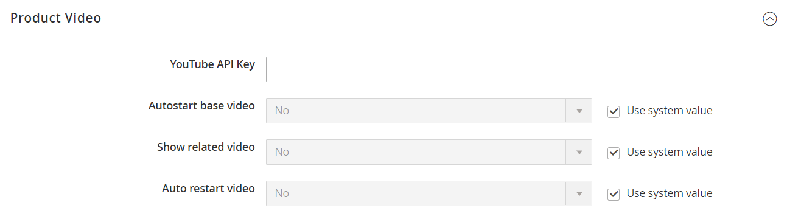

# Configure product video

You can add video from external resources (currently, from [YouTube](https://youtube.com) and [Vimeo](https://vimeo.com/)) on product pages. Video is [added in Admin](https://docs.magento.com/user-guide/catalog/product-video.html) when creating or editing a product.

Certain product video options can be set in the `config.xml` configuration file. These settings are not theme-specific.

## Programmatic options

You can set the following product video options:

|Option|Description|Type|Default|
|--- |--- |--- |--- |
|`play_if_base`|Play automatically on page load.|Boolean|0 (video is not played on page load)|
|`show_related`|Display related videos.|Boolean|0 (related videos are not displayed)|
|`video_auto_restart`|Auto re-play video.|Boolean|0 (video is not automatically replayed)|

You can configure these options in your custom [module's](https://glossary.magento.com/module) `config.xml` file.

Example:

```xml
<config xmlns:xsi="http://www.w3.org/2001/XMLSchema-instance" xsi:noNamespaceSchemaLocation="urn:magento:module:Magento_Store:etc/config.xsd">
    <default>
        <catalog>
            <product_video>
                <play_if_base>1</play_if_base>
                <show_related>1</show_related>
                <video_auto_restart>1</video_auto_restart>
            </product_video>
        </catalog>
    </default>
</config>
```

For the sake of compatibility, upgradability and easy maintenance, do not edit the default code. Instead add your customizations in a separate module.

## Admin options

1. On the _Admin_ sidebar, go to **Stores** > _Settings_ > **Configuration**.

1. In the left panel, expand **Catalog** and choose **Catalog** underneath.

1. Expand the _Product Video_ section and uncheck the **Use system value** checkbox. Then change the configuration options.



1. When complete, click _Save Config_.

1. When prompted, refresh the cache.
