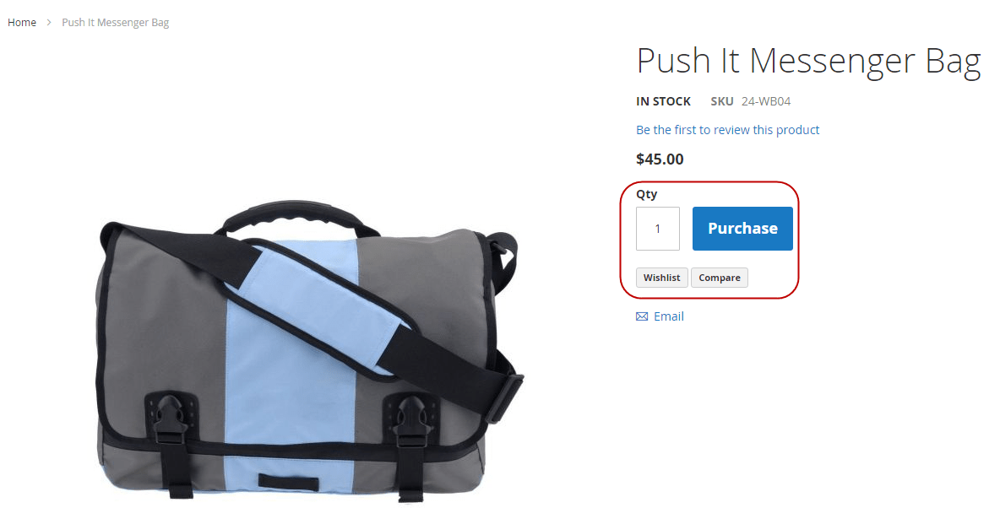
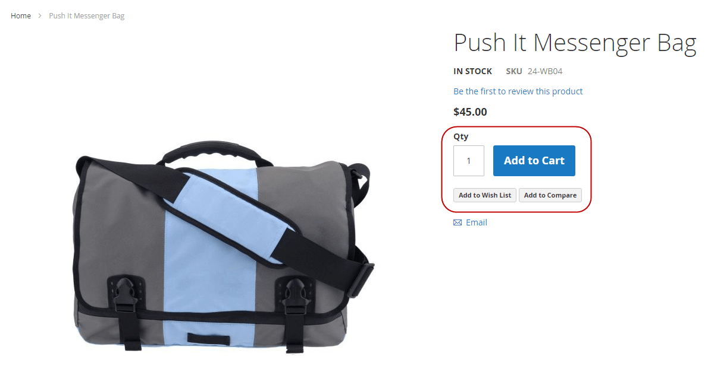

This topic is a step-by-step tutorial to create a default en_US [locale](https://glossary.magento.com/locale) [dictionary](dictionary.md) for a custom [theme](https://glossary.magento.com/theme).

## Changing default strings

ExampleCorp created a custom `orange` theme that inherits from the Blank theme. When customizing their theme, they want to rephrase certain strings used in the Blank theme and modules for the default locale.

Namely, they need the following changes:

-  Change **Add to Cart** label to **Purchase**.
-  Change **Add to Compare** label to **Compare**.
-  Change **Add to Wish List** label to **Wishlist**.

The following image shows a page where the current strings are used:



To override the strings, ExampleCorp plans to use the `en_US.csv` dictionary file.

1. Run the [i18n (internationalization) tool](https://devdocs.magento.com/guides/v2.4/config-guide/cli/config-cli-subcommands-i18n.html#config-cli-subcommands-xlate-dict) to generate the en_US dictionary for the `orange` theme:

   ```bash
   bin/magento i18n:collect-phrases --output="app/design/frontend/ExampleCorp/orange/i18n/en_US.csv" app/design/frontend/ExampleCorp/orange
   ```

1. Open the newly generated `app/design/frontend/ExampleCorp/orange/i18n/en_US.csv` file and add the following rows:

   ```text
   "Add to Cart", "Purchase"
   "Add to Compare", "Compare"
   "Add to Wish List", "Wishlist"
   ```

1. Run the `deploy` command to get localization changes:

   ```bash
   bin/magento setup:static-content:deploy
   ```

## Results

When ExampleCorp applies the orange theme, the custom strings are used instead of the default.

For example:



## Additional information

-  [Translations overview]
-  [Translation dictionaries and language packages]
-  [Use translation dictionary to customize strings]
