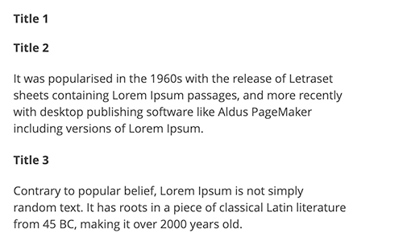

# Accordion widget

The accordion widget is an extension of the [tabs widget].

Accordions are generally used to break content into multiple sections that can be swapped to save space.

The accordion widget source is [lib/web/mage/accordion.js].

## Initialize the accordion widget

### Initialize accordion in JS components

#### Initialize accordion with `data-*` attributes specified

Generally the accordion widget is instantiated like following:

```javascript
$("#element").accordion();
```

Where:

-  `#element` is the selector of the element for accordion is initialized.
-  `#element` has children with the following attributes specified:

   -  `data-role="title"`
   -  `data-role="content"`

Optionally, you can specify the following:

-  If you want the trigger to be different from the title, add the `data-role="content"` attribute for the element
-  To have the content updated using Ajax, add the `data-ajax="true"` attribute for the element containing the URL for request.

Accordions support arbitrary markup, but the following requirements should be kept:

1. Titles and contents are specified in the same order in DOM: first title, then contents.
1. The header, trigger and content are specified, either by adding the `data-*` attributes for the corresponding children elements or by specifying these elements with selectors as options.

Mark-up examples:

```html
<div id="element">
    <div data-role="collapsible">
        <div data-role="trigger">
            <span>Title 1</span>
        </div>
    </div>
    <div data-role="content">Content 1</div>

    <div data-role="collapsible">
        <div data-role="trigger">
            <span>Title 2</span>
        </div>
    </div>
    <div data-role="content">Content 2</div>

    <div data-role="collapsible">
        <div data-role="trigger">
            <span>Title 3</span>
        </div>
    </div>
    <div data-role="content">Content 3</div>
</div>

<script>
    require([
        'jquery',
        'accordion'], function ($) {
        $("#element").accordion();
    });
</script>
```

#### Initialize accordion with option

You can specify the header, content, trigger as options when you initialize the widget.
For example:

```javascript
$("#element").accordion({
    header : "#title-1",
    content : "#content-1",
    trigger : "#trigger-1",
    ajaxUrlElement: "a"
 });
```

### Initialize accordion in a template

The accordion widget can be initialized using the `data-mage-init` attribute or `<script>` element, as described in [JavaScript initialization].

## Option

Accordion options coincide with [tabs options] and include the additional custom options.

### `active`

Defines which tab is active when the widget gets instantiated.

**Type**: Array, String

**Default value**: `[0]`

Example of the accordion initialization with the `active` option specified:

```javascript
$("#element").accordion({ active: "0 1" });
$("#element").accordion({ active: [0,1] });
```

### `multipleCollapsible`

Defines if multiple panels can be expanded at the same time.

**Type**: Boolean

**Default value**: `false`

Example of the accordion initialization with the `multipleCollapsible` option specified:

```javascript
$("#element").accordion({ multipleCollapsible: false });
```

Get or set the `multipleCollapsible` option, after initialization:

```javascript
//getter
var multipleCollapsible = $("#element").accordion("option", "multipleCollapsible");

//setter
$("#element").tabs("option", "multipleCollapsible", false);
```

### `openOnFocus`

For keyboard navigation defines if the accordion expands when the title gets in focus.

**Type**: Boolean

**Default value**: `false`

## Methods

Accordion widget options and keyboard interaction mostly coincide with the tabs widget methods.

### `activate(index)`

Activate a tab with the specified `index`.

**Type**: Number, Array.

If no `index` is passed, all panels are activated.

Code examples:

```javascript
$( "#element" ).accordion("activate");
$( "#element" ).accordion("activate", 1);
$( "#element" ).accordion("activate", [0,1]);
```

### `deactivate(index)`

Deactivate a tab with the specified `index`.

**Type**: Number, Array.

If no index is passed, all panels are deactivated.

Code examples:

```javascript
$( "#element" ).accordion("deactivate");
$( "#element" ).accordion("deactivate", 1);
$( "#element" ).accordion("deactivate", [0,1]);
```

## Events

The accordion widget subscribes to the same events as the [Tabs widget](tabs.md):

### `beforeOpen callback`

Called before the content is opened.

Example of adding a callback to `beforeOpen` events:

```javascript
$("#element").on("beforeOpen", function () {
    // do something before opening the content
});
```

### `dimensionsChanged`

Called after content is opened or closed.

Example of adding a callback to `dimensionsChanged` events:

```javascript
$("#element").on("dimensionsChanged", function (event, data) {
    var opened = data.opened;

    if (opened) {
        // do something when the content is opened
        return;
    }
    // do something when the content is closed
});
```

## Code sample

The following example shows how to initialize the accordion widget and pass options during the initialization.

```html
<div id="accordion" data-mage-init='{
        "accordion":{
            "active": [1, 2],
            "collapsible": true,
            "openedState": "active",
            "multipleCollapsible": true
        }}'>
    <div data-role="collapsible">
        <div data-role="trigger">
            <h4>Title 1</h4>
        </div>
    </div>
    <div data-role="content">Lorem Ipsum is simply dummy text of the printing and typesetting industry. Lorem Ipsum has been the industry's standard dummy text ever since the 1500s</div>

    <div data-role="collapsible">
        <div data-role="trigger">
            <h4>Title 2</h4>
        </div>
    </div>
    <div data-role="content"> It was popularised in the 1960s with the release of Letraset sheets containing Lorem Ipsum passages, and more recently with desktop publishing software like Aldus PageMaker including versions of Lorem Ipsum.</div>

    <div data-role="collapsible">
        <div data-role="trigger">
            <h4>Title 3</h4>
        </div>
    </div>
    <div data-role="content">Contrary to popular belief, Lorem Ipsum is not simply random text. It has roots in a piece of classical Latin literature from 45 BC, making it over 2000 years old.</div>
</div>
```

### Result

The result is three sections with separate swapped content.



[tabs widget]:tabs.md
[lib/web/mage/accordion.js]: https://github.com/magento/magento2/blob/2.4/lib/web/mage/accordion.js
[JavaScript initialization]: ../init.md#use-the-data-mage-init-attribute
[tabs options]: tabs.md#options
