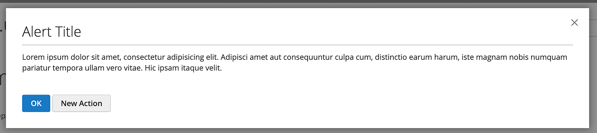

# Alert widget

The alert widget implements a modal pop-up window with a confirmation button. It extends the [confirmation widget] which in turn extends the [modal widget].

The alert widget source is [`<Magento_Ui_module_dir>/view/base/web/js/modal/alert.js`].

The widget can be used for implementing alert windows for both Admin and [storefront](https://glossary.magento.com/storefront). The design patterns for the pop-up modal windows in the Admin are described in the [Admin Pattern Library, the Slide-out Panels, Modal Windows, and Overlays topic.]

## Initialize

The alert widget can be initialized with or without binding to a certain element.

**Example1**: initialization on an element

```javascript
$('#init_element').alert({
    title: $.mage.__('Warning'),
    content: $.mage.__('Warning content'),
    actions: {
        always: function(){}
    }
});
```

**Example2**: standalone initialization

```javascript
require([
    'Magento_Ui/js/modal/alert',
    'jquery'
], function(alert, $) { // Variable that represents the `alert` function

    alert({
        title: $.mage.__('Some title'),
        content: $.mage.__('Some content'),
        actions: {
            always: function(){}
        }
    });

});
```

For details about how to initialize a widget in a`.phtml` template, refer to the [JavaScript initialization] topic.

## Options

### `actions`

Widget callbacks.

**Type**: Object.
**Default value**:

```javascript
actions: {
    always: function(){}
}
```

### `autoOpen`

Automatically open the alert window when the widget is initialized.

**Type**: Boolean

**Default value**: `false`

### `buttons`

The buttons list.

**Type**: Array of Objects.

**Default value**:

```javascript
buttons: [{
    text: $.mage.__('OK'),
    class: 'action-primary action-accept',
    click: function () {
        this.closeModal(true);
    }
}]
```

### `clickableOverlay`

Close the alert window when a user clicks on the overlay.

**Type**: Boolean

**Default value**: `true`

### `content`

The text displayed in the alert window.

**Type**: String.

### `focus`

The selector of the element to be in focus when the alert window opens.
If `focus` is not specified or set to empty string, the focus is on the close button. If focusing is not required, set `focus` to `none`.

**Type**: String.

**Default value**: `''`

### `title`

The title of the alert window.

**Type**: String.

**Default value**: `''`

### `modalClass`

The CSS class of the alert window.

**Type**: String.

**Default value**: `'confirm'`

## Events

The alert widget implements a single event: the `always` callback.
The `always` callback is invoked when a modal window is closed.

## Keyboard navigation

The keyboard navigation for the alert windows is similar to the [navigation of the modal widget].

## Code Sample

### Standalone initialization

```html
<div class="alert-modal-content">
    <p>Lorem ipsum dolor sit amet, consectetur adipisicing elit.</p>
</div>

<script>
require([
    'jquery',
    'Magento_Ui/js/modal/alert'
], function ($, alert) {
    'use strict';

    alert({
        title: 'Alert Title',
        content: $('.alert-modal-content'),
        modalClass: 'alert',
        actions: {
            always: function() {
                // do something when the modal is closed
            }
        },
        buttons: [{
            text: $.mage.__('Accept'),
            class: 'action primary accept',

            /**
             * Click handler.
             */
            click: function () {
                this.closeModal(true);
            }
        }, {
            text: $.mage.__('New Action'),
            class: 'action',

            /**
             * Click handler.
             */
            click: function () {
                // New action
            }
        }]
    });
});
</script>
```

### Initialization on an element

```html
<div class="alert-modal-content">
    <p>Lorem ipsum dolor sit amet, consectetur adipisicing elit.</p>
</div>

<script>
require([
    'jquery',
    'Magento_Ui/js/modal/alert'
], function ($) {
    'use strict';

    $('.alert-modal-content').alert({
        title: 'Alert Title',
        modalClass: 'alert',
        actions: {
            always: function() {
                // do something when the modal is closed
            }
        },
        buttons: [{
            text: $.mage.__('Accept'),
            class: 'action primary accept',

            /**
             * Click handler.
             */
            click: function () {
                this.closeModal(true);
            }
        }, {
            text: $.mage.__('New Action'),
            class: 'action',

            /**
             * Click handler.
             */
            click: function () {
                // New action
            }
        }]
    });
});
</script>
```

## Result



[confirmation widget]: confirm.md
[modal widget]: modal.md
[`<Magento_Ui_module_dir>/view/base/web/js/modal/alert.js`]: https://github.com/magento/magento2/blob/2.4/app/code/Magento/Ui/view/base/web/js/modal/alert.js
[Admin Pattern Library, the Slide-out Panels, Modal Windows, and Overlays topic.]: https://devdocs.magento.com/guides/v2.4/pattern-library/containers/slideouts-modals-overlays/slideouts-modals-overalys.html#modals
[JavaScript initialization]: ../init.md
[navigation of the modal widget]: modal.md#keyboard-navigation
