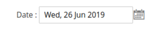

# Calendar widget

The Calendar widget is a customized jQuery [Datepicker Widget] that enables selecting a data using a pop-up or an in-line calendar. Calendar is also responsible for:

-  Merging the [global configuration](#configure) with the options that are passed from PHP when Calendar is initialized.
-  Taking into account server time zone offset.
-  Converting date and time formats to avoid inconsistency in Zend Date format and Datepicker format.
-  Making the calendar initialization easier.
-  The Calendar widget source is [lib/web/mage/calendar.js].

## Initialize

For information about how to initialize a widget in a JS component or `.phtml` template, see the [Initialize JavaScript] topic.

## Configure

The calendar widget's *global configuration* is a set of default options that are applied when each calendar instance is initialized. It includes the following:

-  Translations for days, months, and control buttons
-  Date and time format
-  Animation settings
-  Calendar pop-up mode
-  Server time zone offset

Global configuration for calendar is stored in a jQuery object as a hash of properties. Having global configuration set enables specifying all translations and default options at once, and use it for all instances of calendar, and it enables usage of inline translation for the calendar. During initialization, the calendar widget merges the hash of options from the global configuration, and the options which are transferred from PHP, and then passes the merged options to datepicker.

Example of setting global widget configuration follows:

```javascript
require([
  'jquery',
  'mage/calendar'
  ], function ( $ ) {
    $.extend(true, $, {
      calendarConfig: { ... }
    });
});
```

## Validate

To validate the calendar widget, specify the required **dateFormat** parameter:

```javascript
'validate-date': [
    function (value, params, additionalParams) {
        var test = moment(value, utils.convertToMomentFormat(additionalParams.dateFormat));

        return $.mage.isEmptyNoTrim(value) || test.isValid();
    },
    $.mage.__('Please enter a valid date.')
];
```

This example shows how to add date validation for a calendar widget:

```javascript
data-validate="{'required-entry': true, 'validate-date': {dateFormat: 'MM/dd/Y'}}"
```

## Options, methods, and events

Most options, methods, and events for the calendar widget correspond to the jQuery [Datepicker Widget] options.

## Code sample

This example shows how to initialize the calendar widget, including custom parameters.

```html
<div class="field">
    <label>Date : </label>
    <input type="text" class="input-text" id="example-date" style="width: auto" name="example-date" />
</div>

<script>
  require([
    'jquery',
    'mage/translate',
    'mage/calendar'
    ], function ($, $t) {
      $('#example-date').calendar({
        changeMonth: true,
        changeYear: true,
        showButtonPanel: true,
        currentText: $t('Go Today'),
        closeText: $t('Close'),
        showWeek: true
      });
    })
</script>
```

### Result

The result is a calendar and a icon(*Click Here*) that opens the calendar.

#### Calendar field initial state


#### Calendar field opened state


#### Calendar field date chosen



[Datepicker Widget]: https://api.jqueryui.com/datepicker/
[lib/web/mage/calendar.js]: https://github.com/magento/magento2/blob/2.4/lib/web/mage/calendar.js
[Initialize JavaScript]: ../init.md
