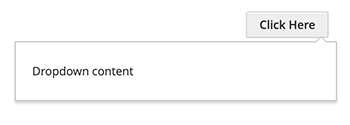

# DropdownDialog widget

The dropdownDialog widget is a customization of the standard [jQuery UI Dialog](http://api.jqueryui.com/dialog/). As extra functionality it implements the following:

-  triggering event for opening
-  delaying to automatically close the drop-down on mouse out
-  clicking outside the area closes the drop-down

The dropdownDialog widget source is located in [lib/web/mage/dropdown.js].

## Initialize

For information about how to initialize a widget in a JS component or `.phtml` template, see the [Initialize JavaScript] topic.

## Options

The customized Dialog widget has default [jQuery UI Dialog widget](http://api.jqueryui.com/dialog/) options, plus several custom options.

### `autoPosition`

Specifies if the [`position`] option is used for calculating the drop-down offset.

If set to `false` (default value), then `position` rules are not used and the drop-down is positioned under the element for which the widget is initialized. Otherwise the drop-down offset is calculated using the `position` rules.

**Type**: Boolean

**Default value**: `false`

### `autoOpen`

Specifies if the drop-down should open after page load.

**Type**: Boolean

**Default value**: `false`

### `autoSize`

Specifies if the size of the drop-down is defined by widget options ([height], [width], [minHeight], [minWidth]).

**Type**: Boolean

**Default value**: `false`

### `closeOnMouseLeave`

Specifies if the drop-down is closed when mouse pointer is moved out.

**Type**: Boolean

**Default value**: `true`

### `closeOnClickOutside`

Specifies if the drop-down is closed on mouse click outside the drop-down.

**Type**: Boolean

**Default value**: `true`

### `createTitleBar`

Defines if the [title] option is used for displaying the title bar.

**Type**: Boolean

**Default value**: `false`

### `defaultDialogClass`

Class that is added to the drop-down, when it gets initialized.

**Type**: String

**Default value**: `mage-dropdown-dialog`

Class that is added/removed on drop-down content when it gets opened/closed.

**Type**: String

**Default value**: `null`

### `parentClass`

Class that is added/removed for the dropdown parent, when the drop-down gets opened/closed.

**Type**: String

**Default value**: `null`

### `triggerClass`

Class that is added/removed on the trigger element when the drop-down gets opened/closed.

**Type**: String

**Default value**: `null`

### `triggerEvent`

Name of the event that triggers the `open()` function for drop-down.

**Type**: String

**Default value**: `click`

### `triggerTarget`

Element that triggers the drop-down.

**Type**:

-  String
-  jQuery object

**Default value**: `null`

### `timeout`

The number of milliseconds until the dropdown is closed after mouse pointer moves out.

**Type**: Number

**Default value**: 500

## Methods

The customized dropdownDialog widget has default [jQuery UI Dialog widget] methods, though some of them are customized.

Customized public methods:

-  [open()](#open)
-  [close()](#close)

### `open()`

Beside default functionality, this method calls the `_mouseLeave()` and `_mouseEnter()` functions, adds classes on trigger and drop-down parent, and binds the close on mouse click outside drop-down to the `<body>` element.

Invoke the open method:

```javascript
$("#element").dropdownDialog("open");
```

### `close()`

Beside default functionality, this method removes the classes from trigger and drop-down parent.Also clears the timeout if the latter exists.

Invoke the close method:

```javascript
$("#element").dropdownDialog("close");
```

## Code sample

The following example shows how to initialize the dropdown dialog widget and pass options during the initialization.
This example uses some CSS classes that are used for minicart.

```html
<div data-block="dropdown" class="minicart-wrapper">
    <button type="button" class="action" data-trigger="trigger">
        <span data-bind="i18n: 'Click Here'"></span>
    </button>
</div>
<div class="block block-minicart"
     data-mage-init='{
        "dropdownDialog": {
            "appendTo": "[data-block=dropdown]",
            "triggerTarget":"[data-trigger=trigger]",
            "timeout": 2000,
            "closeOnMouseLeave": false,
            "closeOnEscape": true,
            "autoOpen": true,
            "triggerClass": "active",
            "parentClass": "active",
            "buttons": []
        }
     }'>
    <div id="minicart-content-wrapper">
        Here is our content
    </div>
</div>
```

The following example shows a PHTML file using the script and custom CSS classes that have no defined properties:

```php
<?php
/** @var \Magento\Framework\Escaper $escaper */
?>

<div class="dropdown-wrap">
    <button class="dropdown-button">
        <span><?= $escaper->escapeHtml(__('Dropdown open button')) ?></span>
    </button>
    <div id="dropdown-dialog" data-role="dropdownDialog">
        <?= $escaper->escapeHtml(__('Dropdown content')) ?>
    </div>
</div>

<script type="text/javascript">
    require([
        'jquery',
        'dropdownDialog'
        ], function($, dropdownDialog) {
            'use strict';

            $('#dropdown-dialog').dropdownDialog({
                appendTo: '.dropdown-wrap',
                triggerTarget: '.dropdown-button',
                closeOnMouseLeave: false,
                closeOnEscape: true,
                timeout: 2000,
                triggerClass: 'active',
                parentClass: 'active',
                buttons: [{
                    text: $.mage.__('Close'),
                    click: function () {
                        $(this).dropdownDialog("close");
                    }
                }]
            });
        }
    );
</script>
```

### Result

The result is a dropdown dialog and a button (_Click Here_) that opens the dialog.



[lib/web/mage/dropdown.js]: https://github.com/magento/magento2/blob/2.4/lib/web/mage/dropdown.js
[Initialize JavaScript]: ../init.md
[`position`]: http://api.jqueryui.com/dialog/#option-position
[height]: http://api.jqueryui.com/dialog/#option-height
[width]: http://api.jqueryui.com/dialog/#option-width
[minHeight]: http://api.jqueryui.com/dialog/#option-minHeight
[minWidth]: http://api.jqueryui.com/dialog/#option-minWidth
[title]: http://api.jqueryui.com/dialog/#option-title
[jQuery UI Dialog widget]: http://api.jqueryui.com/dialog/
