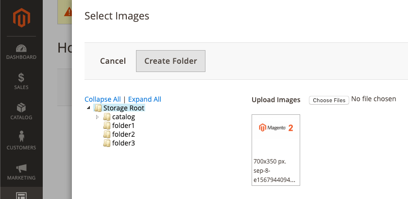
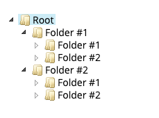

# FolderTree widget

The FolderTree [widget](https://glossary.magento.com/widget/) allows creating a dynamic hierarchical tree structure with folders.

The main purpose of this widget is to represent a folder structure from the server, database or another resource and to allow the users to browse that structure.

The dynamic hierarchical allows us to easily update the folders via [Ajax URL](#url) and show different levels of folders, with subfolders that can be collapsed and expanded.

For example: in the Wysiwyg editor, the FolderTree widget is used to represents the structure of media folders on the server. After clicking on one of the folders, an admin is able to see media files within the folder.



The FolderTree widget can be used only in the [adminhtml](https://glossary.magento.com/adminhtml) area.

The FolderTree widget source is [`<Magento_Cms_module_dir>/view/adminhtml/web/js/folder-tree.js`][].

## Initialize

For information about how to initialize a widget in a JS component or `.phtml` template, see the [Initialize JavaScript][] topic.

```javascript
$("#folder-tree").folderTree({
    rootName: 'Root',
    url: 'some/url',
    currentPath: ['root']
});
```

Where:

-  `#folder-tree` is the selector of the element which will display FolderTree.

The following example shows a [PHTML](https://glossary.magento.com/phtml) file using the script:

```html
<script>
    require([
        'jquery',
        'Magento_Cms/js/folder-tree'
    ], function ($) {
        'use strict';

        $("#folder-tree").folderTree({
            rootName: 'Root',
            url: 'some/url',
            currentPath: ['root']
        });
    });
</script>
```

## Options

### `currentPath`

This option pre-opens the specified folder path. It is an array of folders IDs which represents the path to the current opened folder.

**Type**: Array

**Default value**: `['root']`

### `root`

The id for the root folder [HTML](https://glossary.magento.com/html) element.

**Type**: String

**Default value**: `'root'`

### `rootName`

The name of the root folder.

**Type**: String

**Default value**: `'Root'`

### `tree`

The configuration for [jstree](https://www.jstree.com) widget.

The FolderTree widget uses the [jstree](https://www.jstree.com) widget to build a hierarchical tree with folders.

**Type**: String

**Default value**:

```json
{
    'plugins': ['themes', 'json_data', 'ui', 'hotkeys'],
    'themes': {
        'theme': 'default',
        'dots': false,
        'icons': true
    }
}
```

### `url`

The endpoint URL for getting the folders JSON data.

The example of the JSON response:

```json
[
  {
    "text": "Folder #1",
    "id": "1",
    "path": "some/path/",
    "cls": "folder folder-1"
  },
  {
    "text": "Folder #2",
    "id": "2",
    "path": "some/path/2",
    "cls": "folder folder-2"
  }
]
```

**Type**: String

**Default value**: `undefined`

## Code sample

The following example shows the initialization of FolderTree widget.

```html
<div data-role="tree" data-mage-init='{
    "folderTree": {
        "rootName": "Root",
        "url": "/some/path/jsontree",
        "currentPath": ["root"]
    }
}'>
```

### Result



<!-- Link Definitions -->
[`<Magento_Cms_module_dir>/view/adminhtml/web/js/folder-tree.js`]: https://github.com/magento/magento2/blob/2.4/app/code/Magento/Cms/view/adminhtml/web/js/folder-tree.js
[Initialize JavaScript]: ../init.md
