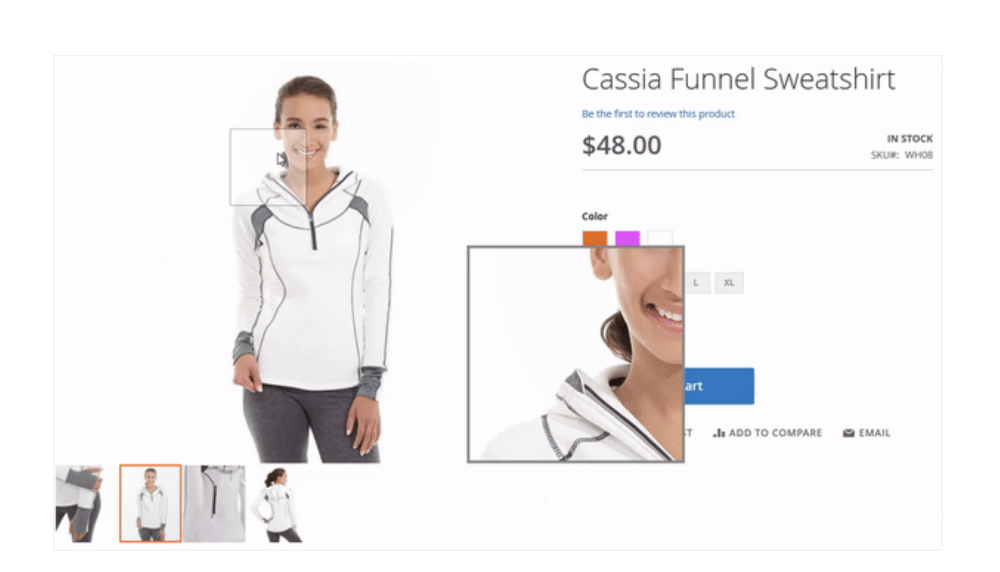

# Magnifier widget

Magnifier is a widget that allows displaying images in 100% scaled size in a separate dedicated layer.
It is used by the [gallery](gallery.md) widget for zooming the product images on product pages. It must be enabled in your local theme `view.xml` configuration file.



The Magnifier widget source is located in [lib/web/magnifier/magnify.js](https://github.com/magento/magento2/blob/2.4/lib/web/magnifier/magnify.js).

## Initialize

The magnifier widget is initialized as described in [JavaScript initialization](../init.md#insert-a-component-in-a-phtml-template).
The following is the example of gallery initialization with the magnifier enabled:

```javascript
<script type="text/x-magento-init">
    {
        "<element_selector>": {
            "mage/gallery/gallery": {
                "data": [{
                    "thumb": "<small_image_url>",
                    "img": "<small_image_url>",
                    "full": "<small_image_url>",
                    "caption": "<message>",
                    "isMain": "<true/false>"
                }],
                "mixins": ["magnifier/magnify"],
                "magnifierOpts": {
                   "enabled": <true/false>,
                   "eventType": "<hover/click>",
                   "width": <number>,
                   "height": <number>,
                   "top": <number>,
                   "left": <number>,
                   "fullscreenzoom": <number>,
                   "mode": "<outside/inside>"
                }
            }
        }
    }
</script>
```

## Options

### `enabled`

Enables the magnifier.

**Type**: Boolean

### `height`

Height of the magnifier block in pixels.

### `eventType`

Action that activates zoom.

Possible values:

*  `hover`
*  `click`

### `fullscreenzoom`

Zoom step in percents for the fullscreen view.

Type: Integer

### `left`

The value for the CSS `left` property for the magnifier block positioning.

**Type**: Integer

### `top`

The value for the CSS `top` property for the magnifier block positioning.

**Type**: Integer

### `width`

Width of the magnifier block in pixels.

**Type**: Integer

### `mode`

Specifies whether to display magnified image inside / outside lens.

Possible values:

*  `outside`
*  `inside`

## Enable and configure

`view.xml` is a theme configuration file that enables the Magnifier widget. The file is conventionally located in the `<theme_dir>/etc/` directory.

The enabling option is:

```xml
<var name="magnifier">
   <var name="enabled">true</var> <!-- Turn on/off magnifier (true/false) -->
</var>
...
```

Several other Magnifier options are set in `view.xml`:

```xml
<var name="magnifier">
  <var name="fullscreenzoom">20</var> <!-- Zoom for fullscreen (integer) -->
  <var name="top"></var> <!-- Top position of magnifier -->
  <var name="left"></var> <!-- Left position of magnifier -->
  <var name="width"></var> <!-- Width of magnifier block -->
  <var name="height"></var> <!-- Height of magnifier block -->
  <var name="eventType">hover</var> <!-- Action that activates zoom (hover/click) -->
...
</var>
```

For an example of setting the gallery option, see the [view.xml](https://github.com/magento/magento2/blob/2.4/app/design/frontend/Magento/blank/etc/view.xml#L225) file in the Blank theme.
