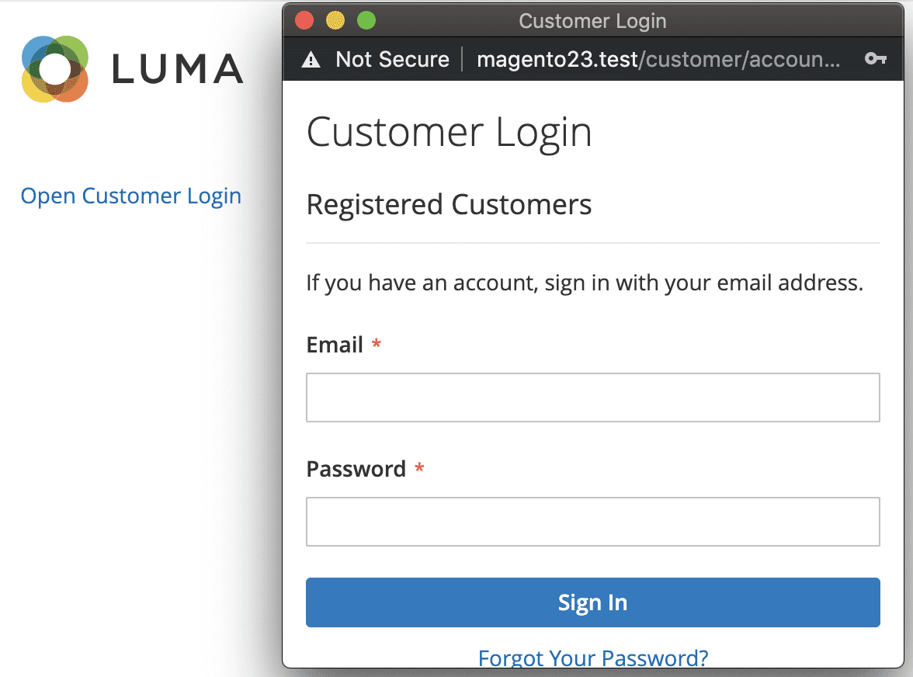

# PopupWindow widget

The PopupWindow [widget](https://glossary.magento.com/widget/) allows you to open a popup window with content from any URL.

The PopupWindow widget source is [lib/web/mage/popup-window.js][].

## Initialize

For information about how to initialize a widget in a JS component or `.phtml` template, see the [Initialize JavaScript][] topic.

The PopupWindow widget is instantiated with:

```javascript
$("#element").popupWindow({
    "windowURL": "http://example.com",
    "windowName": "Window Name",
    "width": 800,
    "height": 800,
    "left": 0,
    "top": 0,
    "resizable": 1,
    "scrollbars": 1
});
```

Where:

-  `#element` is the selector of the element which will be the PopupWindow.

The following example shows a PHTML file using the script:

```html
<script>
    require([
        'jquery',
        'popupWindow'
    ], function ($) {
        'use strict';

        $("#element").popupWindow({
              "windowURL": "http://example.com",
              "windowName": "Window Name",
              "width": 800,
              "height": 800,
              "left": 0,
              "top": 0,
              "resizable": 1,
              "scrollbars": 1
        });
    });
</script>
```

## Options

### `centerBrowser`

Centers the popup window over a browser window. It overrides the [top](#top) and [left](#left) options.

**Type**: Integer

**Default value**: `0`

### `centerScreen`

Centers the popup window over the entire screen. It overrides [top](#top) and [left](#left) options.

**Type**: Integer

**Default value**: `0`

### `height`

The height in pixels of the popup window.

**Type**: Integer

**Default value**: `500`

### `left`

Left position when the window appears.

**Type**: Integer

**Default value**: `0`

### `location`

Determines whether the address bar is displayed.

**Type**: Integer

**Default value**: `0`

### `menubar`

Determines whether the menu bar is displayed.

**Type**: Integer

**Default value**: `0`

### `resizable`

Allows the popup window to be resized.

**Type**: Integer

**Default value**: `0`

### `scrollbars`

Controls whether scrollbars appear on the popup window.

**Type**: Integer

**Default value**: `0`

### `status`

Controls the status bar at the bottom of the popup window.

**Type**: Integer

**Default value**: `0`

### `width`

The width in pixels of the popup window.

**Type**: Integer

**Default value**: `500`

### `windowName`

Name of the popup window. By default, it is set from the name attribute of the element that invokes the click.

**Type**: String, Null

**Default value**: `null`

### `windowURL`

The URL which is used for the popup window.

**Type**: String, Null

**Default value**: `null`

### `top`

Top position when the window appears.

**Type**: Integer

**Default value**: `0`

### `toolbar`

Determines whether the toolbar is displayed.

**Type**: Integer

**Default value**: `0`

## Code sample

This example shows the *Open Customer Login* link, and after clicking on this link the popup window is opened with *Customer Login* page.

```html
<a href="#" class="action" title="Open Customer Login"
   data-mage-init='{"popupWindow": {
        "windowURL": "/customer/account/login",
        "windowName": "customer-login",
        "width": 400,
        "height": 400,
        "left": 0,
        "top": 0,
        "resizable": 1,
        "scrollbars": 1,
        "status": 1,
        "menubar": 1
    }}'>
    <span>Open Customer Login</span>
</a>
```

## Result

As a result, we see the *Open Customer Login* link and after clicking on it, the *Customer Login* page is opened in the popup.



<!-- Link Definitions -->
[lib/web/mage/popup-window.js]: https://github.com/magento/magento2/blob/2.4/lib/web/mage/popup-window.js
[Initialize JavaScript]: ../init.md
