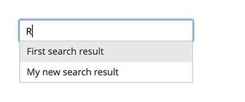

The quickSearch [widget](https://glossary.magento.com/widget) is an autocomplete widget that populates a list of suggested search terms for a given field.

The suggest widget source is [`<Magento_Search_module_dir>/view/frontend/web/js/form-mini.js`].

## Initialize the quickSearch widget {#quicksearch_init}

For information about how to initialize a widget in a JS component or `.phtml` template, see the [Initialize JavaScript] topic.

## Options {#quicksearch_options}

-  [autocomplete](#autocomplete)
-  [destinationSelector](#destinationselector)
-  [isExpandable](#isexpandable)
-  [formSelector](#formselector)
-  [minSearchLength](#minsearchlength)
-  [responseFieldElements](#responsefieldelements)
-  [searchLabel](#searchlabel)
-  [selectClass](#selectclass)
-  [submitBtn](#submitbtn)
-  [suggestionDelay](#suggestiondelay)
-  [template](#template)
-  [url](#url)

### `autocomplete`

Attaches the `autocomplete` attribute to the search field.

**Type**: String

**Default value**: `off`

**Accepted values**: `off`, `on`

### `destinationSelector`

The element's selector where the results will be added.

**Type**: String

**Default value**: `null`

### `isExpandable`

The isExpandable option is used to show and hide search input field on devices with max width 768px.

**Type**: Boolean

**Default value**: `null`

### `formSelector`

The form selector containing the search input field.

**Type**: String

**Default value**: No form by default.

### `minSearchLength`

Minimum number of characters required before the auto suggest triggers.

**Type**: Integer

**Default value**: `2`

### `responseFieldElements`

Selector for the response elements.

**Type**: String

**Default Value**: `ul li`

### `searchLabel`

Selector of a search input label.

**Type**: String

**Default value**: `[data-role=minisearch-label]`

### `selectClass`

Class assigned to the selected suggested term.

**Type**: String

**Default value**: `selected`

### `submitBtn`

Disable the submit button.

**Type**: String

**Default value**: `button[type="submit"]`

### `suggestionDelay`

The `suggestionDelay` option prevents overloading the server with requests by waiting until the user has stopped typing for the specified period of time.

**Type**: Integer

**Default value**: `300`

### `template`

Template responsible for rendering returned data (suggested terms).

**Type**: String

**Default value**:

```html
<li class="<%- data.row_class %>" id="qs-option-<%- data.index %>" role="option">
    <span class="qs-option-name">
       <%- data.title %>
    </span>
    <span aria-hidden="true" class="amount">
       <%- data.num_results %>
    </span>
</li>
```

### `url`

The endpoint URL for processing the search query.

**Type**: String

**Default value**: `null`

## Code sample

This example shows how to initialize the quickSearch widget and pass options during the initialization.

```html
<form class="" id="new_search_form" action="/catalogsearch/result/" method="get">
   <div class="field search">
      <div class="control">
          <input id="new-search"
              data-mage-init='{"quickSearch":{
                     "formSelector":"#new_search_form",
                     "minSearchLength": 1,
                     "url":"/search/ajax/suggest",
                     "destinationSelector":"#search_results"}
                    }'
              type="text"
              name="q"
              placeholder="<?= $block->escapeHtmlAttr(__('Search entire store here...')) ?>"
              class="input-text"/>
         <div id="search_results" class="search-autocomplete"></div>
      </div>
  </div>
  <div class="actions">
    <button type="submit"
            title="<?= $block->escapeHtml(__('Search')) ?>"
            class="action search"
            aria-label="Search">
      <span><?= $block->escapeHtml(__('Search')) ?></span>
    </button>
  </div>
</form>
```

### Result

The result is an input with autocomplete results, where the results will be returned by the `url` option that was provided on initialization, as shown here:



[`<Magento_Search_module_dir>/view/frontend/web/js/form-mini.js`]: https://github.com/magento/magento2/blob/2.4/app/code/Magento/Search/view/frontend/web/js/form-mini.js
[Initialize JavaScript]: ../init.md
