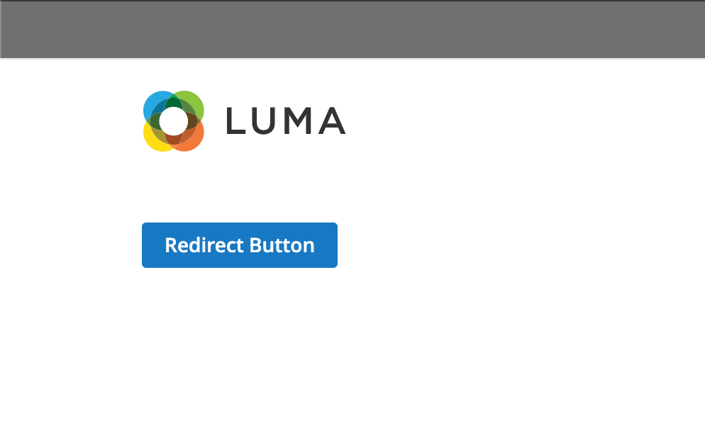

# RedirectUrl widget

The RedirectUrl widget allows redirecting to an URL when an event triggers.

The RedirectUrl widget source is [lib/web/mage/redirect-url.js][].

## Initialize

For information about how to initialize a widget in a JS component or `.phtml` template, see the [Initialize JavaScript][] topic.

Generally the RedirectUrl widget is instantiated like following:

```javascript
$("#element").redirectUrl({url: 'http://example.com'});
```

Where:

-  `#element` is the selector of the element for which RedirectUrl is initialized.

The following example shows a PHTML file using the script:

```html
<script>
    require([
        'jquery',
        'redirectUrl'
    ], function ($) {
        'use strict';

        $("#element").redirectUrl({url: 'http://example.com'});
    });
</script>
```

## Options

### `event`

The event of the DOM element for which you want to carry out the redirect.

**Type**: String

**Default value**: `click`

### `url`

The redirect URL.

**Type**: String

**Default value**: `undefined`

## Code sample

The following example shows the button and after clicking on this button you will be redirected to the `http://example.com` URL.

```html
<button class="action primary"
        data-mage-init='{"redirectUrl": {"event": "click", "url": "http://example.com"}}'
        type="button"
        title="Redirect Button">
    <span>Redirect Button</span>
</button>
```

## Result



[lib/web/mage/redirect-url.js]: https://github.com/magento/magento2/blob/2.4/lib/web/mage/redirect-url.js
[Initialize JavaScript]: ../init.md
