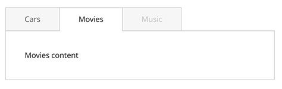

# Tabs widget

The tabs widget implements single content area with multiple panels, each associated with a header in a list. It uses the [collapsible widget].

The tabs widget source is [lib/web/mage/tabs.js].

## Initialize

For information about how to initialize a widget in a JS component or `.phtml` template, see the [Initialize JavaScript] topic.

Generally the tabs widget is instantiated like following:

```javascript
$("#element").tabs();
```

Where:

-  `#element` is the selector of the element for tabs is initialized.

The following example shows a PHTML file using the script:

```html
<script>
    require([
        'jquery',
        'tabs'], function ($) {
        $("#element").tabs();
    });
</script>
```

## Options

### `active`

Index of the tab, which is active at the moment of initialization. Starts from "0"

**Type**: Number

**Default value**: `0`

### `ajaxUrlElement`

Selector for the tab element, which contains the URL for the Ajax request.
The option of the [collapsible] widget used by tabs.

**Type**: String

**Default value**: `[data-ajax=true]`

### `ajaxContent`

Defines if the content is loaded by Ajax request.
The option of the [collapsible] widget used by tabs.

**Type**: Boolean

**Default value**: `false`

### `animate`

Specifies if the collapse/expand actions are performed with animation. The option of the [collapsible]  widget used by tabs.

**Type**:
Multiple types are supported:

-  Boolean: the `false` value disables the animation
-  Number: duration in milliseconds
-  String: is parsed to an object as a json string
-  Object:

   ```javascript
   {
       duration: <Number>,
       easing: <String>,
       <propToAnimate>: <howToAnimate>
   }
   ```

   For details about the object passed, see [jQuery.animate()].

**Default value**: `false`

### `closedState`

Class assigned to the tab being closed.

**Type**: String

**Default value**: `null`

### `collapsible`

If this option is set to false, the content is not collapsed when the panel is active. The option of the [collapsible] widget used by tabs.

**Type**: Boolean

**Default value**: `false`

### `collapsibleElement`

Selector of the element for which the collapsible widget is initialized.

**Type**: String

**Default value**: `[data-role=collapsible]`

### `content`

Selector for the content element, searched for using `.find()` on the main collapsible element. The option of the [collapsible] widget used by tabs.

**Type**: String

**Default value**: `[data-role=content]`

### `disabled`

Array of the elements' indexes which are disabled when the widget is initialized.

**Type**: Array of numbers.

**Default value**: `[]`

### `disabledState`

Class assigned to the tab being currently disabled.

**Type**: String

**Default value**: `null`

### `header`

Selector for the header element, searched for using `.find()` on the main collapsible element.
The option of the [collapsible] widget used by tabs.

**Type**: String

**Default value**: `[data-role=title]`

### `icons`

The classes for icons to be used in headers. If no classes are specified, icons are not be created. A new span is created and appended to the header, the classes for this span are automatically changed whenever the content gets expanded/collapsed.
The option of the [collapsible] widget used by tabs.

**Type**: String

**Default value**: `{ header: null, activeHeader: null }`

### `loadingClass`

Class assigned to a tab during content loading for this tab.

**Type**: String

**Default value**: `null`

### `openedState`

Class name assigned to a tab which is being currently opened.

**Type**: String

**Default value**: `null`

### `openOnFocus`

Used for setting keyboard navigation. Defines if the tab is expanded when its header is in focus.

**Type**: Boolean

**Default value**: `true`

### `saveState`

Specifies if the state is saved in the local storage if the browser supports it. Otherwise will be saved into a cookie.
The option of the [collapsible] widget used by tabs.

**Type**: Boolean

**Default value**: `true`

### `trigger`

Selector for the trigger element, applied using `.find()` on the main collapsible element. If the trigger is not found, the header becomes a trigger.
The option of the [collapsible] widget used by tabs.

**Type**:

-  String
-  jQuery object

**Default value**: `[data-role=trigger]`

## Methods

### `activate()`

`activate(index)` displays `content` for the tab with the corresponding `index`.

### `enable()`

`enable(index)` enables the tab with the corresponding `index`.

### `deactivate()`

`deactivate(index)` hides `content` for the tab with the corresponding `index`.

### `disable()`

`disable(index)` disables the tab with the corresponding `index`.

## Events

Tabs is subscribed to the same events as the [collapsible] widget.

### `beforeOpenCallback`

Called before the content is opened.

Example of adding a callback to `beforeOpen` events:

```javascript
$("#element").on("beforeOpen", function () {
    // do something before opening the content
});
```

### `dimensionsChanged`

Called after content is opened or closed.

Example of adding a callback to `dimensionsChanged` events:

```javascript
$("#element").on("dimensionsChanged", function (event, data) {
    var opened = data.opened;

    if (opened) {
        // do something when the content is opened
        return;
    }

    // do something when the content is closed
});
```

## Code sample

The following example shows how to initialize the tabs widget and pass options during the initialization.
This example uses the same CSS classes as the tabs on the product page.

```html
<div class="product data items"
     data-mage-init='{"mage/tabs": {"openedState": "active", "animate": {"duration": 100}, "active": 1, "disabled": [2], "disabledState": "disabled"}}'>
    <div class="item title" data-role="collapsible">
        <a class="switch" data-toggle="trigger" href="#tab-cars">Cars</a>
    </div>
    <div id="tab-cars" class="item content" data-role="content">Cars content</div>

    <div class="item title" data-role="collapsible">
        <a class="switch" data-toggle="trigger" href="#tab-movies">Movies</a>
    </div>
    <div id="tab-movies" class="item content" data-role="content">Movies content</div>

    <div class="item title" data-role="collapsible">
        <a class="switch" data-toggle="trigger" href="#tab-music">Music</a>
    </div>
    <div id="tab-music" class="item content" data-role="content">Music Content</div>
</div>
```

### Result

The result is three tabs with content, where the last tab is disabled based on initialization options, as shown here:



[collapsible widget]: collapsible.md
[lib/web/mage/tabs.js]: https://github.com/magento/magento2/blob/2.4/lib/web/mage/tabs.js
[Initialize JavaScript]: ../init.md
[collapsible]: collapsible.md
[jQuery.animate()]: http://api.jquery.com/animate/
