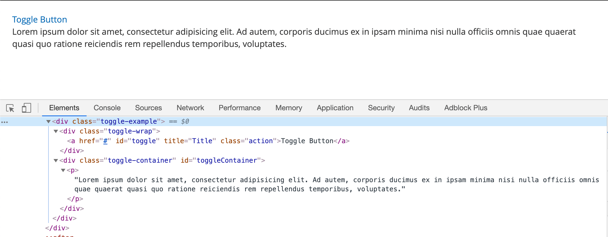
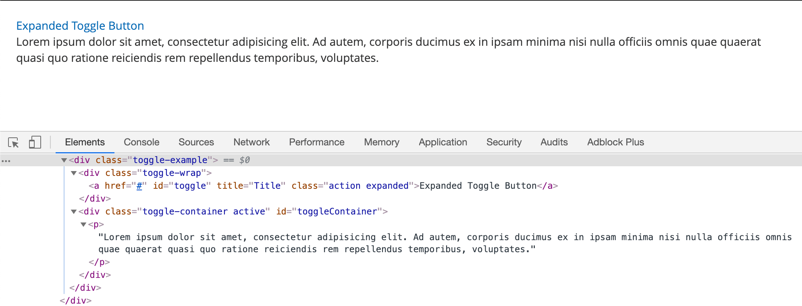

# ToggleAdvanced widget

Use the ToggleAdvanced widget to toggle the HTML class for selectors by clicking on a toggle element.

The widget also allows toggling a clicked element class and clicked element text if an element is toggled.

The ToggleAdvanced widget source is [lib/web/mage/toggle.js].

## Initialize

For information about how to initialize a widget in a JS component or `.phtml` template, see the [Initialize JavaScript] topic.

To instantiate the ToggleAdvanced widget:

```javascript
$("#element").toggleAdvanced();
```

Where:

-  `#element` is the selector of the element for which ToggleAdvanced is initialized.

The following example shows a PHTML file using the script:

```html
<script>
    require([
        'jquery',
        'toggleAdvanced'
    ], function ($) {
        'use strict';

        $("#element").toggleAdvanced();
    });
</script>
```

## Options

### `baseToggleClass`

The class used to toggle on a clicked element.

**Type**: String

**Default value**: `active`

### `selectorsToggleClass`

The class that will be toggled (added/removed) for selected DOM elements.

**Type**: String

**Default value**: `hidden`

### `toggleContainers`

The selectors of DOM elements that will be toggled.

**Type**: String

**Default value**: `null`

### `newLabel`

Text of the new label to be used on toggle.

**Type**: String

**Default value**: `null`

### `curLabel`

Text of the old label to be used on toggle.

**Type**: String

**Default value**: `null`

### `currentLabelElement`

Container element of the current label.

**Type**: String

**Default value**: `null`

## Methods

### `beforeCreate`

`beforeCreate()` method used to inject 3rd party functionality before creating.

### `afterCreate`

`afterCreate()` method used to inject 3rd party functionality after creating.

## Code sample

The following example shows how to initialize the ToggleAdvanced widget.

```html
<div class="toggle-example">
    <div class="toggle-wrap">
        <a href="#"
           data-mage-init='{"toggleAdvanced": {"selectorsToggleClass": "active", "baseToggleClass": "expanded", "toggleContainers": "#toggleContainer", "newLabel": "Expanded Toggle Button"}}'
           id="toggle"
           title="Title"
           class="action">Toggle Button</a>
    </div>
    <div class="toggle-container" id="toggleContainer">
        <p>Lorem ipsum dolor sit amet, consectetur adipisicing elit. Ad autem, corporis ducimus ex in ipsam minima nisi nulla officiis omnis quae quaerat quasi quo ratione reiciendis rem repellendus temporibus, voluptates.</p>
    </div>
</div>
```

## Result

The result is two sections with initial content and toggled content.




[lib/web/mage/toggle.js]: https://github.com/magento/magento2/blob/2.4/lib/web/mage/toggle.js
[Initialize JavaScript]: ../init.md
