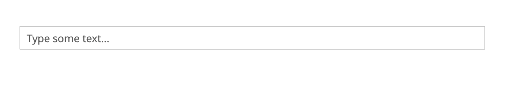

# TrimInput widget

The TrimInput [widget](https://glossary.magento.com/widget) trims  whitespace in an input field.

The TrimInput widget source is [lib/web/mage/trim-input.js][].

## Initialize

For information about how to initialize a widget in a JS component or `.phtml` template, see the [Initialize JavaScript][] topic.

The TrimInput widget is instantiated with the following:

```javascript
$('#element').trimInput();
```

Where:

-  `#element` is the selector of the input element to be trimmed.

The following example shows a PHTML file using the script:

```html
<script>
    require([
        'jquery',
        'mage/trim-input'
    ], function ($) {
        'use strict';

        $("#element").trimInput();
    });
</script>
```

## Code sample

This example shows how to initialize the TrimInput widget:

```html
<input type="text" name="text" id="text" class="input-text" data-mage-init='{"mage/trim-input":{}}' placeholder="Type some text...">
```

## Result

As a result, we have the text input field and the value of this input will be trimmed each time it is changed.



[lib/web/mage/trim-input.js]: https://github.com/magento/magento2/blob/2.4/lib/web/mage/trim-input.js
[Initialize JavaScript]: ../init.md
