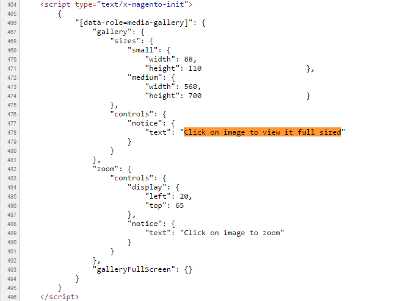
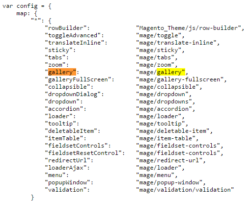

This topic features a step-by-step illustration of how to customize a [jQuery](https://glossary.magento.com/jquery) [widget](https://glossary.magento.com/widget) and how to use a custom widget instead of the default.

## Customize a default jQuery widget

In their Orange theme, ExampleCorp wants to remove the "Click on image to view it full sized" message displayed on the product page.

The high-level steps for this task are the following:

1. Define how the message is output.
1. Add the custom script extending the default one.
1. Update RequireJS configuration to use the custom script instead of the default one.

Let's look at each step in more detail.

### Step 1: Define how the message is output {#define_script1}

ExampleCorp needs to define how the message is output. To do this, they take the following steps:

1. Open a product page.
1. Select to view the page source.
1. Search for the "Click on image to view it full sized" string. The illustration of the search result follows: 
1. View that it is output by [`gallery.js`].

We see that the script which ExampleCorp needs to alter is `gallery.js`.

To be able to extend `gallery.js`, ExampleCorp needs to know the path to it. To get this info, they refer to `requirejs-config.js`, which [can be reached from the page source view or from the file system]. According to the configuration, the path for `gallery` is `mage/gallery`. The illustration follows:



### Step 2: Add the custom widget extending the gallery widget {#add_code1}

In the `app/design/frontend/ExampleCorp/orange/web/js` ExampleCorp adds `orange-gallery.js` with the following content:

```javascript
define([
  'jquery',
  'jquery-ui-modules/widget',
  'mage/gallery/gallery'
], function($){

  $.widget('orange.gallery', $.mage.gallery, {
    _create: function() { // special method of jQuery UI Widgets
      this._setOption('controls', {'notice': {}});
    }
  });

  return $.orange.gallery;
});
```

### Step 3: Update the RequireJS configuration {#config1}

ExampleCorp adds the custom `app/design/ExampleCorp/orange/requirejs-config.js` with the following content:

```javascript
var config = {
  map: {
    "*": {
      "gallery": "js/orange-gallery"
    }
  }
};
```

The new behavior is applied once the store pages are reloaded.

## Add and use a custom widget (jCarousel) {#use_custom_widget}

ExampleCorp wants to use the [jCarousel widget] to display product images on product pages. The high level steps for this task are the following:

1. Define how product images are displayed by default.
1. Add the custom script to the file system.
1. Update RequireJS configuration to use the custom script instead of the default one.

Let's look at each step in more detail.

### Step 1: Define what is the default implementation

Using the approach described in the previous section, ExampleCorp defines that the product images are displayed by [`gallery.js`], and the configuration path for it is `mage/gallery`.

### Step 2: Add the custom script to the file system

For the jCarousel widget to be able to use the configuration passed to the gallery widget,
ExampleCorp needs to add a "wrapper" script.

To do this, ExampleCorp adds the following files in the `app/design/frontend/ExampleCorp/orange/web/js` directory:

-  The jCarousel widget source file: `jquery.jcarousel.js`
-  A \"wrapper\" `orange-carousel.js` with the following content:

   ```javascript
       define([
         'jquery',
         'js/jquery.jcarousel'
       ], function($){

         return function (config, element) {
          var jCarouselConfig = {
            list: '.items.thumbs',
            items: '.item.thumb'
          };
          $(element).jcarousel(jCarouselConfig);
         }
       });
    ```

### Step 3: Update RequireJS configuration

In the `app/design/ExampleCorp/orange` directory ExampleCorp adds `requirejs-config.js` with the following content:

```javascript
var config = {
  map: {
    "*": {
      "gallery": "js/orange-gallery"
    }
  },
  shim: {
    "js/jquery.jcarousel": ["jquery"] // as jquery.jcarousel isn't an AMD module
  }
};
```

[`gallery.js`]: https://github.com/magento/magento2/blob/2.4/lib/web/mage/gallery/gallery.js
[can be reached from the page source view or from the file system]: custom.md#extend-a-default-js-component
[jCarousel widget]: http://sorgalla.com/jcarousel/
[`gallery.js`]: https://github.com/magento/magento2/blob/2.4/lib/web/mage/gallery/gallery.js
