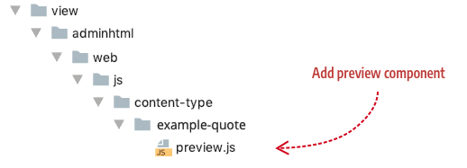
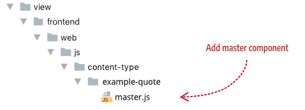
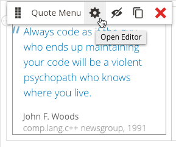

# Add components

In this step, we will create a preview component in order to customize the options menu for our Quote. The options menu is the popup menu that appears when you mouseover a content type, as shown here:


The options menu provides end-users with several functions, including a button to open the content type's form editor, which we will add in [Add form](add-form.md).

## About components

Components are JavaScript files that define the behaviors of your content type when they appear on the Admin stage (using the `preview.js` component) and in the storefront (using the `master.js` component). As such, they are complementary to the templates you added previously in Step 2, acting as the view models to the template's views.

Adding custom component files to your content types is completely optional. Whether you need one or not will depend on the complexity of your content type. If you do not add components to your content type, Page Builder will use these defaults:

-  Default preview component: `Magento_PageBuilder/js/content-type/preview`

-  Default master component: `Magento_PageBuilder/js/content-type/master`

When you start developing more complex content types, you will need to create custom preview components in order to make these and other functions available on the Admin stage:

-  Initiating and using additional 3rd party libraries like sliders and tabs.

-  Adding image uploader support.

-  Providing dynamic data into your preview templates from the back-end.

-  Allowing the back-end to conduct rendering (such as our block and dynamic block content types).

-  Declaring special states based on the data stored, for example, showing a disabled state when certain fields are set to specific values.

Examples of implementing these functions will be added to future tutorials and other topics in this documentation.

Adding your own master component is far less common. The master component is only necessary if you want to manipulate the final output of your content type before it is persisted to the database.

## Component conventions

The conventions for naming your components and adding them to your module are as follows:

-  Your preview component must be named `preview.js` and placed here in your module (`view/adminhtml/web/js/content-type/example-quote/`):



-  Your master component must be named `master.js` and placed here in your module (`view/frontend/web/js/content-type/example-quote/`):

  

We will not create a master component for our Quote example, but the location is given here if you need to include one for more complex content types.

Before continuing, add the preview component file (`preview.js`) to your `PageBuilderQuote` module within the directory structure noted.

## Component configuration

In your configuration file, reference your Admin `preview_component` (`preview.js`) as shown here:

```xml
<config xmlns:xsi="http://www.w3.org/2001/XMLSchema-instance"
        xsi:noNamespaceSchemaLocation="urn:magento:module:Magento_PageBuilder:etc/content_type.xsd">
    <type name="example_quote"
        label="Quote"
        component="Magento_PageBuilder/js/content-type"
        preview_component="Example_PageBuilderQuote/js/content-type/example_quote/preview"
        master_component="Magento_PageBuilder/js/content-type/master">
        ...
    </type>
</config>
```

A description of each component-related attribute from the Quote configuration follows:

| Attribute           | Description                                                                                                                                                                                                                                                                                                                                                                                                                                                                                                                                                                                                                                                              |
|---------------------|--------------------------------------------------------------------------------------------------------------------------------------------------------------------------------------------------------------------------------------------------------------------------------------------------------------------------------------------------------------------------------------------------------------------------------------------------------------------------------------------------------------------------------------------------------------------------------------------------------------------------------------------------------------------------|
| `component`         | Page Builder provides two component types to choose from: `content-type` and `content-type-collection`. Use `Magento_PageBuilder/js/content-type` for static content types that do not have children (like our Quote). Use `Magento_PageBuilder/js/content-type-collection` for content types that can contain children (container content types). You can also create and specify your own component implementations, provided they conform to the Page Builder interfaces.                                                                                                                                                                                             |
| `preview_component` | Optional. The `preview.js` file provides rendering logic to the Admin preview template. If your content type does not require any changes to Page Builder's standard rendering logic, you can omit this attribute from the the `type` element. When you omit the attribute, Page Builder will use `Magento_PageBuilder/js/content-type/preview` by default.<br /><br />However, if you want to make changes to the option menu for your content type, or other customize other user-interactivity in the Admin, you need to create your own preview component as we have done for the Quote content type.                                                                |
| `master_component`  | Optional. The `master.js` file provides rendering logic to the master format storefront template. As with the `preview_component`, if your content type does not require any specific user-interactivity or other behavior when it's displayed in the storefront, you can simply omit this attribute from the the `type` element. When you omit the attribute, Page Builder will use `Magento_PageBuilder/js/content-type/master` by default. <br /><br />In the Quote configuration, the `master_component` attribute is only included for discussion. It simply points to the Page Builder default `master.js` component that would be used the attribute was omitted. |

## Quote `preview_component`

The Quote `preview_component`  (`preview.js`) example is shown here in full for you to copy into your `preview.js` file, followed by an explanation of its key parts.

```js
define([
  'Magento_PageBuilder/js/content-type/preview',
], function (PreviewBase) {
    'use strict';
    var $super;

    function Preview(parent, config, stageId) {
    PreviewBase.call(this, parent, config, stageId);
    }

    Preview.prototype = Object.create(PreviewBase.prototype);
    $super = PreviewBase.prototype;

    Preview.prototype.retrieveOptions = function retrieveOptions() {
    var options = $super.retrieveOptions.call(this, arguments);

    // Change option menu icons
    options.remove.icon = "<i class='icon-admin-pagebuilder-error'></i>";

    // Change tooltips
    options.edit.title = "Open Editor";
    options.remove.title = "Delete";
    // options.move.title = "Move";
    // options.duplicate.title = "Duplicate";

    // Remove menu options
    // delete options.move;
    // delete options.duplicate;
    // delete options.edit;
    // delete options.remove;

    return options;
    };
    return Preview;
});
```

### Extend from `Preview`

The first thing we do in our preview component is extend Page Builder's `Preview` class (`magento2-page-builder/app/code/Magento/PageBuilder/view/adminhtml/web/ts/js/content-type/preview.ts`) by declaring it as a dependency and calling it from the preview component's constructor as follows:

```js
define([
  'Magento_PageBuilder/js/content-type/preview',
], function (PreviewBase) {
    'use strict';
    var $super;

    function Preview(parent, config, stageId) {
    PreviewBase.call(this, parent, config, stageId);
    }

    Preview.prototype = Object.create(PreviewBase.prototype);
    $super = PreviewBase.prototype;
```

You don't have to extend `Preview` this way, but if you do, you get access to both its public and protected functions. In our Quote example, we need access to one protected function, discussed next.

### Customize the options menu

Our goal for the Quote preview component is to customize the default Page Builder options menu for a content type, as shown here:


To do this, we need to override the protected `retrieveOptions()` function from the `Preview` class so we can change various options as shown here:

```js
Preview.prototype.retrieveOptions = function retrieveOptions() {
    var options = $super.retrieveOptions.call(this, arguments);

    // Change option menu icons
    options.remove.icon = "<i class='icon-admin-pagebuilder-error'></i>";

    // Change tooltips
    options.edit.title = "Open Editor";
    options.remove.title = "Delete";
    // options.move.title = "Move";
    // options.duplicate.title = "Duplicate";

    // Remove menu options
    // delete options.move;
    // delete options.duplicate;
    // delete options.edit;
    // delete options.remove;

    return options;
};
```

In the preceding code, we made changes to the options menu icons and tooltips. You can also remove options from the menu. For example, if you don't want end-users to move or duplicate your content type, you can remove those options from your menu using `delete options.move` and `delete options.duplicate` as shown commented out in the code.



<InlineAlert variant="info" slots="text"/>

Even though you can change the base option menu properties as described, we suggest you stick the the default options as much as possible to provide end-users with a consistent experience across Adobe Commerce's content types and other third-party content types that are included as time goes on.

## Quote `master_component`

As mentioned previously, our Quote content type has no need for a master component. We are using Page Builder's default master component file: `Magento_PageBuilder/js/content-type/master`.

## Next

[Add form](add-form.md)
