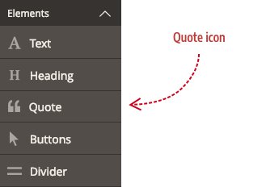
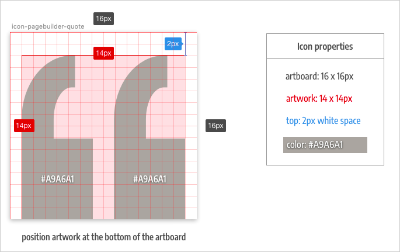
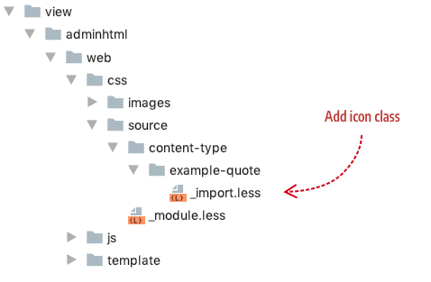

# Add icon

In this last step, we will create a panel icon for our Quote content type so that it has a unique but visually consistent identity alongside Page Builder's native font icons. When finished, the panel icon for our Quote content type will look like this:



## About icons

The icons used for Page Builder's built-in content types are actually font icons. Although you could create your own font icons and use those within your module, we recommend a using SVG or PNG images instead.

To create and add an icon, you must:

1. Create your SVG or PNG icon.
1. Create a CSS class for the icon.
1. Reference the icon class in the config file.

## Create your icon

As mentioned, you can create a PNG or an SVG icon, but we recommend creating SVG icons because they are smaller and render more clearly on high-resolution screens, including mobile devices. Use the following specifications to create a panel icon that integrates seamlessly with the existing panel icons.



As the illustration shows, the *artboard* represents the actual width and height of your icon when it is exported from your graphics application (16 x 16px). The *artwork* represents the content of your icon. Following these dimensions ensures your icons will match the size and positioning of the existing Page Builder icons within the panel.

When finished, add your icon to your `images` directory as follows:


## Create a CSS class for the icon

Next we'll create a CSS class that references your SVG file. Add this class to your LESS file in `adminhtml` as shown here:



The CSS for integrating SVG and PNG images with the font icons used by Page Builder can be a bit tricky in terms of matching size and positioning. As such, we recommend the following CSS rule set and conventions, changing only the content url path to your icon:

```css
.icon-pagebuilder-quote {
    content: url('@{baseDir}Example_PageBuilderQuote/css/images/content-type/example-quote/appearance/icon-pagebuilder-quote.svg');
    width: 18px;
    height: 18px;
    margin-bottom: -1px;
}
```

| Attribute       | Description                                                                                                                                                                                                                                                                                                                                                |
|-----------------|------------------------------------------------------------------------------------------------------------------------------------------------------------------------------------------------------------------------------------------------------------------------------------------------------------------------------------------------------------|
| `class name`    | To match the class names of Page Builder's native icons, we recommend prefixing your icon names with `icon-pagebuilder` as we have done with our Quote icon.                                                                                                                                                                                               |
| `content`       | The relative path to your SVG or PNG icon when rendered from `pub/static`. Referencing your image from your CSS icon class ensures that the link to your image will be created in the static output and the icon will resolve in the browser. Using the `@{baseDir}` variable also ensures that the static path to your image file will resolve correctly. |
| `width`         | Sets the width of the content area that most closely matches the widths of Page Builder icon fonts.                                                                                                                                                                                                                                                        |
| `height`        | Sets the height of the content area that most closely matches the widths of Page Builder icon fonts.                                                                                                                                                                                                                                                       |
| `margin-bottom` | Pulls the SVG or PNG image down within the panel container to more closely match the positioning of Page Builder's font icon.                                                                                                                                                                                                                              |

When deployed, your icon images are linked from `pub/static` as shown here:


## Add the icon class to the config file

The last step is to add our icon's class name to our config file. Previous to this step, we used an existing icon class: `icon-pagebuilder-heading`. Now we can replace this class with our new class: `icon-pagebuilder-quote`, as shown here:

```xml
<config xmlns:xsi="http://www.w3.org/2001/XMLSchema-instance" xsi:noNamespaceSchemaLocation="urn:magento:module:Magento_PageBuilder:etc/content_type.xsd">
    <type name="example_quote"
        label="Quote"
        menu_section="elements"
        component="Magento_PageBuilder/js/content-type"
        preview_component="Example_PageBuilderQuote/js/content-type/example-quote/preview"
        master_component="Magento_PageBuilder/js/content-type/master"
        form="pagebuilder_example_quote_form"
        icon="icon-pagebuilder-quote"
        sortOrder="21"
        translate="label">
```

That's it. Now you can regenerate your static assets, empty your browser cache, and do a hard reload of your Admin page to see your new icon in the panel.
