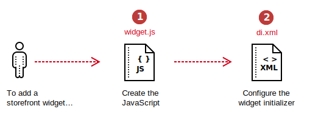
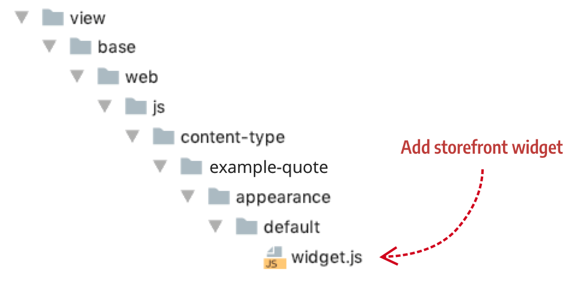

# Add a storefront widget

A storefront widget is a JavaScript component that handles the behavior of a content type after Page Builder renders it on the storefront. For example, the Tabs and Sliders have their own storefront widgets to handle the end-user's tapping of tabs and swiping of slides on the storefront.

However, Page Builder also executes storefront widgets on the Admin stage for block and dynamic block content types. This allows end-users to preview how Page Builder will render the blocks and dynamic blocks on the storefront.

Adding a storefront widget to your content type is a simple two-step process:



## Step 1: Create the JavaScript

Name your JavaScript file `widget.js` and put it in the following directory structure: `/view/base/web/js/content-type/{content-type-name}/appearance/{appearance-name}/widget.js`. An example from the PageBuilderQuote content type follows:



The JavaScript for the widget can handle events, initialize third-party controls, or do whatever else you need to control your content type's behavior _after_ Page Builder renders the master format template on the frontend (or within a block or dynamic block on the Admin stage).

```javascript
define([
    'jquery',
], function ($) {
    'use strict';

    return function (config, element) {
        var element = $(element);
        console.log("ELEMENT: " + element.data('element'));
    };
});
```

## Step 2: Configure the widget initializer

To configure your `widget.js` so that Page Builder can initialize and load it, create a new `WidgetInitializerConfig` type in your module's global `di.xml` file (`etc/di.xml`). Then add your custom configuration (that includes your widget) as a replacement argument. The following example is from the PageBuilderQuote module:

``` xml
<config xmlns:xsi="http://www.w3.org/2001/XMLSchema-instance" xsi:noNamespaceSchemaLocation="urn:magento:framework:ObjectManager/etc/config.xsd">
    <type name="Magento\PageBuilder\Model\WidgetInitializerConfig">
        <arguments>
            <argument name="config" xsi:type="array">
                <item name="example_quote" xsi:type="array">
                <!-- Name is the appearance name -->
                <item name="default" xsi:type="array">
                    <!--required argument-->
                        <item name="component" xsi:type="string">Example_PageBuilderQuote/js/content-type/example-quote/appearance/default/widget</item>
                    </item>
                </item>
            </argument>
        </arguments>
    </type>
</config>
```

That's it! For more examples, look at several of Page Builder's native widget implementations within `app/code/Magento/PageBuilder/view/base/web/js/content-type/`.
