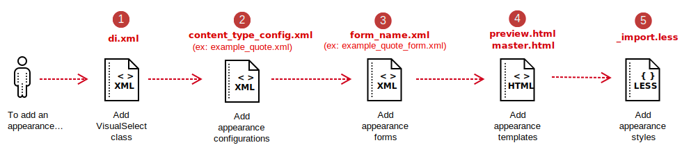
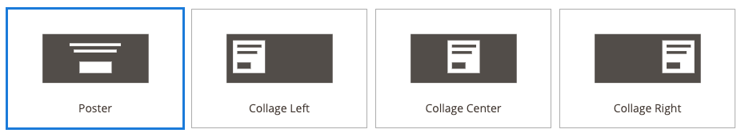
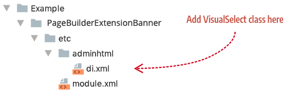
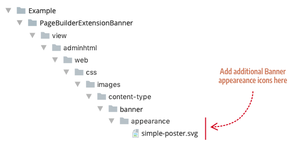
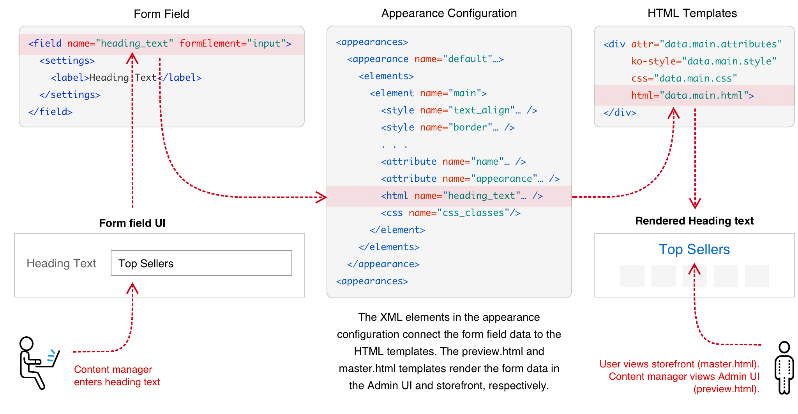
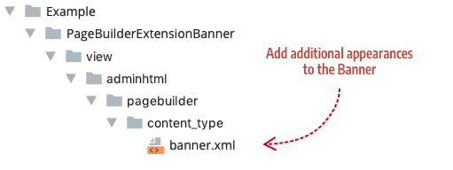
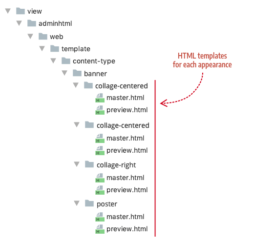
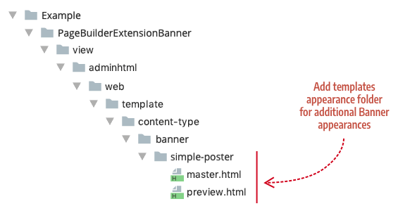
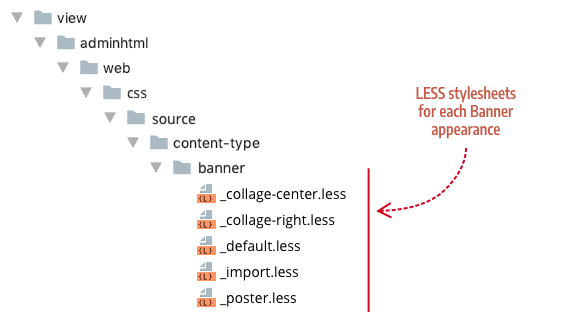
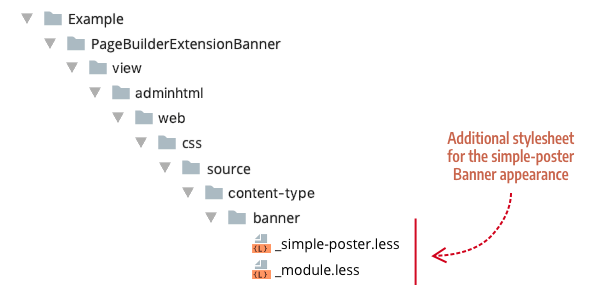

# Add appearances

This topic shows you how to add an appearance to Page Builder's native content types. An overview of the steps and the files you need to add are illustrated here:



*Steps for adding appearances*

These steps also apply to adding appearances to your custom content types and any third-party content types.

## Step 1: Add virtual type for VisualSelect class

First, we need a way select our new appearance within the form. In Page Builder, we use the `VisualSelect` class. This class provides the UI for selecting different appearances. For example, the `VisualSelect` class for the Banner provides four appearances to choose from:



*Visual selector for Banner*

To add a new appearance option for one of Page Builder's native content types (such as the Banner), create a new `di.xml` file in your module, as shown here:



*File and location for the VisualSelect class*

Within the `di.xml` file, add a virtual type using the`VisualSelect` class with the Banner's virtual type name (`<virtualType name="AppearanceSourceBanner"`), as shown here:

```xml
<config xmlns:xsi="http://www.w3.org/2001/XMLSchema-instance" xsi:noNamespaceSchemaLocation="urn:magento:framework:ObjectManager/etc/config.xsd">
    <virtualType name="AppearanceSourceBanner" type="Magento\PageBuilder\Model\Source\VisualSelect">
        <arguments>
            <argument name="optionsData" xsi:type="array">
                <item name="simple-poster" xsi:type="array">
                    <item name="value" xsi:type="string">simple-poster</item>
                    <item name="title" xsi:type="string" translate="true">Simple Poster</item>
                    <item name="icon" xsi:type="string">Example_PageBuilderBannerAppearance/css/images/content-type/banner/appearance/simple-poster.svg</item>
                </item>
            </argument>
        </arguments>
    </virtualType>
</config>
```

*VisualSelect class for new Banner appearance*

Using the same class name as the Banner ensures that Adobe Commerce's XML merging will add your new visual appearance option to the existing Banner appearance options.

The following table describes the configuration arguments for each appearance option.

| Arguments       | Description                                                                                                                                                                                                                                                             |
|-----------------|-------------------------------------------------------------------------------------------------------------------------------------------------------------------------------------------------------------------------------------------------------------------------|
| `optionsData`   | Grouping array for all the appearance options of a content type.                                                                                                                                                                                                        |
| `item array`    | Grouping array of properties that define an appearance option. We recommend you match the `name` of the item array to the option's `value` string. In our example, the `item` array's name is `simple-poster`, which matches the option's value string `simple-poster`. |
| `value`         | String that matches the appearance name defined in the content type's configuration file. Page Builder uses this string value to link the option to the appearance.                                                                                                     |
| `title`         | Display name for the appearance option. Banner example: Poster.                                                                                                                                                                                                         |
| `icon`          | Path to the `.svg` icon for the appearance: `view/adminthtml/web/css/images/content-type/[content-type-name]/appearance/*.svg`. See [Creating an icon for your appearance](#create-an-appearance-icon)                                                                  |
| `noticeMessage` | (Not shown in example.) The `noticeMessage` displays a message below the appearance options when the appearance is selected. For example, two of the Row appearances (`full-width` and `full-bleed`) define `noticeMessage` strings that display when selected.         |

To add more appearance options, simply create more `item` arrays with names that match the `value`, as shown here:

```xml
<item name="tall" xsi:type="array">
    <item name="value" xsi:type="string">tall</item>
    <item name="title" xsi:type="string" translate="true">Tall</item>
    <item name="icon" xsi:type="string">Example_PageBuilderExtensionBanner/css/images/content-type/banner/appearance/tall.svg</item>
</item>
<item name="short" xsi:type="array">
    <item name="value" xsi:type="string">short</item>
    <item name="title" xsi:type="string" translate="true">Short</item>
    <item name="icon" xsi:type="string">Example_PageBuilderBannerExtensionBanner/css/images/content-type/banner/appearance/short.svg</item>
</item>
```

*Example of appearance options*

### Create an appearance icon

Appearance icons are `.svg` files that graphically depict the layout of an appearance.
Add your additional appearance icons to your module's css appearance directory (`css/images/content-type/[content-type-name]/appearance/`).
You can add appearance icons for the Banner using the directory structure shown here:



*Appearance icons for Banner*

You can use any design tool to create your SVG. But if you want to match your appearance icons to Page Builder's icons *perfectly*, use the SVG structure and dimensions shown here:

```xml
<svg xmlns="http://www.w3.org/2000/svg" width="218" height="110" viewBox="0 0 218 110">
  <g fill="none" fill-rule="evenodd">
    <rect width="149" height="69" x="35" y="21" fill="#524D49"/>
    <!--- Optional shapes displayed on top of base rect -->
    <rect width="45" height="16" x="87" y="60" fill="#FFF"/>
    <rect width="72" height="4" x="73" y="34" fill="#FFF"/>
    <rect width="60" height="4" x="79" y="43" fill="#FFF"/>
  </g>
</svg>
```

*SVG appearance template*

These specific dimensions ensure that your icon fits seamlessly with Page Builder's existing appearance icons:

| Property                       | Value       |
| ------------------------------ | ----------- |
| `svg width`                    | 218         |
| `svg height`                   | 110         |
| `svg viewbox`                  | 0 0 218 110 |
| `g fill`                       | none        |
| base `rect width`              | 149         |
| base `rect height`             | 69          |
| base `rect x`                  | 35          |
| base `rect y`                  | 21          |
| base `rect fill`               | #524D49     |
| other  shape `fill` properties | #FFF        |

## Step 2: Add appearance configurations

Appearance configurations connect the data entered in a content type's form to its HTML templates.

For example, the Heading content type has an `<html>` config element (`<html name="heading_text" />`) that maps the text entered into the content type's `heading_text` field (`<field name="heading_text" formElement="input">`) to the Heading's Knockout template binding (`html="data.main.html"`), as illustrated here:



*Appearance configurations explained*

The same concept applies to `styles`, `attributes`, and `css` elements. These elements ensure that the form settings (both content and styles) get applied to the templates as expected.

To add a new Banner appearance configuration, create a content type config file named `banner.xml`, as shown here:



*Add appearances to Banner content type*

<InlineAlert variant="info" slots="text"/>

This procedure applies to any native content type you want to extend.
In other words, you can use the file name (such as `heading.xml`) and type name (such as `<type name="heading">`) of any content type to extend it based on Commerce's XML merging behavior.

An example `banner.xml` config file for a new `simple-poster` appearance is shown here:

```xml
<?xml version="1.0"?>
<config xmlns:xsi="http://www.w3.org/2001/XMLSchema-instance" xsi:noNamespaceSchemaLocation="urn:magento:module:Magento_PageBuilder:etc/content_type.xsd">
    <type name="banner">
        <children default_policy="deny"/>
        <appearances>
            <appearance name="simple-poster"
                        preview_template="Example_PageBuilderBannerAppearance/content-type/banner/simple-poster/preview"
                        master_template="Example_PageBuilderBannerAppearance/content-type/banner/simple-poster/master"
                        reader="Magento_PageBuilder/js/master-format/read/configurable">
                <elements>
                    <element name="main">
                        <style name="display" source="display" converter="Magento_PageBuilder/js/converter/style/display" preview_converter="Magento_PageBuilder/js/converter/style/preview/display"/>
                        <style name="margins" storage_key="margins_and_padding" reader="Magento_PageBuilder/js/property/margins" converter="Magento_PageBuilder/js/converter/style/margins"/>
                        <attribute name="name" source="data-content-type"/>
                        <attribute name="appearance" source="data-appearance"/>
                        <attribute name="show_button" source="data-show-button"/>
                        <attribute name="show_overlay" source="data-show-overlay"/>
                        <css name="css_classes"/>
                    </element>
                    . . .
            </appearance>
        </appearances>
    </type>
</config>
```

*Simple-poster appearance for the Banner content type*

## Step 3: Add appearance forms

Appearances for a content type can share the same form or use different forms. For example, the Products content type uses two different forms, one for each appearance. The Grid appearance uses the `pagebuilder_products_form.xml` to provide options for displaying products in a grid. While the Carousel appearance uses the `pagebuilder_products_carousel_form.xml` to provide extra options for displaying products in a carousel.

When you select an appearance with a form, Page Builder replaces the content type's form (defined in the `<type>` element) with the appearance's form. But when you select an appearance that does *not* have a form defined, the appearance switches back to using the content type's form.

```xml
<config xmlns:xsi="http://www.w3.org/2001/XMLSchema-instance"...>
    <type name="products"
          form="pagebuilder_products_form"
```

*Content type form used by default for all appearances*

To add a form for an appearance, add a `<form>` element as a child of the `<appearance>` element in your content type's config file. As mentioned, the Products content type uses a form for its Carousel appearance, as shown here:

```xml
<appearance name="carousel"
            preview_template="Magento_PageBuilder/content-type/products/grid/preview"
            master_template="Magento_PageBuilder/content-type/products/grid/master"
            reader="Magento_PageBuilder/js/master-format/read/configurable">
    <form>pagebuilder_products_carousel_form</form>
    <elements>
    . . .
```

*Adding a form to an appearance*

## Step 4: Add appearance templates

Appearances use different HTML templates to create different layouts. They also use templates to apply different styles to the same layouts. For example, the Banner uses four sets of `preview.html` and `master.html` templates, one set for each appearance:



*Banner appearance templates*

<InlineAlert variant="info" slots="text"/>

Notice how Page Builder organizes the Banner templates by appearance name. We recommend the same practice when adding templates for your appearances.

To create templates for additional Banner appearances, such as the `simple-poster` described in steps 1 and 2, add a new appearance folder with your `master.html` and `preview.html` templates, as shown here:



*Add additional templates to `template/content-type/[content-type-name]/[appearance-name]`*

## Step 5: Add appearance styles

Appearances use different CSS/LESS files to create different visual styles for a content type. For example, the Banner content type uses a different `.less` file for each appearance, as shown here:



*Banner stylesheets*

To create a stylesheet for an additional Banner appearance, such as the `simple-poster`, add a folder named `banner` and a `.less` file with the name of the appearance, as shown here:



*Add additional stylesheets to `css/source/content-type/[content-type-name]/`*

The `_module.less` file is an import file that ensures the additional stylesheet gets added to the existing Banner styles. The `_module.xml` file for our `simple-poster.less` file looks like this:

```scss
@import "_simple-poster";
```

Use `_module.less` for import statements

## Example Module

An example module for this topic is available for download in the [pagebuilder-examples repository](https://github.com/commerce-docs/pagebuilder-examples/tree/master/BannerApp/Appearance).

## Final thoughts

Using appearances to extend Page Builder's native content types represents one of Page Builder's best practices for creating a variety of new content building blocks based on existing content types.
