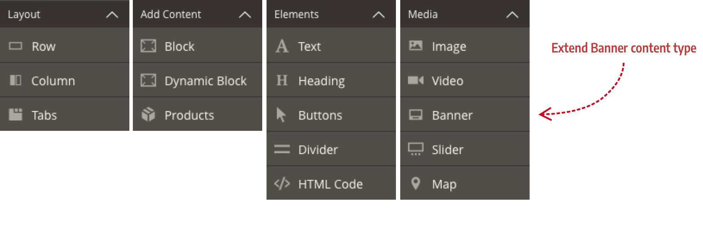
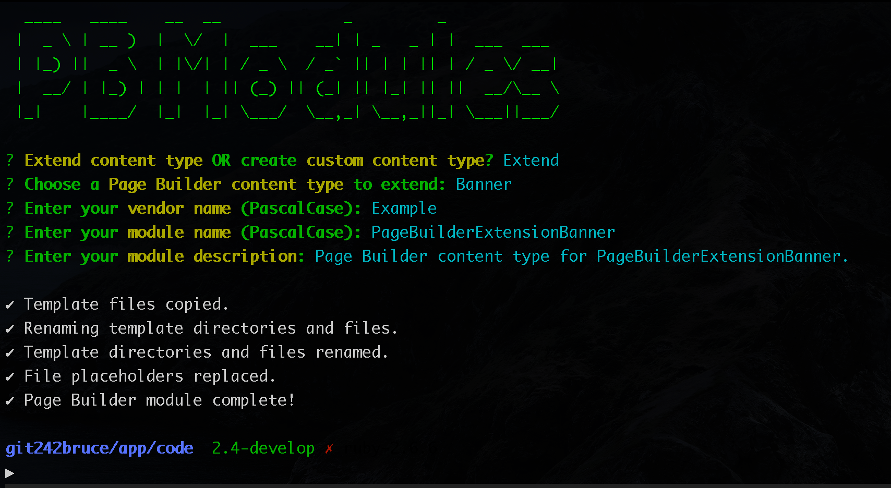
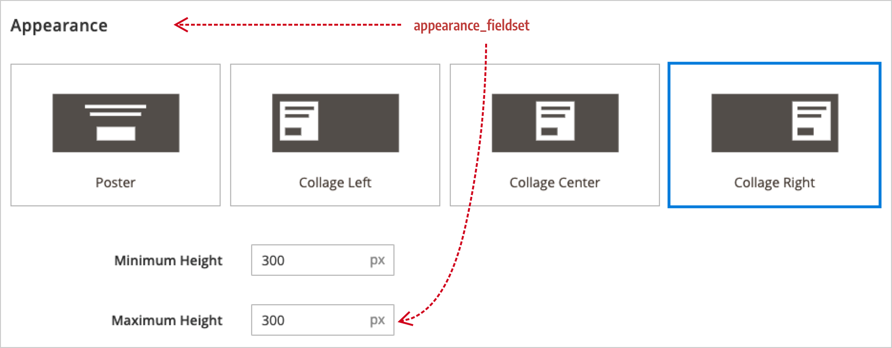

# Extend an appearance

In this topic, you will learn how to add a new user-defined property to an existing content type. Specifically, we will add a `max-height` property to all the Banner appearances. Why? Because our customers told us to, drill sergeant. [(WTM?)](https://www.youtube.com/watch?v=U6VPEcj77v8 "What's That Movie?").

**Scenario:** Your customers use Banners to feature products on their site. However, they don't like the fact that the Banner's height grows with the content they enter. So they want you to add a `max-height` field to all the Banner appearances. That way they can limit all their banners to the same height, and have their extra content scroll as needed.



## Steps to extend appearances

These steps describe the basic process for adding new style properties to existing content type appearances:

1. [Create a Page Builder extension module](#step-1-create-a-page-builder-extension-module).

1. [Add your properties to elements](#step-2-add-new-properties-to-elements).

1. [Add your property fields to the form](#step-3-add-your-property-fields-to-the-form).

1. [Add static styles](#step-4-add-static-styles) (as needed).

### Step 1: Create a Page Builder extension module

Use the [PB Modules CLI](https://github.com/magento-devdocs/pbmodules) to create the starting directory structure and files for a Banner extension. Instructions for using PB Modules can be found in the repo [`README.md`](https://github.com/magento-devdocs/pbmodules#pb-modules) file.

1. Navigate to your `<magento-instance-root>/app/code/` directory and run the following command:

    ```terminal
    npx https://github.com/magento-devdocs/pbmodules.git
    ```

1. Extend the `Banner` and complete the remaining prompts. When finished, you should have a complete directory structure and all the files you need (plus extras) to start extending the Banner.

    

1. Before continuing, run `bin/magento setup:upgrade` to install and enable your module.

### Step 2: Add new properties to elements

Now we can add our `max-height` property to the right `element` in all the Banner appearances. But which `element`?

We know that the Banner's content is making the Banner grow. So we need to find the `element` node that controls text. And here it is:

```xml
<element name="content">
    <html name="message" preview_converter="Magento_PageBuilder/js/converter/html/directive"/>
</element>
```

The use of an `html` node confirms it. The `<html>` element allows the value for a field to be output as HTML. We can confirm this as the right element by looking at the `preview.html` and `master.html` templates for the HTML elements that are bound to the `content` element:

```html
<!-- master.html -->
<div attr="data.content.attributes"
     ko-style="data.content.style"
     css="data.content.css"
     html="data.content.html">
</div>

<!-- preview.html -->
<div if="isWysiwygSupported()"
     class="inline-wysiwyg"
     ko-style="data.content.style"
     css="data.content.css"
     attr="data.content.attributes"
     afterRender="afterRenderWysiwyg"
     contenteditable="true"
     event="mousedown: stopEvent, click: activateEditor, dblclick: handleDoubleClick">
</div>
```

Both templates have `<div>` elements with several attributes bound to `<element name="content">`, including the `html` attribute on the frontend template (`master.html`). We can safely say that this is right element for our `max-height` property.

Because `max-height` is an official CSS property, we will add it using the `style` node as follows:

```xml
<element name="content">
    <style name="max_height" source="max_height" converter="Magento_PageBuilder/js/converter/style/remove-px"/>
</element>
```

Attributes of the `style` node are described briefly here:

-  `name` — name used to bind to the form field with the same name.

-  `source` — name of the CSS property in snake_case. Page Builder changes `max_height` to `max-height` when writing it to the DOM.

-  `converter` — JavaScript function that converts internal property values to and from the DOM because DOM values are often not in the right format for internal processing.

#### To add the `max-width` property to the `content` element of each appearance:

1. Open your module's `banner.xml` configuration file.

1. Remove the `preview` and `master` templates as well as the `main` element nodes from each appearance.

1. Add your new `content` element and `style` node to the `elements` node of each appearance.

When you are done, the `appearances` section of your `banner.xml` configuration file should look like this:

```xml
<appearances>
    <appearance name="collage-left">
        <elements>
            <element name="content">
                <style name="max_height" source="max_height" converter="Magento_PageBuilder/js/converter/style/remove-px"/>
            </element>
        </elements>
    </appearance>
    <appearance name="collage-centered">
        <elements>
            <element name="content">
                <style name="max_height" source="max_height" converter="Magento_PageBuilder/js/converter/style/remove-px"/>
            </element>
        </elements>
    </appearance>
    <appearance name="collage-right">
        <elements>
            <element name="content">
                <style name="max_height" source="max_height" converter="Magento_PageBuilder/js/converter/style/remove-px"/>
            </element>
        </elements>
    </appearance>
    <appearance name="poster">
        <elements>
            <element name="content">
                <style name="max_height" source="max_height" converter="Magento_PageBuilder/js/converter/style/remove-px"/>
            </element>
        </elements>
    </appearance>
</appearances>
```

### Step 3: Add your property fields to the form

Before you add a field to the form of an existing content type, you need to decide where to add it. In other words, you need to pick a fieldset for your field. For our `max_height` field, it makes sense to add it below the Banner's existing `min_height` field, which is in the the `appearance_fieldset`.

In our example, we used the following markup for our `max_height` field:

```xml
<form xmlns:xsi="http://www.w3.org/2001/XMLSchema-instance" xsi:noNamespaceSchemaLocation="urn:magento:module:Magento_Ui:etc/ui_configuration.xsd">
    <!-- Full Form: Magento/PageBuilder/view/adminhtml/ui_component/pagebuilder_banner_form.xml -->
    <fieldset name="appearance_fieldset">
        <field name="max_height" sortOrder="30" formElement="input">
            <argument name="data" xsi:type="array">
                <item name="config" xsi:type="array">
                    <item name="default" xsi:type="number">400</item>
                </item>
            </argument>
            <settings>
                <label translate="true">Maximum Height</label>
                <additionalClasses>
                    <class name="admin__field-small">true</class>
                </additionalClasses>
                <addAfter translate="true">px</addAfter>
                <dataType>text</dataType>
                <dataScope>max_height</dataScope>
                <validation>
                    <rule name="validate-number" xsi:type="boolean">true</rule>
                </validation>
            </settings>
        </field>
    </fieldset>
</form>
```

Explaining UI component form fields is beyond the scope of this topic, but a few brief descriptions of the most important nodes might help those of you who are not familiar with UI components. If you already know about UI components, feel free to skip this part.

| Elements            | Description                                                                                                                                                                                                                                                                                                                                                                                                                                            |
| ------------------- | ------------------------------------------------------------------------------------------------------------------------------------------------------------------------------------------------------------------------------------------------------------------------------------------------------------------------------------------------------------------------------------------------------------------------------------------------------ |
| `fieldset`          | The fieldset `name` should match the name of the fieldset from the Banner's form. The `appearance_fieldset` is common to all the content type forms and, by default, appears at the top of the forms using the `sortOrder` of 10. If you used [PB Modules](https://github.com/magento-devdocs/pbmodules/), the `fieldset` node names were copied from the Banner's form, so you're all set.                                                            |
| `field`             | The field `name` should match your `style` node name in your `banner.xml` config file. The same is true if you are adding `attribute`, `css`, `html`, or `tag` nodes; their names should match the field names that supply their values. Fields also have a `sortOrder` you can use to place your field above or below existing fields. The `formElement` for a field describes the HTML form type, such as input, wysiwyg, select, checkbox and more. |
| `argument > config` | Provides the initial configuration for the field, including the `default` value. We set our default `max_height` field to `400` (px).                                                                                                                                                                                                                                                                                                                  |
| `settings`          | Provides the field with a label, CSS styling, validation, and other properties as needed.                                                                                                                                                                                                                                                                                                                                                              |

### Step 4: Add static styles

For this Banner extension to work as expected, we need to add a CSS `overflow` property to the `content` element in the DOM. Specifically, we need to add `overflow-y: auto` to ensure that when the Banner reaches its `max-height` setting, any extra content can be scrolled vertically. And using `auto` (not `scroll`) hides the scroll bar when there's nothing to scroll.

In this case, the `overflow` property is considered a `static style` because users don't set it and there is no logic that changes its value for different conditions. The `overflow` property is also essential to the proper rendering of our Banner extensions because of the `max-height` user-defined property we added.

These qualities make the `overflow` property a perfect use case for adding it as a `static_style` on the `content` element. See [static_style and static_attribute elements](../../architecture/configurations.md#static_style-and-static_attribute-elements) for more about these configuration elements.

**Add `overflow-y` as a `static_style` property for each appearance**:

```xml
<appearances>
    <appearance name="collage-left">
        <elements>
            <element name="content">
                <style name="max_height" source="max_height" converter="Magento_PageBuilder/js/converter/style/remove-px"/>
                <static_style source="overflow-y" value="auto" />
            </element>
        </elements>
    </appearance>
    <appearance name="collage-centered">
        <elements>
            <element name="content">
                <style name="max_height" source="max_height" converter="Magento_PageBuilder/js/converter/style/remove-px"/>
                <static_style source="overflow-y" value="auto" />
            </element>
        </elements>
    </appearance>
    <appearance name="collage-right">
        <elements>
            <element name="content">
                <style name="max_height" source="max_height" converter="Magento_PageBuilder/js/converter/style/remove-px"/>
                <static_style source="overflow-y" value="auto" />
            </element>
        </elements>
    </appearance>
    <appearance name="poster">
        <elements>
            <element name="content">
                <style name="max_height" source="max_height" converter="Magento_PageBuilder/js/converter/style/remove-px"/>
                <static_style source="overflow-y" value="auto" />
            </element>
        </elements>
    </appearance>
</appearances>
```

As shown, all `static_styles` (and `static_attributes`) are simple to add, with only two attributes:

-  `source` — refers to the name of the CSS property.

-  `value` — refers to the value you want to set for that property.

The hardest part is knowing when to add them to a configuration.

#### `static_style` or stylesheet style?

When should you add a style (CSS property) as a `static_style` in your configuration, versus adding that style as a property within a CSS selector in your stylesheet?

We offer these guiding principles:

**Both options are valid** when the style property's **value** is:

-  Not set by users

-  Not changed by code

**Use stylesheets** when the style property's **value** is:

-  NOT REQUIRED to render the appearance correctly

**Use `static_style`** when the style property's **value** is:

-  REQUIRED to render the appearance correctly

You will have to evaluate which of your extending style properties are required to render your content type's appearance as it was intended, without the addition styles that are external to the configuration.

### Step 5: Add stylesheet styles

For styles that are not required for the basic rendering of your appearances, add them to your `.less` files in your `css/source` directories. From there, you can use them to target the elements you want to style. Here's how.

Open your module's Admin and frontend `_default.less` files (assuming you used PB Modules to create your module):

-  `adminhtml/web/css/source/content-type/banner/_default.less`

-  `frontend/web/css/source/content-type/banner/_default.less`

 Within your less files, you can use Page Builder's [CSS selector override pattern](../../styles/override-pagebuilder-styles.md) to create CSS selectors that target the `[data-element="<name-of-element>"]` attribute in the DOM. This is the way to style any element in your content type from your CSS/Less stylesheets.

<InlineAlert variant="info" slots="text"/>

**Styling best practices:**
If you don't know [how Page Builder styles content](../../styles/index.md), you need to stop reading this topic, go read that topic, then come back and continue. Knowing how Page Builder styles its content (and yours) is an essential part of mastering appearances. When you know how Page Builder generates and applies its CSS to the DOM, you gain control over your Page Builder styling destiny. No more dreams of selector magic shattered by nightmares of !importance. You can finally win the specificity war (in Page Builder).

#### Use case for stylesheet styles

Let's say your customers want to theme their content for Valentine's Day. They want you to change all the Banners to have a red background with white text.

In this case, you want to create a CSS selector that targets the `banner` content type, then the `wrapper` element within it (to change the background), then the `content` element (to change the text color).

Page Builder makes this easy by adding attributes to the HTML template elements when rendering them to the DOM. For Banners, Page Builder adds a `data-content-type="banner"` attribute to the top element of the Banner's templates to make it easy to target them in the DOM. Page Builder also adds a `data-element="name"` attribute to the HTML template elements that bind to a configuration `element`. The attribute takes the name of the `element` in the configuration.

We want to target the `wrapper` and `content` elements to make our CSS changes. So we start our selectors with `#html-body` followed by the `banner`, `wrapper`, and `content` attributes, and add our style properties like this:

```scss
// Targeting the Banner elements on the frontend
& when (@media-common = true) {
    #html-body {
        [data-content-type='banner'] {
            [data-element='wrapper'] {
                background-color: darkred;
            }

            [data-element='content'] {
                color: white;
            }
        }
    }
}
```

The selectors for the `background-color` and the text `color` both have a specificity of `120`, which overrides any styles Page Builder applies to the same DOM elements. And technically, you don't even need to look at the DOM to make this work. You just needed to know how Page Builder styles its content. (We, of course, look at the DOM all the time because its a great way to learn what attributes and classes Page Builder adds to your templates. Later, this can help you make creative decisions about what configuration and template elements you add to your extensions to get exactly what you want.)

When you get comfortable with targeting the element attributes, you can go much further with your styling customizations and theme nearly every element in your Banner extension:

```scss
// Targeting the Banner elements on the frontend
& when (@media-common = true) {
    #html-body {
        [data-content-type='banner'] {
            [data-element='wrapper'] {
                background-color: darkred;
                border-radius: 10px;
            }

            [data-element='overlay'] {
                max-width: 50%;
            }

            [data-element='content'] {
                color: white;
                margin-bottom: 25px;

                &::-webkit-scrollbar {
                    display: none;
                }
            }

            [data-element='button'] {
                background: white;
                border: white;
                color: darkred;

                &::after {
                    content: '❤️';
                    display: inline-block;
                    transform: translate(25px, -15px) rotate(25deg) scale(2);
                }
            }
        }
    }
}
```

Notice how you don't have to worry about nesting beyond the `banner` attribute: `[data-content-element='banner]`. Our selectors for the `wrapper`, `overlay`, `content`, and `button` elements all have a specificity of `120`. And that's all we need for our overrides.

### Testing your work

After adding your CSS/Less, run your Less transpiler, clean your cache (`bin/magento cache:clean`), drag a new Banner to the Admin stage, open the form editor, and take a look at your new `max-height` field being rendered for every appearance in the form, similar to what's shown here:



## Summary

Before you begin any Page Builder development, first explore whether you can meet your customer's needs by extending existing content types. If you can, you should. It's a quicker path to completion and less work than creating a completely new content type.

With more experience, you may be surprised at how often you can adapt existing content types to meet your customer's needs.

## Next steps

You have two more topic options for learning more about using appearances to extend content types:

1. [Extend another appearance](extend-more-appearances.md) where you will learn more about using the `attribute`, `style`, and `css` elements while extending a Heading content type.

1. [Add an appearance](add-appearances.md) where you will learn how to add a completely new appearance to a content type.
