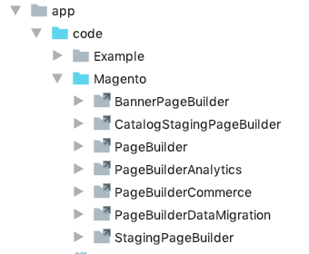

<Edition slot="text"/>

[PaaS only](https://experienceleague.adobe.com/en/docs/commerce/user-guides/product-solutions)

# Install Page Builder

<InlineAlert variant="info" slots="text"/>

These installation instructions are only for contributors to the Page Builder code or documentation.

For everyone else, Page Builder is automatically installed with Adobe Commerce 2.3.1. There is nothing else you need to do.

## GitHub installation for Contributors

Before installing Page Builder for making contributions, you must have the following prerequisites:

-  A local development installation of Adobe Commerce 2.3.1+ -- Use the installation instructions from the [DevDocs installation guide](https://experienceleague.adobe.com/en/docs/commerce-operations/installation-guide/overview).

-  Access to the private Page Builder repository. You should participate in [Adobe Partner Program](https://business.adobe.com/support/adobe-partners.html) to have these permissions.

-  [npm package manager](https://www.npmjs.com/get-npm)

1. Clone the Page Builder repos into the root directory of your Adobe Commerce 2.3+ installation:

    ```terminal
    git clone https://github.com/magento/magento2-page-builder
    git clone https://github.com/magento/magento2-page-builder-ee
    ```

1. From the root directory of your Adobe Commerce installation, use the `dev/tools/build-ee.php` script to symlink `magento2-page-builder` and `magento2-page-builder-ee` repos into your Magento Commerce installation:

    ```terminal
    php dev/tools/build-ee.php --command=link --exclude=true --ee-source="magento2-page-builder" --ce-source="."
    php dev/tools/build-ee.php --command=link --exclude=true --ee-source="magento2-page-builder-ee" --ce-source="."
    ```

    The results should look like this:

    

1. Enable the Page Builder module using the following command:

    ```terminal
    bin/magento setup:upgrade
    ```

### Updating GitHub installation

When a new version of Page Builder is available, pull the latest versions from GitHub at `magento/magento2-page-builder` and `magento/magento2-page-builder-ee`.

### Installing Node.js dependencies

If you plan to contribute to Page Builder, you need to install Node.js dependencies to compile TypeScript.

Navigate to the `pagebuilder` directory and install Page Builder dependencies using the following command:

```terminal
cd <pagebuilder-git-folder>
npm install
```

After installing the npm packages, you can run:

```terminal
npm run start
```

This command watches for changes to your TypeScript files, compiles, and checks for errors.
