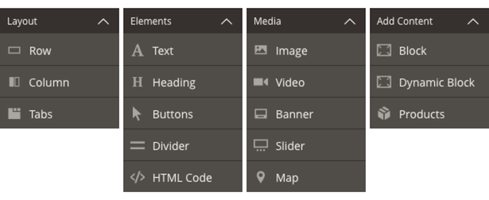

# What is Page Builder?

Page Builder is a Adobe extension for creating content by dragging-and-dropping pre-built controls.

We call these controls "content types." The available content types are shown in Page Builder's menu:

These content types provide several key features, including:

-  **Drag-and-drop** functionality for content creation.

-  **Live previews** of how the content will look on the storefront.

-  **Form editors** for entering and customizing the content.

For end-users, this means _no coding required_. For you as a developer, it means you will use content types to customize Page Builder in order to meet the end-user's needs. There are two ways to customize Page Builder using content types:

-  **Extend** existing content types

-  **Create** new content types

This documentation describes how to do both.

## Getting started with Page Builder development

The following topics will help you get started with Page Builder development:

-  [Contributors Only - Install Page Builder](contributors.md)

-  [Install Page Builder Examples](pagebuilder-examples.md)

-  [Check out the User Guide](https://experienceleague.adobe.com/docs/commerce-admin/page-builder/guide-overview.html?lang=en)
