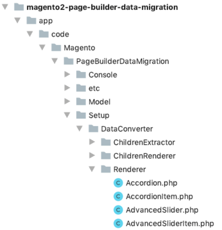

# How content migration works

Each content type has a corresponding renderer to convert the old BlueFoot JSON structure into the new PageBuilder format. The Page Builder format uses HTML to store all data associated with the content type within the DOM tree through attributes, styles, and child nodes. See [Page Builder architecture](../architecture/index.md) and [Configurations](../architecture/configurations.md) for more information.

In contrast to BlueFoot, the HTML structure we generate contains all the information needed to render the content type, this HTML string is committed directly into the database in place of the BlueFoot string.

Migrating will result in any field containing `<!--GENE_BLUEFOOT="…"-->` to now containing valid HTML with embedded metadata storing the configuration of the content type.

## Data Converters

We have two data converters provided out of the box which enable migration of data from different sources.

These data converters are located within `app/code/Magento/PageBuilderDataMigration/Setup/DataConverter`.

| Name                    | Description                                                                                                                                                                                                                                                                                                    |
| ----------------------- | -------------------------------------------------------------------------------------------------------------------------------------------------------------------------------------------------------------------------------------------------------------------------------------------------------------- |
| `BlueFootToPageBuilder` | Consumes BlueFoot generated content structures formed of JSON and uses renderer's to convert every content type to Page Builder HTML. In the instance the data converter encounters an error it will store the original JSON as un-migrated content.                                                           |
| `MixedToPageBuilder`    | If the above data converter fails on a particular piece of content due to an error or missing renderer for the content type it will have it's data preserved as un-migrated content. In this instance you can use the mixed data converter to run the un-migrated content blocks through the renderer's again. |

You can find more information on how to use the `MixedToPageBuilder` converter within our [Migrate content from custom blocks](migrate-content-custom-blocks.md) guide. We do not use this data converter out of the box so it will not be ran unless the steps in the attached guide are followed.

### Un-migrated content

We have a custom error handler along with logic to ensure that any issue content which fails during migration is preserved. If this logic of error handler are triggered you can expect to see errors within `var/log/system.log` along with the content being stored like the following in your migrated output:

```html
<div data-element="main" data-content-type="row" data-appearance="contained">
    <div data-element="main" data-content-type="html" data-appearance="default">
        &lt;!--UNMIGRATED_CONTENT="{"type":"custom","children":[]}"--&gt;
    </div>
</div>
```

The content is placed within an HTML content type. The original JSON is stored within a similar HTML comment as the BlueFoot data. This ensures preservation of the content to be migrated at a later point. HTML code has its contents encoded, those the greater than and less than symbols being encoded.

The usage of the HTML Code content type allows for other aspects of the page to be edited within Page Builder, while allowing this special content to be stored until the migration tools are available.

## Renderer

Every content type which is supported by the migration suite will have a renderer defined to translate the BlueFoot JSON data into valid Page Builder HTML. These renderers do not share the code used by the Page Builder tool itself due to our master format rendering being implemented in JavaScript.

Each renderer implements a straightforward interface (`Magento\PageBuilder\Setup\DataConverter\RendererInterface`) which defines a single `render` method which is responsible for consuming the form & EAV data and returning the valid Page Builder HTML.

```php
interface RendererInterface
{
    /**
     * Render HTML for content type
     *
     * @param array $itemData
     * @param array $additionalData
     * @return string
     * @throws \InvalidArgumentException
     * @throws NoSuchEntityException
     */
    public function render(array $itemData, array $additionalData = []) : string;
}
```

### Parameters

| Name              | Description                                                                                                                                    |
| ----------------- | ---------------------------------------------------------------------------------------------------------------------------------------------- |
| `$itemData`       | All associated item data for the content type, this will contain the form data along with the associated BlueFoot entity ID.                   |
| `$additionalData` | In some instances, there will be additional information associated with the content type. Most commonly used when a content type has children. |

### Location

All the core content type renders are located in `Setup/DataConverter/Renderer`:



### Example Renderer

To learn more about renderers, let's look at the Heading renderer code, then discuss the key parts.

```php
/**
 * Copyright [first year code created] Adobe. All rights reserved.
 */
declare(strict_types=1);

namespace Magento\PageBuilderDataMigration\Setup\DataConverter\Renderer;

use Magento\PageBuilderDataMigration\Setup\DataConverter\RendererInterface;
use Magento\PageBuilderDataMigration\Setup\DataConverter\EavAttributeLoaderInterface;
use Magento\PageBuilderDataMigration\Setup\DataConverter\StyleExtractorInterface;
use Magento\PageBuilderDataMigration\Setup\DataConverter\ElementRendererInterface;

class Heading implements RendererInterface
{
    /**
     * @var StyleExtractorInterface
     */
    private $styleExtractor;

    /**
     * @var EavAttributeLoaderInterface
     */
    private $eavAttributeLoader;

    /**
     * @var ElementRendererInterface
     */
    private $elementRenderer;

    /**
     * @param StyleExtractorInterface $styleExtractor
     * @param EavAttributeLoaderInterface $eavAttributeLoader
     * @param ElementRendererInterface $elementRenderer
     */
    public function __construct(
        StyleExtractorInterface $styleExtractor,
        EavAttributeLoaderInterface $eavAttributeLoader,
        ElementRendererInterface $elementRenderer
    ) {
        $this->styleExtractor = $styleExtractor;
        $this->eavAttributeLoader = $eavAttributeLoader;
        $this->elementRenderer = $elementRenderer;
    }

    /**
     * @inheritdoc
     *
     * @throws \Magento\Framework\Exception\NoSuchEntityException
     */
    public function render(array $itemData, array $additionalData = []) : string
    {
        $eavData = isset($itemData['entityId']) ? $this->eavAttributeLoader->load($itemData['entityId']) : [];

        $rootElementAttributes = [
            'data-element' => 'main',
            'data-content-type' => 'heading',
            'data-appearance' => 'default',
            'class' => $eavData['css_classes'] ?? ''
        ];

        $formData = $itemData['formData'] ?? [];
        $rootElementAttributes['style'] = $this->styleExtractor->extractStyle(
            $formData,
            $this->getAdvancedDefaults()
        );

        return $this->elementRenderer->render(
            $eavData['heading_type'] ?? 'h2',
            $rootElementAttributes,
            $eavData['title'] ?? ''
        );
    }

    /**
     * Define the defaults for the advanced section
     *
     * @return array
     */
    private function getAdvancedDefaults()
    {
        return [
            'border-style' => 'none',
            'border-width' => '1px',
            'border-radius' => '0px',
        ];
    }
}
```

### Parts of a renderer

The significant parts of a content type renderer are as follows:

#### Constructor dependency injection

First, we use [dependency injection](https://developer.adobe.com/commerce/php/development/components/dependency-injection/) to include our dependencies. These are all aspects of Data Migration that aid in retrieving and formatting data along with rendering DOM elements. We go into these in more detail below.

```php
    public function __construct(
        StyleExtractorInterface $styleExtractor,
        EavAttributeLoaderInterface $eavAttributeLoader,
        ElementRendererInterface $elementRenderer
    ) {
        $this->styleExtractor = $styleExtractor;
        $this->eavAttributeLoader = $eavAttributeLoader;
        $this->elementRenderer = $elementRenderer;
    }
```

#### Render function

We then have the initial part of our render function, as the Heading content type in BlueFoot stored some data in its EAV tables we need to retrieve that data using the `EavAttributeLoaderInterface`. A renderer has to support rendering an empty content type as supported by BlueFoot, due to this reason we set the `$eavData` to an empty array if the content type is lacking an entity ID.

```php
    public function render(array $itemData, array $additionalData = []) : string
    {
        $eavData = isset($itemData['entityId']) ? $this->eavAttributeLoader->load($itemData['entityId']) : [];
```

#### Root element attributes

Next, we declare the root element attributes which should be rendered on our root element; this allows us to make modifications based on conditions further down if required. Note how we're ensuring if there is no value set for things like `css_classes` and `formData` we default these to empty arrays to allow the renderer to produce an output regardless.

```php
        $rootElementAttributes = [
            'data-element' => 'main',
            'data-content-type' => 'heading',
            'data-appearance' => 'default',
            'class' => $eavData['css_classes'] ?? ''
        ];
```

#### Form data

Within BlueFoot, block data is stored in two different places: database EAV tables and JSON. Most of the data is stored in the EAV tables. However, the "advanced" section within BlueFoot is not persisted to the database. It is held in the JSON format. We refer to this as `formData` and ensure this value is present as an empty array if no data is provided as part of the `$itemdata`:

```php
        $formData = $itemData['formData'] ?? [];
```

#### Style extractor

We retrieved the form data above for usage in the style extractor (`StyleExtractorInterface`), this serves as a helper class to retrieve and build the style declaration for the current content type based on the form data and any defaults, notably throughout the default renderers we use the function name `getAdvancedDefaults`.

```php
        $rootElementAttributes['style'] = $this->styleExtractor->extractStyle(
            $formData,
            $this->getAdvancedDefaults()
        );
```

#### Element renderer

Along with the EAV & style classes we provide an element renderer class (`ElementRendererInterface`) to help when generating DOM elements from the BlueFoot JSON. In our instance, our element should have the tag name associated with the heading type, or by default h2, along with our previously defined root element attributes. Finally, we use the `title` from the EAV data as the contents of the element.

```php
        return $this->elementRenderer->render(
            $eavData['heading_type'] ?? 'h2',
            $rootElementAttributes,
            $eavData['title'] ?? ''
        );
```

#### Default form values

We declare the advanced defaults for this content type. Each Page Builder content type can define default values within its form declaration. These values are automatically applied to the content types master format on creation. BlueFoot did not implement the same system, which means you must declare the defaults for inclusion here manually.

```php
    private function getAdvancedDefaults()
    {
        return [
            'border-style' => 'none',
            'border-width' => '1px',
            'border-radius' => '0px',
        ];
    }
```

In this instance, the defaults are very simple because there's only a single DOM element for the entire content type. However, in more complex content types, we break out the default values into separate functions within the `getAdvancedDefaults()` function.

### `EavAttributeLoaderInterface`

In BlueFoot, the majority of the content is persisted into the database using the entity-attribute-value (EAV) format, which means the content is not available in the JSON from `$itemData`.

Some content types do not persist content to the database, such as the row and column. However, for all content types that require it, you must define a virtual type declaring which EAV attributes should be loaded for the content type:

`Magento\PageBuilder\Setup\DataConverter\ConfigurableEavAttributeLoader` which in turn implements our `EavAttributeLoaderInterface`.

**Example `di.xml` entry for EAV hydrator for Heading:**

```xml
<virtualType name="HeadingEavAttributeLoader" type="Magento\PageBuilder\Setup\DataConverter\ConfigurableEavAttributeLoader">
    <arguments>
        <argument name="additionalEavAttributes" xsi:type="array">
            <item name="title" xsi:type="string">title</item>
            <item name="heading_type" xsi:type="string">heading_type</item>
        </argument>
    </arguments>
</virtualType>
```

In this example, the EAV loader for Heading is assigned the `title` and `heading_type` attributes, this ensures the EAV attribute loader will retrieve these values within your renderer. Failing to include an attribute here will result in that attribute not being loaded.

We then use [dependency injection](https://developer.adobe.com/commerce/php/development/components/dependency-injection/) to inject our virtual configurable EAV loader into the Heading renderer.

**Example `di.xml` entry for Heading renderer:**

```xml
<type name="Magento\PageBuilder\Setup\DataConverter\Renderer\Heading">
    <arguments>
        <argument name="eavAttributeLoader" xsi:type="object">HeadingEavAttributeLoader</argument>
    </arguments>
</type>
```

The `EavAttributeLoaderInterface` includes a single method (`load`) to load the EAV data:

```php
public function load($entityId) : array;
```

| Parameter   | Type              | Description                                                  |
| ----------- | ----------------- | ------------------------------------------------------------ |
| `$entityId` | String  \| Number | BlueFoot entity ID associated with the current content type. |

```php
$eavData = isset($itemData['entityId']) ? $this->eavAttributeLoader->load($itemData['entityId']) : [];
```

#### Attributes with sources

Some BlueFoot attributes have sources for their data providing their actual values based on an ID. For instance, this is commonly used with boolean (Yes / No) values.

We automatically follow these references and update the values with their associated labels, meaning a boolean will return the value "Yes" or "No".

### `StyleExtractorInterface`

We utilise the style extractor to help with translating the simple EAV stored values of BlueFoot into our new actual inline CSS expressions. This extractor exists as aspects of this operation can be tedious and result in lots of duplicated code between content types.

The migration tool has a preference within it's `di.xml` file that aligns our interface with the concrete implementation. We import this dependency through our constructor using `Magento\PageBuilder\Setup\DataConverter\StyleExtractorInterface`.

#### Extracting Styles

The first method we provide helps extract styles and generates the associated CSS strings from BlueFoot EAV or form data.

```php
public function extractStyle(array $formData, array $defaults = [], array $pluck = []) : string;
```

| Parameter   | Type  | Description                                                                                                                                                                      |
| ----------- | ----- | -------------------------------------------------------------------------------------------------------------------------------------------------------------------------------- |
| `$formData` | Array | Associative array of data from a BlueFoot block. This could be either the EAV data, the form data, or a combination of both.                                                     |
| `$defaults` | Array | Associative array of default values which should be generated alongside the `$formData`. Existing values in the form data override any default values provided in this argument. |
| `$pluck`    | Array | Array of style keys to pluck from the generated styles. For example, `['text-align', 'border-color']` would provide just those two styles even if other styles were generated.   |

Even if you do not have any `$formData`, you must still run the `extractStyle` method on an empty array to ensure we apply the correct default styles to the content type. Default styles are important because they can drastically change the final appearance of the content type on the storefront and result in missing data in the admin.

**Usage:**

```php
$this->styleExtractor->extractStyle($formData, ['margin' => '10px'], ['margin']);
```

#### Creating a style string from an array

There may be cases where you need to apply new styles to an element manually, without first extracting styles that don't exist using the `extractStyle`. In these cases, use the `createStyleFromArray` function:

```php
public function createStyleFromArray(array $styles) : string;
```

| Parameter | Type  | Description                                                                                                                          |
| --------- | ----- | ------------------------------------------------------------------------------------------------------------------------------------ |
| `$styles` | Array | Associative array of styles to be converted into a string. For example, `['border-style': 'none']` results in `border-style: none;`. |

This method helps ensure continuity between content types and their styles.

### Children content blocks

Some BlueFoot content types, such as the slider, can contain special child content types. Page Builder handles this differently. In Page Builder, all children are dealt with the same. In BlueFoot, these special children are stored in specific parts of the JSON data. For these particular instances, you will need to define a custom extractor for children to ensure that the migration module traverses the tree as expected.

For structural content types such as rows and columns a custom children extractor is not required as they will use the default.

During rendering, content types are processed from the bottom of the tree to the top. In other words, the system renders all child blocks first and makes the results available to the immediate parent for placement.

Using a virtual type of `Magento\PageBuilder\Setup\DataConverter\ChildrenExtractor\Configurable` we can define the path to which the child items are located within the BlueFoot data.

**Example `di.xml` entry:**

```xml
<virtualType name="ButtonsChildrenExtractor" type="Magento\PageBuilder\Setup\DataConverter\ChildrenExtractor\Configurable">
    <arguments>
        <argument name="path" xsi:type="string">children/button_items</argument>
    </arguments>
</virtualType>
```

After the system renders the child blocks, the content is available to the parent renderer through `$additionalData['children']` as a string. If the content type has no children this array item will not be set, so you should validate first before attempting to use it.

All children extractors must implement `Magento\PageBuilder\Setup\DataConverter\ChildrenExtractorInterface`; the path should be provided using `di.xml` into the constructor, the extractor for children provides a single method (`extract`) for retrieving the defined children:

```php
public function extract(array $data) : array;
```

| Parameter | Type  | Description                                 |
| --------- | ----- | ------------------------------------------- |
| `$data`   | Array | The BlueFoot content types structured data. |

This function is called internally when traversing the BlueFoot structure and should not be called within individual renderers.

### Renderer Pool

The `di.xml` file declares which content type renderers are available in the renderer pool. The core PageBuilder module implements content type renderers for all its core content types.

**Example di.xml file:**

```xml
<type name="Magento\PageBuilder\Setup\DataConverter\RendererPool">
    <arguments>
        <argument name="renderers" xsi:type="array">
            <item name="row" xsi:type="object">Magento\PageBuilder\Setup\DataConverter\Renderer\Row</item>
            <item name="column" xsi:type="object">Magento\PageBuilder\Setup\DataConverter\Renderer\Column</item>
            <item name="heading" xsi:type="object">Magento\PageBuilder\Setup\DataConverter\Renderer\Heading</item>
            ....
        </argument>
    </arguments>
</type>
```

If you are creating a new renderer for migration outside the PageBuilder module, you only need to list your custom renderer in the `renderers` array in your `di.xml` file.

## Custom Content Types

You can create a custom content type renderer as we've displayed here by following our article: [Migrate custom content types](migrate-content-custom-blocks.md).
