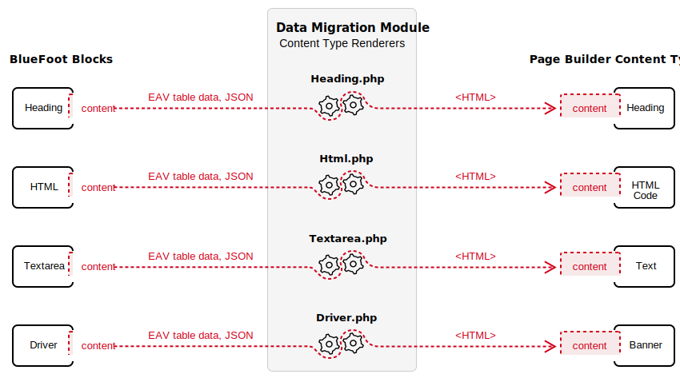

<Edition slot="text"/>

[PaaS only](https://experienceleague.adobe.com/en/docs/commerce/user-guides/product-solutions)

# Overview of content migration

Our content migration module (`PageBuilderDataMigration`) enables BlueFoot users to migrate *the content* from their BlueFoot blocks to the new Page Builder content types. The migration module does not convert the code from the BlueFoot blocks; it only migrates the content.

<InlineAlert variant="info" slots="text"/>

We only support migrating content from BlueFoot to Page Builder `1.0.*` (released with Adobe Commerce `2.3.1`). If we release a newer version of Page Builder, you must first migrate your BlueFoot content to Page Builder `1.0.*`, then upgrade your instance of Page Builder to the newer version.

## Supported Content Types

The data migration module is a developer's tool to help you migrate content from the core BlueFoot blocks into their equivalent Page Builder content types. We tried to keep the Page Builder content types aligned with the BlueFoot blocks to make content migration easier.

The migration tool will migrate content from BlueFoot blocks, as follows:

| BlueFoot Blocks | Content Type Renderer | Page Builder Content Type |
| :-------------- | :-------------------- | :------------------------ |
| *Accordion*       | Accordion.php         | **HTML Code**               |
| Advanced Slider | AdvancedSlider.php    | Slider                    |
| *Anchor*          | Anchor.php            | **HTML Code**               |
| Buttons         | Buttons.php           | Buttons                   |
| *Code*            | Code.php              | **Text**                    |
| Column          | Column.php            | Column                    |
| Driver          | Driver.php            | Banner                    |
| HTML            | Html.php              | HTML Code                 |
| Heading         | Heading.php           | Heading                   |
| Horizontal Rule | Divider.php           | Divider                   |
| Image           | Image.php             | Image                     |
| Map             | Map.php               | Map                       |
| *Newsletter*      | Newsletter.php        | **HTML Code**               |
| Product         | Product.php           | Products                  |
| Product List    | ProductionList.php    | Products                  |
| Row             | Row.php               | Row                       |
| *Search*          | Search.php            | **HTML Code**               |
| Slider          | AdvancedSlider.php    | Slider                    |
| Static Block    | Block.php             | Block                     |
| Tabs            | Tabs.php              | Tabs                      |
| Textarea        | Textarea.php          | Text                      |
| Video           | Video.php             | Video                     |

The BlueFoot blocks displayed in italics (*HTML Code* and *Text*) do not have a comparable Page Builder content type. So the migration module moves the content from these blocks into an HTML Code or Text content type. This action preserves the content and renders it on the storefront. However, editing the content within the Admin will be difficult until you move it into a new content type.

## Empty content types

In BlueFoot, you were able to create an "empty block" by adding the block to the stage and clicking "Cancel" on the form. This resulted in a block with no data. If these blocks have equivalent Page Builder content types, they are migrated to Page Builder, but marked as hidden on the Admin stage. Being hidden means that you can see and edit the content types on the Admin stage, but they will not display on the storefront.

Empty blocks that do not have equivalent Page Builder content types are not migrated.

## Content type renderers

We use classes called renderers to migrate content from BlueFoot blocks to Page Builder content types. The migration module provides a renderer for each BlueFoot block. Learn more about renderers in [How content migration works](how-content-migration-works.md).

## Custom content types

Out of the box, the migration module does not support migrating custom BlueFoot blocks (blocks not shipped by default with BlueFoot). You can migrate these blocks through our custom content type APIs. Before using these APIs, however, you must create a suitable content type in Page Builder. Learn more in [Migrate content from custom blocks](migrate-content-custom-blocks.md).

## Other BlueFoot content

BlueFoot could be active in a part of Commerce that, by default, Page Builder is not active. If you think this applies to your site, take a look at [Migrate other Commerce entities](migrate-other-bluefoot-content.md).

## Next Step: Installation

The first step to migrating your content is to [Install the migration module](install-migration-module.md).
