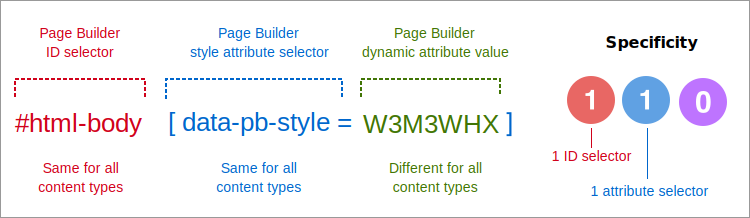

# How Page Builder styles content

Page Builder applies CSS styles to both native and custom content types by generating attribute-based CSS rulesets that are unique to each content type on a page. Page Builder generates and applies styles to content types in four stages:

-  [Add content-type attributes](#content-type-attributes). Page Builder adds a `data-pb-style` attribute and a dynamically generated value to the content type so that it can be uniquely targeted by a CSS selector.

-  [Generate dynamic CSS selectors](#dynamic-css-selectors). Page Builder generates a CSS selector for the content type by combining the page's `html-body` ID and the `data-pb-style` attribute with the content type's unique value.

-  [Create CSS rulesets](#css-rulesets). Page Builder creates the CSS ruleset (property: values) for the selector by pulling values from the content type's form editor.

-  [Create internal stylesheets](#internal-stylesheets). Page Builder creates an internal stylesheet for each page by adding a `<style>` block before the content types on the page.

This topic details each stage in the process.

## Content-type attributes

For every content type (both native and custom), Page Builder adds an attribute called `data-pb-style` with a unique and dynamically generated value. The following example shows a Heading content type with the style attribute:

```html
<h2 data-content-type="heading"
    data-appearance="default"
    data-element="main"
    data-pb-style="XDFNGK9">
    My Heading
</h2>
```

## Dynamic CSS selectors

Page Builder generates its CSS selectors using one `id` selector and one `attribute` selector. This pattern is always the same, which gives all Page Builder CSS selectors a specificity of **110**. The anatomy of a Page Builder CSS selector is shown here:



As noted, the CSS specificity of 110 is relatively low, which makes it possible to override these styles with your own custom CSS. For more information on CSS specificity and how it works, see [Specificity documentation](https://developer.mozilla.org/en-US/docs/Web/CSS/Guides/Cascade/Specificity).

## CSS rulesets

To create the CSS rulesets for the selectors, Page Builder pulls the properties and values from the content type's form editor. The following example lists the CSS rules created from a Row content type (with minor changes made to the margins and paddings in the editor):

```css
#html-body [data-pb-style=WMWMCFQ] {
    justify-content: flex-start;
    display: flex;
    flex-direction: column;
    background-position: left top;
    background-size: cover;
    background-repeat: no-repeat;
    background-attachment: scroll;
    border-style: none;
    border-width: 1px;
    border-radius: 0;
    margin: 0 0 10px;
    padding: 10px;
}
```

As end users change and save settings within a content type's editor, Page Builder updates the CSS ruleset to reflect those changes (and creates a new unique value for `data-pb-style`).


## Internal stylesheets

If you inspect a page on your storefront built with Page Builder, you can see how Page Builder applies styles to its content types. For example, the following HTML is from a simple page with three content types: a `Row`, `Heading`, and `Text`. The highlighted parts show how Page Builder defines and applies the styles to content types on a page.


1. **Html-body ID**. The first thing to notice is the CSS `id=html-body` assigned to Adobe Commerce storefront pages. Page Builder uses this `id` to construct all the CSS selectors it applies to its content types.

1. **Internal style block**. Page Builder adds all the unique `data-pb-style` attribute styles for the page's content types to a single `<style>` block. This creates what's called an internal stylesheet for the page. In this example, the page contains three content types that required three CSS rulesets for the page's `<style>` block.

    Note that not every content type on the page needs its own unique ruleset. In many cases, CSS rulesets can be shared among the content types on the page. Page Builder determines the most efficient application of CSS to the content types on the page, then creates the rulesets necessary for accurate styling.

1. **Applied styles**. The dynamic `data-pb-style` attributes on the content types match their respective CSS styles in the `<style>` block, and the browser does the rest. For both custom and native content types, Page Builder applies the `data-pb-style` attribute to content type elements that contain `style` nodes.

    For example, notice how Page Builder adds the `data-pb-style` attribute to the Row's `inner` element, and not the `main` element, as was done for the Heading and Text content types. The reason becomes clear when you look at the Row's element structure within its config file (`row.xml`):

    ```xml
    <elements>
        <element name="main">
            <style name="display" source="display" converter="Magento_PageBuilder/js/converter/style/display" preview_converter="Magento_PageBuilder/js/converter/style/preview/display"/>
            <attribute name="name" source="data-content-type"/>
            <attribute name="appearance" source="data-appearance"/>
        </element>
        <element name="inner">
            <style name="background_color" source="background_color"/>
            <style name="background_image" source="background_image" converter="Magento_PageBuilder/js/converter/style/background-image" preview_converter="Magento_PageBuilder/js/converter/style/preview/background-image" persistence_mode="write"/>
            <style name="background_position" source="background_position"/>
            <style name="background_size" source="background_size"/>
            <style name="background_repeat" source="background_repeat"/>
            <style name="background_attachment" source="background_attachment"/>
            <style name="text_align" source="text_align"/>
            ...
    ```

    As shown, the Row's `inner` element contains all the `style` nodes applied to the Row, not the `main` element. So Page Builder applies the `data-pb-style` attribute to the Row's `inner` element to ensure the proper application of CSS styles. For the Heading and Text content types, all the `style` nodes are in the `main` element, so Page Builder applies the `data-pb-style` attribute to those elements in the DOM.

## Summary

Page Builder applies styles to native and custom content types by creating dynamic, attribute-based styles, using a CSS selector pattern that results in a specificity of 110 for each content type style. Page Builder adds these styles to a single internal stylesheet for each page and can be easily overridden with custom CSS classes.

See [Override Page Builder styles](override-pagebuilder-styles.md) to start customizing Page Builder's styles to meet your needs.
