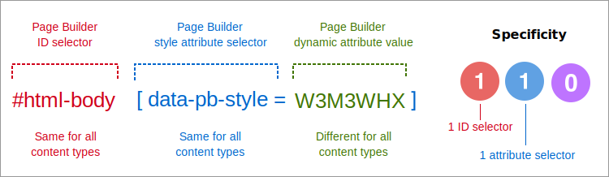
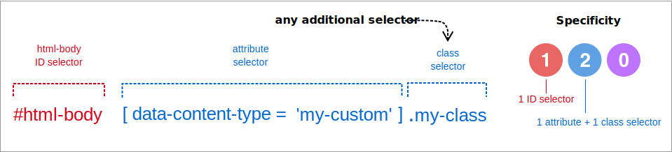
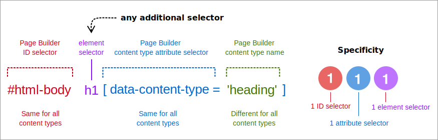
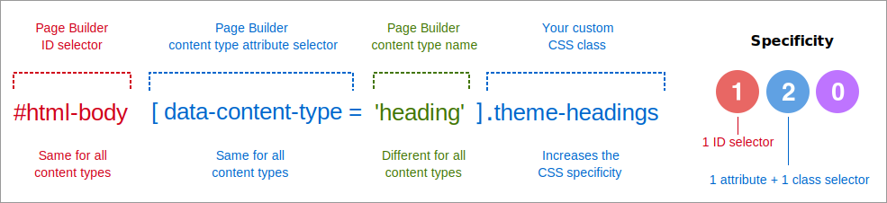
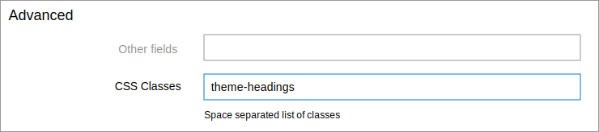

<Edition slot="text"/>

[PaaS only](https://experienceleague.adobe.com/en/docs/commerce/user-guides/product-solutions)

# Override Page Builder styles

To override the internal CSS styles that Page Builder applies to content types, you must create a CSS selector with a [specificity](https://developer.mozilla.org/en-US/docs/Web/CSS/Guides/Cascade/Specificity) greater than `110`, which is the selector specificity that Page Builder applies to all of its native content types and your custom content types. Page Builder's default selector pattern is shown here:

```scss
// Specificity = 110, always

#html-body  +  [data-pb-style=W3M3WHX]
```



You can find all the details about how Page Builder styles its content types in [How Page Builder styles content](index.md).

## CSS selector override pattern

<InlineAlert variant="info" slots="text"/>

**Specificity Calculator**. This calculator is an excellent resource for learning and checking the specificity of your CSS selectors: [Specificity Calculator](https://specificity.keegan.st/).

To override Page Builder's styles, always use the following CSS selector pattern:

```scss
// Creates a specificity = 111, or greater.

#html-body  +  [content-type-attribute]  +  any additional selector
```



1. `#html-body` - Start all your override selectors with this `id`. The `#html-body` id is in the `<body>` element of every Adobe Commerce frontend and admin page.

1. `[data-content-type='my-custom']` - Add a content-type attribute selector next, where the `'my-custom'` is the name of the content type found in its configuration file. For example, to target the `Row` content type, your attribute selector would look like `[data-content-type='row']`.

1. `Any additional selector` - The first two selectors match Page Builder's internal selectors with a specificity of `110`. Adding any other selector (except `*`) will bump the specificity to `111` or higher, which overrides Page Builder's internal selector.

## CSS selector override example

If you want to override just *one* of the HTML heading elements (`h1 - h6`), you would start with `#html-body` (as always), add the content type `heading` attribute, then add the heading element you want to override. That combination creates a CSS specificity of `111`, just enough to override Page Builder:

```scss
#html-body h1[data-content-type="heading"] {}
```



Again, you can override Page Builder's default styles with `any additional selector`. This keeps your CSS simple and the specificity low.

## More selector override examples

In the following examples, each selector targets different DOM elements for a content type. But they all have a specificity higher than Page Builder's default of `110`:

**Overrides all `heading` elements (`h1 - h6`) for all `heading` appearances**

```scss
// Specificity: 120
#html-body [data-content-type="heading"][data-element="main"] {}
```

**Overrides `heading` elements (`h1 - h6`) for the `default` appearance**

```scss
// Specificity: 120
#html-body [data-content-type="heading"][data-appearance="default"] {}
```

**Override all `Row` inner element styles**

```scss
#html-body [data-content-type="row"] [data-element="inner"] {} // Specificity 120
```

**Override all `Text` typography styles**

```scss
#html-body [data-content-type="text"] p {} // Specificity 111
```

## Override content using CSS Classes

So far, we've only used IDs, attributes, and elements to override Page Builder's CSS. But you can also use CSS classes as your overriding selector in the **additional selector** slot.

To override a content type using one or more custom CSS classes:

1. Create the CSS selector.

1. Apply the CSS class.

### Step 1: Create the CSS selector

If your CSS class name is `.theme-headings`, the CSS selector you define in your `.less` file would look something like this:

```scss
#html-body [data-content-type="heading"].theme-headings {}
```



By adding the class to the pattern, you create a `Heading` selector with a specificity of `120`—which again overrides Page Builder's default specificity of `110`. All the CSS rules declared in the selector with the `.theme-headings` class will override Page Builder's equivalent rules for the `Heading` content type.

### Step 2: Apply the CSS class

The second step is to add your custom class name to the content type's form editor, specifically to the **CSS Classes** field.

For example, to have Page Builder apply the `theme-headings` class to a `Heading` on the page, you would open the `Heading` form editor and enter `theme-headings` (no period) in the **CSS Classes** field, as shown here:



Page Builder adds this class to the `Heading` element (`h1` - `h6`) in the DOM, where it is targeted and styled by your CSS class selector and ruleset.

## Where to override Page Builder CSS

Now that you understand Page Builder's CSS selector override pattern, as well as how to apply class names to existing Page Builder content types, it's time to put your knowledge to use.

The next three topics describe how and where you can override Page Builder's default styles:

-  [Use Themes to override styles](use-themes-to-override-styles.md)

-  [Use Modules to override styles](use-modules-to-override-styles.md)

-  [Use HTML Code to override styles](use-htmlcode-to-override-styles.md)
