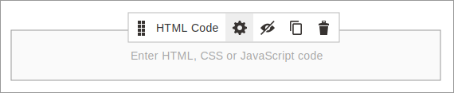
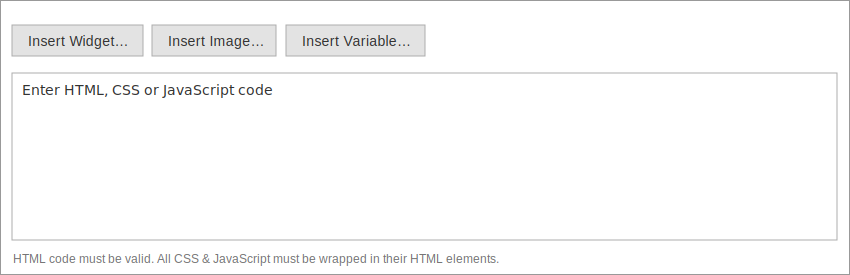

# Use HTML Code to override styles

<InlineAlert variant="info" slots="text"/>

The `HTML Code` content type can only override frontend theme and module styles. Admin styles cannot be overridden using HTML Code.

## Quick and dirty testing

We don't recommend this practice for anything other than a quick way to experiment and test your CSS styles and overrides for pages on the storefront.

## Steps

1. Drag an `HTML Code` content type anywhere on the stage. Its position on the stage does not matter. Styles added to `HTML Code` will always be placed _after_ Page Builder's internal `<style>` block. This placement ensures that your `HTML Code` block styles will override Page Builder's styles, even when your selector specificity is the same as Page Builder's (110).

1. Open the form editor for the content type.

   

1. Add your overriding CSS styles to a `<style>` block in the WYSIWYG editor.

   

    ```html
    <style>
    #html-body [data-content-type='heading'].my-class {
      display: flex;
      justify-content: center;
      align-items: center;
      color: red;
      margin: 40px;
    }
    </style>
    ```

Using `HTML Code` in this way creates an internal stylesheet (on the page) that overrides any same-specificity CSS defined in the external stylesheets of your themes and modules. This is handy when you want to test changes of your existing module and frontend theme styles, without having to recompile `.less` files all the time.
