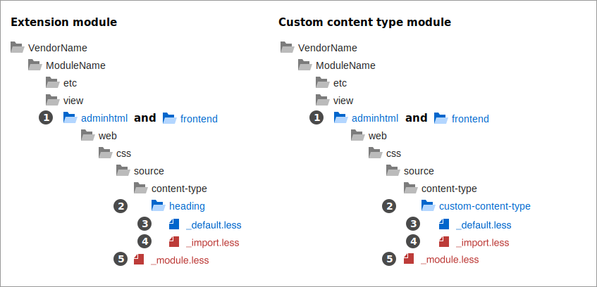

# Use Modules to override styles

When you create a Page Builder module by either extending a Page Builder content type or creating a custom content type, you should override Page Builder's styles from within the module, using the Page Builder selector override pattern: `#html-body` + `[content-type attribute]` + `any additional selector`, as shown here:

```scss
#html-body [data-content-type='my-custom'].my-class // Specificity = 120.
```


## The great benefit

Using this selector pattern consistently in your modules has one great benefit: You can reuse all your module's CSS style selectors in your themes, where you can change style rules to override your modules! That's the way it should work, right? Theme styles should override module styles. But you must use the override pattern consistently within Page Builder, or it won't work.

Adopting this pattern makes it work because Commerce adds theme styles _after_ module styles in the `styles.css` outputs. And the browser does the rest. The browser's cascading stylesheet rules apply the _last_ same-specificity CSS selectors to page content. So your theme style selectors, added last in the stylesheets, will always override the same selectors in your modules.

The cascade effect makes your module styles act as "default" styles. And the same selectors in your themes provide the theming overrides.

## Steps for overriding Admin and frontend styles

The steps for overriding Page Builder styles in the Admin and on the storefront are the same. The following diagram shows the numbered steps shared between the development `areas` and module types.



The steps for overriding styles in your modules are similar to those introduced for [overriding Admin themes](use-themes-to-override-styles.md).

### Step 1: Create `adminhtml` and `frontend` directories

In modules, the only difference between overriding Page Builder Admin styles and storefront styles is the required location of your `.less` files. Adding your `.less` files to the `adminhtml` directory overrides Page Builder's matching Admin styles. Adding them to the `frontend` directory overrides Page Builder's matching storefront styles. All the other guidelines for each `area` are the same.

### Step 2: Add content type directories

To help organize your `.less` files, we recommend using directory names that match the content-type names you want to override. This keeps you consistent with Page Builder module conventions. For example, in our `Heading` extension module, we added a `heading` directory. And for our custom content type module, we added a `custom-content-type` directory (assuming that's the name of our custom content type). These subdirectories (including `content-type`) are not required. They simply help organize your stylesheets as your modules grow.

### Step 3: Add `.less` files and styles.

We also recommend naming your `.less` files to match the content-type appearances you are overriding. Again, this is the Page Builder convention. Our example modules each have only one appearance called `default`. So we added a `_default.less` file to each. However, if we were extending Page Builder's `Row`, we add three `.less` files named after each `Row` appearance. This naming convention helps you find your overriding styles when you start extending or create content types with multiple appearances.

Here's an example style that uses the CSS selector pattern to override Page Builder's `h1` heading tags:

```scss
// CSS specificity = 111, just enough to override Page Builder's specificity of 111.
#html-body h1[data-content-type="heading"] {
    font-size: 40px;
    line-height: 61px;
    font-weight: 700;
    margin-bottom: 0;
}
```

To ensure this style overrides the `h1` element of the `Heading` content type, both within the Admin and on the storefront, you need to add it to the `_default.less` files in both the `adminhtml` and `frontend` areas of your module.

### Step 4: Add `_import.less` files

As another organizing practice, we recommend adding `_import.less` files to each content type directory. These files should only contain `@import` statements for all other `.less` files in the directory. When there's only one `.less` file in the directory (as with our example), this practice feels like overkill. But it's a good habit to create as your modules become more complex. Using import files like this makes it easy to import all your files into the required `_module.less` file (Step 5). In our examples, the `_import.less` file often contains only one import:

```scss
@import '_default.less';
```

### Step 5: Add a `_module.less` file

The `_module.less` file is the only **required** `.less` file you need. It must be added directly to the `adminhtml/web/css/source` directory. Commerce uses this file to add all your Admin styles to the `pub/static/adminhtml` output, where they will override Page Builder's default content-type styles. As with the `_import.less` files, it's a best practice to add only `@import` statements to your `_module.less` file. Technically, you could put all your CSS directly in `_module.less`, but that could quickly become a mess. Using best practices, our `_module.less` files in these examples would look like this:

```scss
// Extension module
@import 'content-type/heading/_import.less';

// Custom module
@import 'content-type/custom-content-type/_import.less';
```

## Summary

The key takeaway is this: Use Page Builder's CSS selector override pattern for all your Page Builder styles. Understand it, memorize it, and put it to use. It is the foundation for successful styling within Page Builder:

```terminal
#html-body  +  [content-type attribute]  +  any additional selector
```
