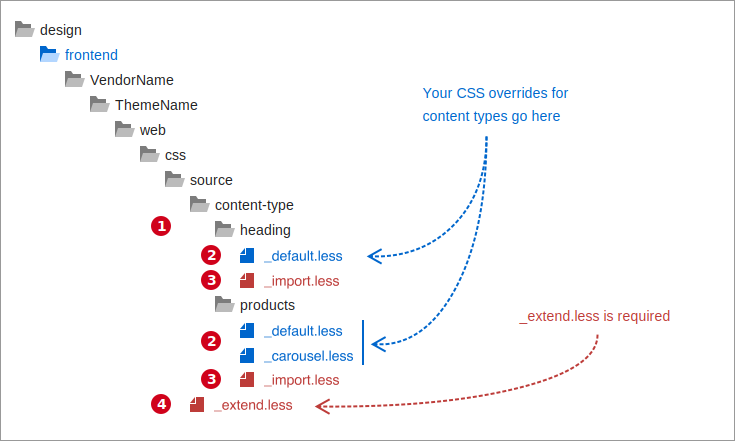
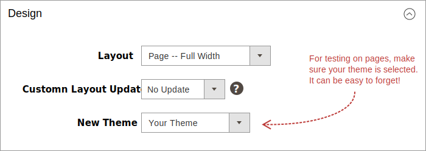

# Use Themes to override styles

The best place to override Page Builder's default styles for native content types is within your Admin and frontend themes. For your own custom or extension modules, you should first add your overriding styles to your modules, as explained in [Use modules to override styles](use-modules-to-override-styles.md).

In this topic, you will learn how to use Admin and frontend themes to override the default styles that Page Builder applies to its out-of-the-box content types.

## Steps to override Admin themes

To override Page Builder styles used in the Admin, you need to:

1. Create or modify an Admin theme.

1. Apply the Admin theme to a module.

### Step 1: Create or modify an Admin theme

The following instructions refer only to the specifics of overriding Page Builder Admin styles. To learn more on creating Admin themes in general, see [Create an Admin theme](../../guide/themes/create-admin.md).

Your overriding Admin theme should have a directory and file structure similar to the following:

```terminal
app/design/adminhtml/VendorName/ThemeName/web/css/source/content-type/<specific overrides>
app/design/adminhtml/VendorName/ThemeName/web/css/source/_module.less
```


The key takeaways are numbered in the image and described as follows:

1. **Content types**. Organize your overriding styles according to the Page Builder content-types you want to override. In this example, we added the `design/adminhtml/VendorName/ThemeName/web/css/source/content-type/` directory with the `heading` and `products` content types we want to override.

1. **Overriding stylesheets**. Name your overriding `.less` files to match the appearance names of your content types. In this example, the `heading` content type has one appearance: `default`. However, the `products` content type has two appearances `default` and `carousel`, so we create one `.less` file for each. This convention helps organize your overriding styles to finding and updating them later.

1. **Import files**. Include an `_import.less` file for each content type directory. This file should only contain `@import` statements for all the overriding files in the directory. Using import files like this helps keep your changes closer to where they occur. In our example, the `_import.less` file for our `products` content type contains two imports:

    ```scss
    @import '_default.less';
    @import '_carousel.less';
    ```

1. **_module.less**. The `_module.less` file is required and must be added directly to your Admin theme's `source` directory. Adobe Commerce uses this file to add your Admin styles to the `pub/static/adminhtml` output, where they can override the default Admin styles, including Page Builder's default content-type styles. Like the `_import.less` files, the `_module.less` file should only contain `@import` statements. In our example, our `_module.less` contains two imports:

    ```scss
    @import 'content-type/heading/_import.less';
    @import 'content-type/products/_import.less';
    ```

### Step 2: Apply the Admin theme to a module

The following instructions are specific to applying an Admin theme to a custom Page Builder module. To learn more on applying Admin themes to modules in general, see [Apply an Admin theme](../../guide/themes/apply-admin.md).

**To apply your Admin theme to a module**:

1. Create a `di.xml` file (in your module's `etc` directory) that references your Admin theme. The following example adds the `VendorName/ThemeName` Admin theme that we just created:

    ```xml
    <?xml version="1.0"?>
    <config xmlns:xsi="http://www.w3.org/2001/XMLSchema-instance" xsi:noNamespaceSchemaLocation="urn:magento:framework:ObjectManager/etc/config.xsd">

        <!-- Admin theme -->
        <type name="Magento\Theme\Model\View\Design">
            <arguments>
                <argument name="themes" xsi:type="array">
                    <item name="adminhtml" xsi:type="string">VendorName/ThemeName</item>
                </argument>
            </arguments>
        </type>

    </config>
    ```

1. Upgrade your module, clean the cache, and reload the Admin in the browser:

    ```bash
    bin/magento setup:upgrade
    ```

    ```bash
    bin/magento cache:clean
    ```

## Steps to override frontend themes

To override Page Builder styles on the storefront, you need to:

1. Create or modify a frontend theme.

1. Apply the frontend theme to a store view or page.

### Step 1: Create or modify a frontend theme

The following instructions refer only to the specifics of overriding Page Builder frontend styles. To learn more on creating frontend themes in general, see [Create a new storefront theme](../../guide/themes/create-storefront.md).

Your overriding frontend theme should have a directory and file structure similar to the following:

```terminal
app/design/frontend/VendorName/ThemeName/web/css/source/content-type/<specific overrides>
app/design/frontend/VendorName/ThemeName/web/css/source/_extend.less
```



The first three numbered callouts (**1, 2, 3**) for the frontend theme are identical in description to the Admin theme [previously described](#step-1-create-or-modify-an-admin-theme). The only difference for frontend themes is that the `_module.less` file should be named `_extend.less`.

**_extend.less**. The `_extend.less` file is required and must be added directly to your frontend theme's `source` directory. Commerce uses this file to add your frontend styles to the `pub/static/frontend` output in a location within the `styles-m.css` where they override (instead of replace) the default frontend styles, including Page Builder's default content-type styles. Like the `_import.less` files, the `_extend.less` file should only contain `@import` statements. In our example, our `_extend.less` contains the same two imports as seen in `module.less`:

```scss
@import 'content-type/heading/_import.less';
@import 'content-type/products/_import.less';
```

### Step 2: Apply the frontend theme

The following instructions are here as a **reminder** to apply your frontend theme to a store view or page. If you forget, you won't see your style overrides in the storefront. To learn more on applying themes in general, see [Apply a storefront theme](../../guide/themes/apply-storefront.md).

To apply your frontend theme to a store view:

Navigate to **Content** > **Design** > **Configuration** and edit the store view where you can apply your frontend theme as the default theme:


To apply your frontend theme to a page:

During development, it's easy to apply your frontend theme to a single page for testing, but it's also easy to forget to switch your page to that theme.

On any CMS page, scroll to the Design section at the bottom, and select your theme from the New Theme selector.



## More about themes

For more information on overriding styles using themes, see [Simple ways to customize a theme's styles](../../guide/css/quickstart/customize-styles.md).
