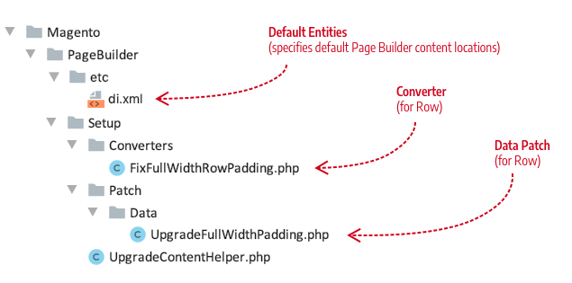
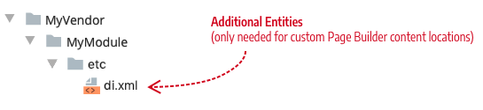
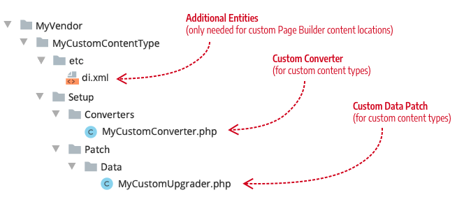

# Upgrade content types

Before version 1.3, if we updated our content-type configurations and sent them out with a new version of Page Builder, it could break the data you saved using the previous version. This happened because the configuration data of a content type is mapped to the content type's display templates. So when we change a configuration, the display of existing content might also change. With significant changes, the data from the appearance `element` nodes (`attributes`, `css`, `html`, `style`, and `tag`) is lost. Such changes cause existing content to appear incorrectly, or not at all.

To fix this limitation, Page Builder now uses Adobe Commerces's native upgrade mechanism, coupled with our content upgrade helpers. These helpers convert existing content so that it maps to new configurations and displays correctly.

## Example: Updating the Row content type

Let's imagine that the Page Builder team needs to change the configuration of the Row's full-width appearance to fix a layout issue. The fix is simple. We need to move a style attribute from one element in the Row's full-width appearance to another element. But without the upgrade helpers, our change to the Row's configuration would break all previously saved Page Builder content that uses Rows.

To fix this issue, we created a set of Page Builder DOM helper classes (`Magento\PageBuilder\Model\Dom\*`) that we can use to update all our native content types (including the Row) that have already been stored in the database.

## Steps overview

There are three steps to upgrading a content type when changing its configuration:

1. Create a Converter (Example: `FixFullWidthRowPadding.php`)

1. Create a Data Patch (Example: `UpgradeFullWidthPadding.php`)

1. Update the UpgradableEntitiesPool (for custom entities)(`Magento\PageBuilder\Model\UpgradableEntitiesPool`)

For our Row example, the Page Builder team would add the following files to the `Magento/PageBuilder/Setup` directories:



### Step 1: Create a Converter

For our Row example, the first task is to create a converter class that implements the `DataConverterInterface`. Specifically, it implements the `convert` function where it uses Page Builder's DOM helper classes to change the DOM of the Row content type within each master format it receives.

Our converter class for fixing a row padding problem might be called `FixFullWidthRowPadding`, with the following example implementation:

```php
<?php
/**
 * Copyright [first year code created] Adobe. All rights reserved.
 */

declare(strict_types=1);

namespace Magento\PageBuilder\Setup\Converters;

use Magento\Framework\DB\DataConverter\DataConverterInterface;
use Magento\PageBuilder\Model\Dom\Adapter\ElementInterface;
use Magento\PageBuilder\Model\Dom\HtmlDocument;
use Magento\PageBuilder\Model\Dom\HtmlDocumentFactory;

/**
 * Converter to move padding in full width columns from the main row element to the inner element
 */
class FixFullWidthRowPadding implements DataConverterInterface
{
    /**
     * @var HtmlDocumentFactory
     */
    private $htmlDocumentFactory;

    /**
     * @param HtmlDocumentFactory $htmlDocumentFactory
     */
    public function __construct(HtmlDocumentFactory $htmlDocumentFactory)
    {
        $this->htmlDocumentFactory = $htmlDocumentFactory;
    }

    /**
     * @inheritDoc
     */
    public function convert($value)
    {
        /** @var HtmlDocument $document */
        $document = $this->htmlDocumentFactory->create([ 'document' => $value ]);
        $fullWidthRows = $document->querySelectorAll("div[data-content-type='row'][data-appearance='full-width']");
        /** @var ElementInterface $row */
        foreach ($fullWidthRows as $row) {
            $style = $row->getAttribute("style");
            preg_match("/padding:(.*?);/", $style, $results);
            $padding = isset($results[1]) ? trim($results[1]) : '';
            if (!$padding) {
                continue;
            }
            // remove padding from main row element
            $row->removeStyle("padding");
            // add padding to inner row element
            $innerDiv = $row->querySelector(".row-full-width-inner");
            $innerDiv->addStyle("padding", $padding);
        }
        return $fullWidthRows->count() > 0 ? $document->stripHtmlWrapperTags() : $value;
    }
}
```

### Step 2: Create a Data Patch

Our second task for updating our example Row content type is to create a Data Patch class that implements the `DataPatchInterface`. Specifically, we need to use the Page Builder `UpgradeContentHelper` class to apply the converter class to all the database entities where Page Builder content exists. These locations are provided by the `UpgradableEntitiesPool`, described later in this topic.

For our Data Patch, we'll create a class called `UpgradeFullWidthPadding`, which fixes our row padding problem with the following example implementation:

```php
<?php
/**
 * Copyright [first year code created] Adobe. All rights reserved.
 */
namespace Magento\PageBuilder\Setup\Patch\Data;

use Magento\Framework\DB\FieldDataConversionException;
use Magento\Framework\Setup\Patch\DataPatchInterface;
use Magento\PageBuilder\Setup\Converters\FixFullWidthRowPadding;
use Magento\PageBuilder\Setup\UpgradeContentHelper;

/**
 * Patch upgrade mechanism allows us to do atomic data changes
 */
class UpgradeFullWidthPadding implements DataPatchInterface
{
    /**
     * @var UpgradeContentHelper
     */
    private $helper;

    /**
     * @param UpgradeContentHelper $helper
     */
    public function __construct(
        UpgradeContentHelper $helper
    ) {
        $this->helper = $helper;
    }

    /**
     * Do upgrade
     *
     * @return void
     * @throws FieldDataConversionException
     */
    public function apply()
    {
        $this->helper->upgrade([
            FixFullWidthRowPadding::class
        ]);
    }

    /**
     * @inheritdoc
     */
    public function getAliases()
    {
        return [];
    }

    /**
     * @inheritdoc
     */
    public static function getDependencies()
    {
        return [];
    }
}
```

### Step 3: Update the UpgradableEntitiesPool (for custom entities)

The `Magento\PageBuilder\Model\UpgradableEntitiesPool` provides the locations in the database where Page Builder content exists by default. These entities include:

-  `cms_block`

-  `cms_page`

-  `catalog_category_entity_text`

-  `catalog_product_entity_text`

-  `pagebuilder_template`

If your Magento installation does not have any additional entities for Page Builder content (beyond the defaults), you do not need to update the `UpgradableEntitiesPool`.

However, if you have created additional database entities for storing Page Builder content, you _must_ add those entities to the `UpgradableEntitiesPool` type in your module's `etc/di.xml`. If you do not, the Page Builder content stored in your entity will not be updated, causing potential data-loss and display issues.



For example, if you have created a blog entity that stores Page Builder content, you must add your blog entity to your `etc/di.xml` file as an `UpgradableEntitiesPool` type. This entry ensures that the upgrade library can update the Page Builder content types used in your blog. An entry for our blog example might look like this:

```xml
<type name="Magento\PageBuilder\Model\UpgradableEntitiesPool">
    <arguments>
        <argument name="entities" xsi:type="array">
            <item name="cms_block" xsi:type="array">
                <item name="identifier" xsi:type="string">blog_id</item>
                <item name="fields" xsi:type="array">
                    <item name="content" xsi:type="boolean">true</item>
                </item>
            </item>
        </argument>
    </arguments>
</type>
```

In such cases, your additional entity will be merged with the default entities from `Magento/PageBuilder/etc/di.xml`:

```xml
<type name="Magento\PageBuilder\Model\UpgradableEntitiesPool">
    <arguments>
        <argument name="entities" xsi:type="array">
            <item name="cms_block" xsi:type="array">
                <item name="identifier" xsi:type="string">block_id</item>
                <item name="fields" xsi:type="array">
                    <item name="content" xsi:type="boolean">true</item>
                </item>
            </item>
            <item name="cms_page" xsi:type="array">
                <item name="identifier" xsi:type="string">page_id</item>
                <item name="fields" xsi:type="array">
                    <item name="content" xsi:type="boolean">true</item>
                </item>
            </item>
            <item name="catalog_category_entity_text" xsi:type="array">
                <item name="identifier" xsi:type="string">value_id</item>
                <item name="fields" xsi:type="array">
                    <item name="value" xsi:type="boolean">true</item>
                </item>
            </item>
            <item name="catalog_product_entity_text" xsi:type="array">
                <item name="identifier" xsi:type="string">value_id</item>
                <item name="fields" xsi:type="array">
                    <item name="value" xsi:type="boolean">true</item>
                </item>
            </item>
            <item name="pagebuilder_template" xsi:type="array">
                <item name="identifier" xsi:type="string">template_id</item>
                <item name="fields" xsi:type="array">
                    <item name="template" xsi:type="boolean">true</item>
                </item>
            </item>
        </argument>
    </arguments>
</type>
```

## How to upgrade your custom content types

To use Page Builder's content upgrade helpers for your own content-type configuration changes, follow these steps:

1. Set up a new environment that uses a _copy_ of your production data, far away from any real data.

1. Create a test branch off your local environment where you can make and test your data patch converters. You will switch back and forth off this branch to reset the data in your Commerce instance as needed.

1. Within the test branch for your content type module changes, set up a directory structure similar to this:

   

1. Implement the `DataConverterInterface` to create a converter for your content type, using Page Builder's `FixFullWidthRowPadding` class as an example.

1. Implement the `DataPatchInterface` to create a data patch for your content type, using Page Builder's `UpgradeFullWidthPadding` class as an example.

1. Make a copy of the data in the `content` fields of existing entities (`cms_page`, `cms_block`, and so on). You will compare this content with the content changes made after running your upgrade patch.

1. Run `bin/magento setup:upgrade` to test your custom conversion.

   After running `setup:upgrade`, you should see an entry at the bottom of the `patch_list` table of your Commerce database. The entry uses your module's namespace with the name of your DataPatch class. So use a descriptive name to ensure the `patch_list` entry makes sense to others.

1. Compare your post-upgraded content to the previous content.

   If the conversion didn't convert your content as planned, remove your entry from the `patch_list` table, restore your database content to the original values, tweak your converter, then run `bin/magento setup:upgrade` again. Repeat as necessary.

## How to upgrade overloaded Page Builder content types

If you have overloaded the configurations of native Page Builder content types, you need to review Page Builder's native configuration changes for each release. If necessary, you will need to create a converter and data patch to customize how the native content types are updated for your changes.

For example, in version 1.3, we updated the configuration of the native Row content type. As mentioned, we moved the padding attribute of the `full-width` appearance from the `<main>` element to the `<inner>` element. So if your Row configuration is different in your custom content type (for example, you removed the `<inner>`