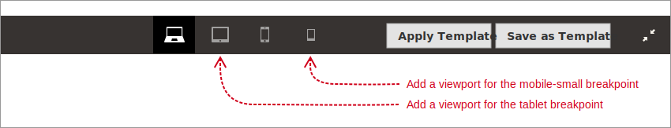
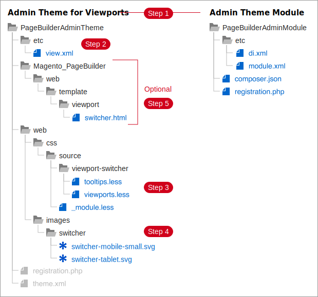
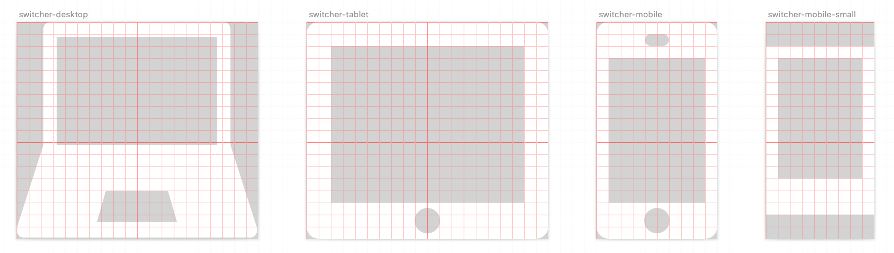

# Add viewports

By default, Page Builder defines four responsive breakpoints, but only uses two of them for viewports: `desktop` and `mobile`. The other two breakpoints are `tablet` and `mobile-small`. This topic shows you how to add viewport previews to these breakpoints and customize them as needed.



<InlineAlert variant="info" slots="text"/>

**Example available**. An example for adding additional viewports is available for viewing and installing from: [https://github.com/magento-devdocs/pagebuilder-theme](https://github.com/magento-devdocs/pagebuilder-theme). This example uses an Admin theme, which is typically a best practice for production releases. But during development, you might find that using a module helps simplify your daily workflow. Especially if you're starting from scratch. Then you can even use the [PB Modules CLI](https://github.com/magento-devdocs/pbmodules) to create a starting module.

## Steps for adding viewports

1. Create an Admin theme or [Create a module](https://github.com/magento-devdocs/pbmodules). Of course you can skip this step if you already have either one.

1. Add a view.xml file. Use this file to define your configuration data for the additional viewports.

1. Add viewport configuration data.

1. Add viewport CSS classes. Create these classes to change the stage width for a selected viewport.

1. Add viewport button images. Create SVG images for your viewport buttons.

### Step 1: Create or add to an existing Admin theme

To create and apply an Admin theme, follow the instructions described here:

-  [Create an Admin theme](../../guide/themes/create-admin.md).

-  [Apply an Admin theme](../../guide/themes/apply-admin.md).

Your Admin theme and its required module should have directories set up as shown in the diagram:



### Step 2: Add a `view.xml` file

Copy the `view.xml` file from Page Builder (`Magento/PageBuilder/etc/view.xml`) and add it to your theme's `etc` directory. Before we continue, let's cleanup the `view.xml` file.

First, delete everything except the `tablet` and `mobile-small` breakpoints. When you finish, your `view.xml` file should look like this:

```xml
<?xml version="1.0"?>
<view>
    <vars module="Magento_PageBuilder">
        <var name="breakpoints">
            <var name="tablet">
                <var name="conditions">
                    <var name="max-width">1024px</var>
                    <var name="min-width">768px</var>
                </var>
                <var name="options">
                    <var name="products">
                        <var name="default">
                            <var name="slidesToShow">4</var>
                        </var>
                        <var name="continuous">
                            <var name="slidesToShow">3</var>
                        </var>
                    </var>
                </var>
            </var>
            <var name="mobile-small">
                <var name="conditions">
                    <var name="max-width">640px</var>
                </var>
                <var name="options">
                    <var name="products">
                        <var name="default">
                            <var name="slidesToShow">2</var>
                        </var>
                        <var name="continuous">
                            <var name="slidesToShow">1</var>
                        </var>
                    </var>
                </var>
            </var>
        </var>
    </vars>
</view>
```

What's left at this point is the `options` element that provides breakpoint custom data to the Products content type.

Products uses this data in its `widget.js` file to make the [slick carousel](https://kenwheeler.github.io/slick/) responsive. You will use this data in the [Use breakpoints](./use-breakpoints.md) topic. But not here. So delete the breakpoint data. When you finish, your `view.xml` file should look like this:

```xml
<?xml version="1.0"?>
<view>
    <vars module="Magento_PageBuilder">
        <var name="breakpoints">
            <var name="tablet">
            </var>
            <var name="mobile-small">
            </var>
        </var>
    </vars>
</view>
```

Now we can add our viewport configurations without distraction.

### Step 3: Add viewport configuration data

In our example, we added the following viewport data to the `table` and `mobile-small` breakpoints:

```xml
<?xml version="1.0"?>
<view>
    <vars module="Magento_PageBuilder">
        <var name="breakpoints">
            <var name="tablet">
                <var name="label">Tablet</var>
                <var name="stage">true</var>
                <var name="class">mobile-switcher</var>
                <var name="icon">PageBuilder_Breakpoints::css/images/switcher/switcher-tablet.svg</var>
                <var name="media">only screen and (max-width: 1024px)</var>
            </var>
            <var name="mobile-small">
                <var name="label">Mobile Small</var>
                <var name="stage">true</var>
                <var name="class">mobile-small-switcher</var>
                <var name="icon">PageBuilder_Breakpoints::css/images/switcher/switcher-mobile.svg</var>
                <var name="media">only screen and (max-width: 640px)</var>
            </var>
        </var>
    </vars>
</view>
```

Details for these viewport elements are in the [Viewport configurations section](../index.md#viewport-configurations), but let's quickly summarize them:

-  `label` — for adding the viewport name to the tooltip.

-  `stage` — for adding or removing the viewport from the stage.

-  `class` — for adding an optional CSS class for the button (not the stage width).

-  `icon` — for adding an icon to the button.

-  `media` — for adding a media query used to show viewport properties on the frontend.

At this point, if you save your `view.xml` file, clear your cache (`bin/magento cache:clean`), and do a hard reload of your browser, you should see two additional buttons (with broken images) in the Page Builder's stage header:


The buttons don't have icons because we haven't added them yet. But they have tooltips that show the viewport names you added to the `label` node. And you can even click them to trigger stage events. But there's nothing to process yet.

So let's add a button icon and CSS for the stage width to make the button look good and actually do something.

### Step 4: Add viewport button icons

Page Builder uses SVG images for its existing viewport button icons. And while you _can_ use other image formats (like .png), we recommend using SVG icons that match Page Builder's existing icons.

For this exercise, you can [download the `switcher-tablet.svg` and `switcher-mobile-small.svg` images](https://github.com/magento-devdocs/pagebuilder-examples/tree/master/Columns/Extension/view/adminhtml/web/css/images/switcher) from our example repo.

After downloading, add the files to your theme or module's `web/css/images/switcher/` directory to match the URLs we set for our viewport `icon` nodes in `view.xml`.

Now you can reload the CMS page, open Page Builder, and hopefully see your new viewport buttons with icons:


#### Creating your own icons

If you want to create your own icons, use the following guidelines to help you match Page Builder's icons as closely as possible:

-  Icon height: `18px`

-  Icon width: `20px`, or narrower as needed.

-  Icon background: `transparent`

-  Icon fill: `#fff`

Shown below are the basic pixel dimensions and styles for our button icons.



**Pro Tip:** Make sure you give all your custom icons a height of 18px, even when they are smaller like the `switcher-mobile-small.svg`. This common height ensures that your icons will align nicely in the stage header alongside Page Builder's existing icons.

### Step 5: Add viewport CSS classes

Page Builder uses CSS classes to change the stage width for the selected viewport. So when you add a viewport configuration to a breakpoint, you need to add a `.less` file to your module or theme, like the `_viewport-stage-widths.less` file from from our example.

This is the part of our viewport framework where convention _dominates_ configuration. You might remember a viewport node called `class` (from Step 3 above). And you might assume that the `class` node is for the CSS class that sets the stage width for your viewport. But this is not the case.

You must name your CSS classes according to the following convention:

```scss
<breakpoint-name>-viewport
```

Where `<breakpoint-name>` is the name of the breakpoint in `view.xml`, such as `mobile-tiny`. So our new viewport class names must be:

-  `.tablet-viewport`

-  `.mobile-small-viewport`

Every time a user clicks a viewport button, Page Builder applies a `.<breakpoint>-viewport` class to the stage. If this class exists (with the right nesting of selectors), the stage width changes to match. If not, nothing happens.

In our theme example, we define our viewport CSS classes in our `_viewport-stage-widths.less` file as follows:

```scss
.tablet-viewport {
    &.pagebuilder-stage-wrapper {
        &.stage-content-snapshot,
        &.stage-full-screen {
            .pagebuilder-stage {
                .pagebuilder-canvas {
                    left: 50%;
                    transform: translateX(-50%);
                    width: 1024px;
                }
            }
        }
    }
}

.mobile-small-viewport {
    &.pagebuilder-stage-wrapper {
        &.stage-content-snapshot,
        &.stage-full-screen {
            .pagebuilder-stage {
                .pagebuilder-canvas {
                    left: 50%;
                    transform: translateX(-50%);
                    width: 640px;
                }
            }
        }
    }
}
```

The `width` values set here should match the `max-width` values configured for the `media` nodes in `view.xml`. If they don't, the end user will see a stage preview that differs from what customers see on the storefront.

Now if you save your `.less` file, transpile it, and reload of your browser, you should see the stage canvas changes widths to match the widths set in your viewport classes.

## Summary

In this topic you learned how to add more viewports to Page Builder's stage so that end users can preview how their content will look a different widths on the storefront. To learn more about how to use these viewports to customize your content types, see How to use viewports.
