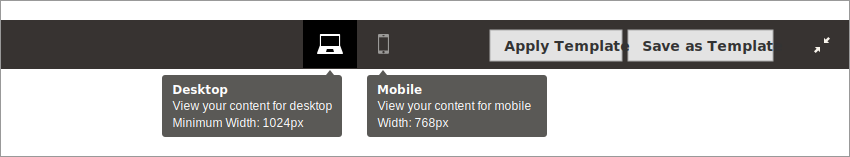
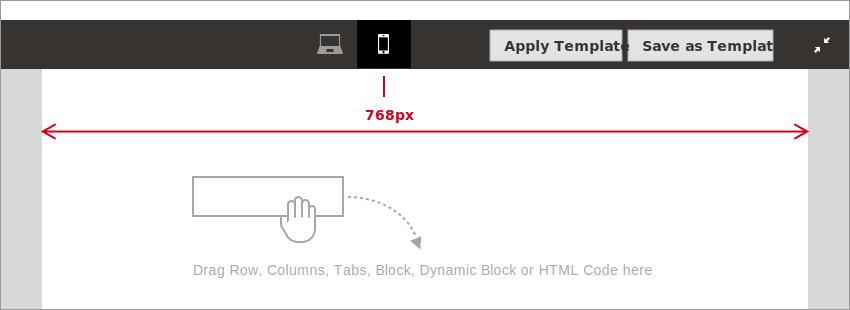
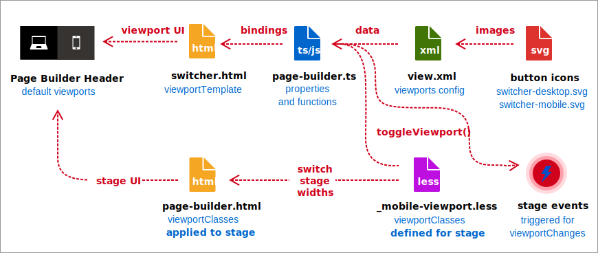
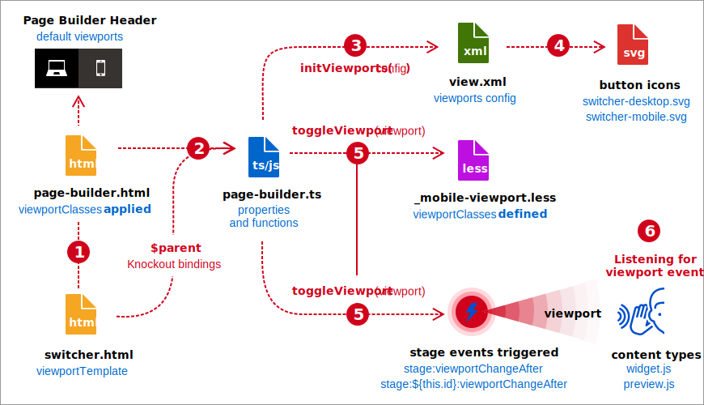
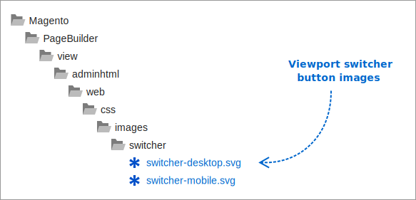

# Introduction to viewports for responsive content

What's a viewport? It's a window in a spacecraft. But that's not important right now. [(WTM?)](https://www.youtube.com/watch?v=AK3gB7DpaM0 "What's That Movie?") For development, we know a viewport refers to the size of the window (or device) used to view content. But in Page Builder, the term has more specific meanings.

Page Builder viewports refer to the buttons and their related device widths shown on the stage. So when we say things like viewport buttons, viewport widths, and viewport configuration data, we're usually talking about the UI elements and settings for the stage.

## Viewports for the stage

By default, Page Builder provides two viewports: **desktop** and **mobile**, as shown here:



When the buttons are clicked, the stage width changes to the width defined in the viewport's CSS class for the stage. For example, the default `mobile` viewport narrows the stage canvas to 768px, as shown here:



The stage width is controlled by the `.mobile-viewport` CSS (Less):

```scss
.mobile-viewport {
    &.pagebuilder-stage-wrapper {
        &.stage-content-snapshot,
        &.stage-full-screen {
            .pagebuilder-stage {
                .pagebuilder-canvas {
                    left: 50%;
                    margin: 0;
                    transform: translateX(-50%);
                    width: 768px;
                }
            }
        }
    }
}
```

## Viewports for property breakpoints

In addition to providing the UI for frontend previews, viewports deliver one of Page Builder's best features: User-controlled property values that are breakpoint-specific. As a developer, you define the breakpoint for a viewport, and the end user defines the property value for that viewport. Without viewports, users can't set breakpoints on content properties.

So let's define another term: _viewport properties_.

Viewport properties refer to the properties of a content type that can accept different values for different viewport breakpoints.

Page Builder defines the **Minimum Height** form field as a viewport property for Rows, Columns, Tabs, Tab Items, Banners, Sliders, and Slides. Users can save two different minimum height values for these content types, one for the `desktop` viewport (`min-width: 1024px`) and one for the `mobile` viewport (`max-width: 768px`).

## How viewport properties work

First, the user clicks the `mobile` viewport button. This changes the stage width accordingly. The user then opens a form for a content type that defines a viewport property field. The user adds a value to the field and clicks the Save button on the form. Page Builder saves that value _with_ the viewport, which connects it to the breakpoint.

Later, when rendering content for the frontend, Page Builder starts generating styles for the content types on the page. When Page Builder gets to the viewport properties it adds, it adds them to a media query on the frontend that is defined in the viewport `media` node of the `view.xml` configuration.

Finally, Page Builder adds all its content type styles — for both viewport properties and common properties — to an internal stylesheet on the page (see [Internal stylesheets](../styles/index.md#internal-stylesheets)). So when the viewport of a device matches the media queries assigned to the viewport properties, those properties change accordingly.

If this is all a bit confusing right now, don't worry. These things will become clear later in this topic as you learn about the parts of the viewport architecture.

**The main takeaway**: Viewports are what make breakpoint-specific properties possible.

## How viewports work

The viewport files listed below provide all the HTML templates, functions, properties, configuration data, and events that make up the viewport framework in Page Builder.

<InlineAlert variant="info" slots="text"/>

To access the linked source code for each file listed here, you must have access to the private Page Builder repository: `magento/magento2-page-builder`.

-  [Magento/PageBuilder/etc/view.xml](https://github.com/magento/magento2-page-builder/blob/develop/app/code/Magento/PageBuilder/etc/view.xml)

-  [Magento/PageBuilder/view/adminhtml/web/template/page-builder.html](https://github.com/magento/magento2-page-builder/blob/develop/app/code/Magento/PageBuilder/view/adminhtml/web/template/page-builder.html)

-  [Magento/PageBuilder/view/adminhtml/web/template/viewport/switcher.html](https://github.com/magento/magento2-page-builder/blob/develop/app/code/Magento/PageBuilder/view/adminhtml/web/template/viewport/switcher.html)

-  [Magento/PageBuilder/view/adminhtml/web/ts/js/page-builder.ts](https://github.com/magento/magento2-page-builder/blob/develop/app/code/Magento/PageBuilder/view/adminhtml/web/ts/js/page-builder.ts)

-  [Magento/PageBuilder/view/adminhtml/web/css/source/_mobile-viewport.less](https://github.com/magento/magento2-page-builder/blob/develop/app/code/Magento/PageBuilder/view/adminhtml/web/css/source/_mobile-viewport.less)

-  [Magento/PageBuilder/view/adminhtml/web/css/images/switcher/switcher-desktop.svg](https://github.com/magento/magento2-page-builder/blob/develop/app/code/Magento/PageBuilder/view/adminhtml/web/css/images/switcher/switcher-desktop.svg)

-  [Magento/PageBuilder/view/adminhtml/web/css/images/switcher/switcher-mobile.svg](https://github.com/magento/magento2-page-builder/blob/develop/app/code/Magento/PageBuilder/view/adminhtml/web/css/images/switcher/switcher-mobile.svg)

The following diagram shows how these files interact to make viewports work.



### Summary descriptions

-  [page-builder.html](#page-builderhtml)—Template parent that hosts Page Builder's header, viewport buttons, template buttons, panel, and stage.

-  [switcher.html](#switcherhtml)—Template (`viewportTemplate`) that defines the viewport buttons using Knockout bindings for the `toggleViewport()` function, button images, and tooltips.

-  [page-builder.ts](#page-builderts)—ViewModel that defines the viewport properties and functions for the `switcher.html` template bindings.

-  [view.xml](#viewxml)—Configuration data that defines properties for viewport names, visibility, defaults, min- and max-widths, button icons, tooltip labels, and more.

-  [_mobile_viewport.less](#_mobile-viewportless)—Defines CSS classes that change the stage width. Classes in this file are assigned to the observable `viewportClasses` property and switched when `toggleViewport()` is triggered by the viewport buttons.

-  [Button icons](#button-icons)—SVG images for the viewport buttons.

-  [Stage events](#stage-event-triggers)—The events triggered from the `toggleViewport()` function—[`stage:viewportChangeAfter`](../architecture/events.md#stageviewportchangeafter) and [`stage:${this.id}:viewportChangeAfter`](../architecture/events.md#stagepreviewcontenttypestageidviewportchangeafter). Content type JavaScript components (`preview.ts` and `widget.js`) can listen for these events and make responsive changes as needed.

## Viewport bindings and events

The following diagram is similar to the previous one, but focuses more on how the viewport bindings and events work. The numbers are not meant to show a strict operational sequence. They simply call out the important actions and connections between the files.



1. **Templates**—The `page-builder.html` template renders the `switcher.html` viewport template in the header section of the Page Builder stage.

1. **Bindings**—The `switcher.html` binds to the properties and functions of its parent ViewModel: `page-builder.ts`.

1. **Initialization**—The `page-builder.ts` ViewModel initializes its properties from the `view.xml` config file and sets the default viewport.

1. **Button icons**—The button icons are referenced by URLs in the `view.xml` for display on the stage.

1. **Toggle function**—The `toggleViewport()` function is bound to the button click event in the `switcher.html` template. This function does two things:

   -  Sets the `viewportClasses` observable to a CSS class referenced by the selected viewport.
   -  Triggers the `stage:viewportChangeAfter` events for listeners.

1. **Events**—Content types handle the viewport events within their `widget.js` and `preview.ts` files.

## page-builder.html

```terminal
Magento/PageBuilder/view/adminhtml/web/template/page-builder.html
```

The `page-builder.html` template hosts the `switcher.html` template (`viewportTemplate`) in the Page Builder's header:

```html
<!-- page-builder.html -->

<div class="admin__field pagebuilder-header"...>
    <span class="viewport-buttons">
        <render args="viewportTemplate"/> <!-- switcher.html -->
    </span>
    ...
</div>
```

The `page-builder.html` template also includes the `viewportClasses` observable. When this observable changes, the stage width changes to match the `width` defined in the viewport's CSS class.

```html
<!-- page-builder.html -->

<div class="pagebuilder-stage-wrapper"
     css="Object.assign({'stage-full-screen': isFullScreen, 'stage-content-snapshot': isSnapshot},
     viewportClasses)"
```

For more information about `viewportClasses`, see [Viewport properties](#viewport-properties) and [_mobile-viewports.less](#_mobile-viewportless), later in this topic.

## switcher.html

```terminal
Magento/PageBuilder/view/adminhtml/web/template/viewport/switcher.html
```

The `switcher.html` file is the template for the viewport buttons. Page Builder uses this template to render a button for each viewport defined in the `view.xml` file. The switcher template uses Knockout bindings to retrieve data and call the button click function from `page-builder.js`, as shown here:

```html
<!-- switcher.html -->

<each args="data: Object.keys(viewports), as: 'name'">
    <span class="tooltip">
        <button type="button"
                class="page-builder-viewport"
                css="$parent.viewports[name].class"
                disable="name === $parent.viewport()"
                click="$parent.toggleViewport.bind($parent, name)">
            
        </button>
        <span class="tooltip-content">
            <span class="tooltip-label" translate="$parent.viewports[name].label"/><br/>
            <span translate="'View your content for '"/><text args="name"/><br/>
            <span translate="'Width'"/>: <text args="Object.values($parent.viewports[name].conditions)[0]"/>
        </span>
    </span>
</each>
```

Notice how the `switcher.html` template uses dot syntax to access viewport data from the `page-builder.ts` ViewModel. This syntax corresponds to the data hierarchy in the `view.xml` configuration. For example, the `` and the `tooltip-label` are bound as follows:

```html
<!-- switcher.html -->


<span class="tooltip-label" translate="$parent.viewports[name].label"/>
```

These bindings map to the `icon` and `label` nodes defined in the `view.xml` file, starting with the viewport name, as shown here:

```xml
<!-- view.xml -->

<var name="desktop">
    <var name="label">Desktop</var>
    <var name="icon">Magento_PageBuilder::css/images/switcher/switcher-desktop.svg</var>
</var>

<var name="mobile">
    <var name="label">Mobile</var>
    <var name="icon">Magento_PageBuilder::css/images/switcher/switcher-mobile.svg</var>
</var>
```

The `view.xml` file makes it easy to customize the template without having to change it directly.

## page-builder.ts

```terminal
Magento/PageBuilder/view/adminhtml/web/ts/js/page-builder.ts
```

As previously noted, Page Builder's `page-builder.ts` file is the `$parent` ViewModel for the `switcher.html` template. This ViewModel includes a viewport's properties and functions bound to the `switcher.html` template. The details follow.

### Viewport properties

**`viewports`**—Object that contains all the viewports (and their properties) defined in the `view.xml` config file. These properties include viewport names, stage visibility, defaults, min- and max-widths, button icons, tooltip labels, and more. See [view.xml](#viewxml) below for details.

**`viewport`**-`KnockoutObservable<string>` that provides the currently selected viewport by name: `desktop` or `mobile` by default.

**`defaultViewport`**—Name of the viewport selected by default. This property is set in the `view.xml` configuration.

**`viewportClasses`**—Observable object array of CSS classes used to change the stage width. The `toggleViewport()` appends the selected viewport name with `'-viewport'`, then assigns it as a CSS class to the`viewportClasses` observable. By default, Page Builder only sets one stage width for its `mobile` viewport, using the `.mobile-viewport` class. The `desktop` viewport does not have a class because it does not set a stage width that is different from the stage's default width. See [_mobile-viewport.less](#_mobile-viewportless) for more information.

### Viewport functions

**`initViewports(config)`**—Sets the viewport property values from the `view.xml` config file. The `switcher.html` template (`viewportTemplate`) binds to these properties as previously described. This function also sets the default viewport for the stage. You can set the default viewport in the `view.xml`.

**`toggleViewport(viewport)`**—Assigns CSS classes to the `viewportClasses` observable, based on the selected viewport name. The CSS classes assigned to `viewportClasses` control the stage width. This function also triggers the `stage:viewportChangeAfter` event. Content types can then change their layouts from event handlers. For more details, see [Stage event triggers](#stage-event-triggers) at the end of this topic.

## view.xml

```terminal
Magento/PageBuilder/etc/view.xml
```

Page Builder's `view.xml` file provides breakpoint _and_ viewport configurations for the `desktop` and `mobile` viewports, but only breakpoint configurations for the `tablet` and `mobile-small` breakpoints.

Page Builder's entire `view.xml` configuration (minus the `media` node) is listed here to help show and explain the difference between viewport and breakpoint configurations.

```xml
<!-- view.xml -->
<view xmlns:xsi="http://www.w3.org/2001/XMLSchema-instance" xsi:noNamespaceSchemaLocation="urn:magento:framework:Config/etc/view.xsd">
    <vars module="Magento_PageBuilder">
        <var name="breakpoints">
            <var name="desktop">
                <var name="label">Desktop</var>
                <var name="stage">true</var>
                <var name="default">true</var>
                <var name="class">desktop-switcher</var>
                <var name="icon">Magento_PageBuilder::css/images/switcher/switcher-desktop.svg</var>
                <var name="conditions">
                    <var name="min-width">1024px</var>
                </var>
                <var name="options">
                    <var name="products">
                        <var name="default">
                            <var name="slidesToShow">5</var>
                        </var>
                    </var>
                </var>
            </var>
            <var name="tablet">
                <var name="conditions">
                    <var name="max-width">1024px</var>
                    <var name="min-width">768px</var>
                </var>
                <var name="options">
                    <var name="products">
                        <var name="default">
                            <var name="slidesToShow">4</var>
                        </var>
                        <var name="continuous">
                            <var name="slidesToShow">3</var>
                        </var>
                    </var>
                </var>
            </var>
            <var name="mobile">
                <var name="label">Mobile</var>
                <var name="stage">true</var>
                <var name="class">mobile-switcher</var>
                <var name="icon">Magento_PageBuilder::css/images/switcher/switcher-mobile.svg</var>
                <var name="media">only screen and (max-width: 768px)</var>
                <var name="conditions">
                    <var name="max-width">768px</var>
                    <var name="min-width">640px</var>
                </var>
                <var name="options">
                    <var name="products">
                        <var name="default">
                            <var name="slidesToShow">3</var>
                        </var>
                    </var>
                </var>
            </var>
            <var name="mobile-small">
                <var name="conditions">
                    <var name="max-width">640px</var>
                </var>
                <var name="options">
                    <var name="products">
                        <var name="default">
                            <var name="slidesToShow">2</var>
                        </var>
                        <var name="continuous">
                            <var name="slidesToShow">1</var>
                        </var>
                    </var>
                </var>
            </var>
        </var>
    </vars>
</view>
```

## Viewport configurations

Notice that the `mobile` breakpoint has a `media` node query. Page Builder uses this query for content type properties that can be assigned to a viewport using _breakpoint-aware_ form fields. So let's call the `media` node a **viewport media query**. This name will help us distinguish it from the `max-width` and `min-width` breakpoints, which are used for a different purpose, described later in this topic.

**Viewport configuration nodes**:

The following nodes in the `view.xml` file provide configuration data for viewports:

-  `label` - (string) Sets a viewport name or description for the tooltip.

-  `stage` - (bool) If set to `true`, the viewport is added to the stage. If set to `false`, it is not, and users will not be able to set responsive properties on a content type for that viewport.

-  `default` - (bool) Determines if the viewport is selected by default when the stage is loaded. Make sure at least one viewport has a `default` setting of `true`. Be aware that if you delete the `default` node entirely from the `desktop` viewport, Page Builder will always set it as the default, and ignore the `default` settings from all other viewports.

-  `class` - (string) Defines a CSS class to style the viewport switcher button.

-  `icon` - (string) - URL to the viewport button image (SVG) location.

-  `media` - (string) Defines the media query Page Builder uses to save breakpoint-specific properties for a viewport. Page Builder then adds the media query (and assigned properties) to its internal stylesheet on the page where the property values are applied at the breakpoints.

## Breakpoint configurations

Page Builder uses the `min-width` and `max-width` breakpoints to build `widget` media queries for content types that require more than CSS to behave responsively. For example, the Products content type uses these breakpoints in its `widget.js` file to control the responsive behavior of its carousel control, described later in this topic.

**Breakpoint configuration nodes**:

The following nodes from the `view.xml` file provide configuration data for breakpoints:

-  `breakpoints` - Defines the parent object for all the named breakpoint objects in Page Builder.

-  `desktop` and `mobile` - Defines the two breakpoint objects Page Builder uses for its default viewports.

-  `conditions` - Contains the `min-width` and `max-width` breakpoints Page Builder uses to build media queries for JavaScript widgets and preview components.

-  `max-width` and `min-width` - Define the breakpoint widths used to construct a media query in JavaScript. The default values are in pixels (`px`), but `em` units can also be used.

**Breakpoint custom data**:

Breakpoint configurations also include any custom nodes you add to defined breakpoint-specific data for your `preview` components and `widgets`. Page Builder uses these particular nodes to define the breakpoint-specific data it needs to make its Products `widget` responsive:

-  `options` - Parent object that defines custom data used by the `Products` content type. You can define similar nodes with unique names for your own content type options.

-  `products` - Parent object that defines the content type for the data. You can define similar nodes with unique names for your own content types.

-  `default` - Parent object that groups `Products` data by appearance. You can define similar nodes with unique names for your own content types.

-  `slidesToShow` - Property defined for a content type appearance. The Products content type uses the `slidesToShow` property within the `preview.js` and `widget.js` components to control responsive behavior in the Admin and the frontend. You can define similar properties for your own content types.

As shown for `Products`, you can define custom nodes for your own breakpoint-specific data. Then use that data to control your content type's layout on the Admin stage (using your `preview` component) and the storefront (using your `widget`).

### Adding custom data to breakpoints

Let's say you want to create a content type that shows customer testimonials in a carousel. Like Products, you could use the [slick control](https://kenwheeler.github.io/slick/) to auto-loop the quotes across the screen. But you need a way to tell slick to increase or decrease the number of quotes to show on the screen for a given breakpoint. You can't do that with CSS media queries because slick is a contained control. You have to do it from your content type's `widget`. In this case, you could create a custom property for each breakpoint called `testimonialsToShow`. This property would define the ideal number of testimonials to show for a given breakpoint.

Your content type's custom configuration data might look like this:

```xml
<!-- view.xml -->

<var name="mobile">
   ...
    <var name="options">
        <var name="testimonials">
            <var name="default">
                <var name="testimonialsToShow">3</var>
            </var>
            <var name="with-images">
                <var name="testimonialsToShow">2</var>
            </var>
        </var>
    </var>
</var>
```

In short, whenever you need breakpoint-specific data in your `widget.js` and `preview.js` components, you can define your own custom data for a breakpoint in your `view.xml` file. See [Use breakpoints for widgets](use-breakpoints.md) for details.

## _mobile-viewport.less

```terminal
Magento/PageBuilder/view/adminhtml/web/css/source/_mobile-viewport.less
```

The `_mobile-viewport.less` file includes the CSS class that **changes the stage width** to match the widths defined for the `mobile` breakpoint in the `view.xml` file. As mentioned in [Viewport properties](#viewport-properties), Page Builder assigns this class to the `viewportClasses` observable after the mobile viewport button is clicked. When this happens, the stage width changes to the width in the `.mobile-viewport` class. For new viewports, the class name that controls the stage width must follow this naming convention:

```terminal
.[breakpoint-name] + -viewport
```

The `[breakpoint-name]` refers to the name of the breakpoint for the viewport, as defined in the `view.xml` file. For example, the `mobile-small` breakpoint requires a CSS class named `.mobile-small-viewport`. If your viewport CSS class name doesn't follow this convention, it won't match the class name generated by the `toggleViewport()` function and assigned to `viewportClasses` for the stage. The code that determines this convention is shown here:

```javascript
// page-builder.ts
public toggleViewport(viewport: string) {
    ...
    this.viewportClasses[`${viewport}-viewport`](true);
    ...
}
```

Page Builder's default `.mobile-viewport` class shows the nesting of CSS selectors required to target the `pagebuilder-canvas` on the stage:

```scss
// _mobile-viewport.less

.mobile-viewport {
    &.pagebuilder-stage-wrapper {
        &.stage-content-snapshot,
        &.stage-full-screen {
            .pagebuilder-stage {
                .pagebuilder-canvas {
                    left: 50%;
                    transform: translateX(-50%);
                    width: 768px;
                }
            }
        }
    }
}
```

## Button icons

Page Builder's viewport buttons use SVG images. The URLs to these images are defined in the `view.xml` file for each viewport (`desktop` and `mobile`), as shown in these snippets:

```xml
<!-- view.xml -->

<var name="desktop">
    <var name="icon">Magento_PageBuilder::css/images/switcher/switcher-desktop.svg</var>
</var>

<var name="mobile">
    <var name="icon">Magento_PageBuilder::css/images/switcher/switcher-mobile.svg</var>
</var>
```

As the URLs indicate, Page Builder's SVG images for the buttons are located here:



## Stage event triggers

Page Builder triggers the viewport stage events from the `toggleViewport()` function. This function is bound to the viewport button in the `switcher.html` template. After the user clicks the viewport button, Page Builder calls `toggleViewport()`, which triggers the stage events as shown here:

```typescript
// page-builder.ts

public toggleViewport(viewport: string) {
    ...
    events.trigger(`stage:${this.id}:viewportChangeAfter`, {
        viewport,
        previousViewport,
    });
    events.trigger(`stage:viewportChangeAfter`, {
        viewport,
        previousViewport,
    });
}
```

Event handlers within Page Builder's content types (and yours) can then make responsive changes based on the selected `viewport` or `previousViewport`.

## Summary

Understanding the elements of Page Builder's responsive framework and how it works is the first step toward making your content types responsive. To begin developing responsive content for Page Builder, we recommended the following sequence of topics:

1. [Add viewports to the stage](add-viewports.md)

1. [Add breakpoints](add-breakpoints.md)

1. [Use breakpoints for widgets](use-breakpoints.md)

1. [Change breakpoints and viewports](change-breakpoints-viewports.md)
