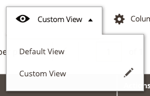

# Bookmarks component

The Bookmarks component stores active and changed state of a grid implemented using [Listing](listing-grid.md). It includes the state of filters, columns position, applied sorting, pagination, and so on.

## Options

Option | Description | Type | Default Value
--- | --- | --- | ---
`newViewLabel` | Default label for a new bookmark. | String | New View
`template` | Path to the component’s `.html` template. | String | `ui/grid/controls/bookmarks/bookmarks`
`viewTmpl` | Path to the `.html` template used to render each bookmark in the list. | String | `ui/grid/controls/bookmarks/view`
`defaultIndex` | The index of the default view. | String | `default`
`activeIndex` | The index of the current view. | String | `default`
`viewsArray` | The array of views. | Array | `default`

## Source files

Extends [`uiCollection`](concepts/collection.md):

-  [`app/code/Magento/Ui/view/base/web/js/grid/controls/bookmarks/bookmarks.js`](https://github.com/magento/magento2/blob/2.4/app/code/Magento/Ui/view/base/web/js/grid/controls/bookmarks/bookmarks.js)
-  [`app/code/Magento/Ui/view/base/web/templates/grid/controls/bookmarks/view.html`](https://github.com/magento/magento2/blob/2.4/app/code/Magento/Ui/view/base/web/templates/grid/controls/bookmarks/view.html)

## Examples

### Integration

This is an example of how to integrate the Bookmarks component with the [Listing](listing-grid.md) component:

```xml
<listing>
    ...
    <listingToolbar>
        ...
        <bookmark name="bookmarks"/>
    </listingToolbar>
    ...
</listing>
```

#### Result


