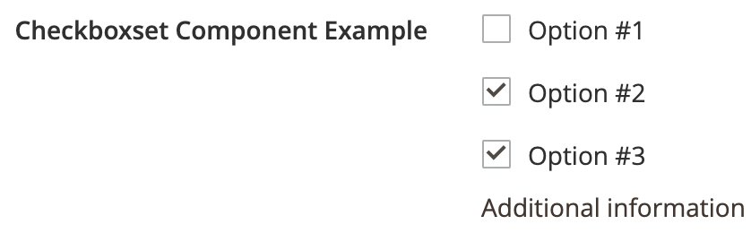

# Checkboxset component

The Checkboxset component implements a group of `<input type="checkbox">` or `<input type="radio">` selection elements.

## Options

| Option | Description | Type | Default |
| --- | --- | --- | --- |
| `class` | Path to the PHP class responsible for the backend implementation of the component. | String | `Magento\Ui\Component\Form\Element\CheckboxSet` |
| `component` | The path to the component’s `.js` file in terms of RequireJS. | String | `'Magento_Ui/js/form/element/checkbox-set'` |
| `multiple` | Set the input type in the UI: `true` for checkbox, `false` for radio button. | Boolean | `true` |
| `options` | The array of the options to be displayed in the list for selection. | Array | `[]` |
| `template` | The path to the component’s `.html` template. | String | `'ui/form/element/checkbox-set'` |

## Source files

Extends [`Abstract`](https://github.com/magento/magento2/blob/2.4/app/code/Magento/Ui/view/base/web/js/form/element/abstract.js):

-  [`app/code/Magento/Ui/view/base/web/js/form/element/checkbox-set.js`](https://github.com/magento/magento2/blob/2.4/app/code/Magento/Ui/view/base/web/js/form/element/checkbox-set.js)
-  [`app/code/Magento/Ui/view/base/web/templates/form/element/checkbox-set.html`](https://github.com/magento/magento2/blob/2.4/app/code/Magento/Ui/view/base/web/templates/form/element/checkbox-set.html)
-  [`app/code/Magento/Ui/Component/Form/Element/CheckboxSet.php`](https://github.com/magento/magento2/blob/2.4/app/code/Magento/Ui/Component/Form/Element/CheckboxSet.php)

## Examples

### Integration

This is an example of how to integrate the Checkboxset component with the [Form](form.md) component:

```xml
<form>
    ...
    <fieldset>
        ...
        <checkboxset name="checkboxset_example">
            <argument name="data" xsi:type="array">
                <item name="config" xsi:type="array">
                    <item name="additionalInfo" xsi:type="string">Additional information</item>
                </item>
            </argument>
            <settings>
                <label translate="true">Checkboxset Component Example</label>
                <options>
                    <option name="0" xsi:type="array">
                        <item name="value" xsi:type="number">1</item>
                        <item name="label" xsi:type="string" translate="true">Option #1</item>
                    </option>
                    <option name="1" xsi:type="array">
                        <item name="value" xsi:type="number">2</item>
                        <item name="label" xsi:type="string" translate="true">Option #2</item>
                    </option>
                    <option name="2" xsi:type="array">
                        <item name="value" xsi:type="number">3</item>
                        <item name="label" xsi:type="string" translate="true">Option #3</item>
                    </option>
                </options>
            </settings>
        </checkboxset>
    </fieldset>
</form>
```

#### Result


